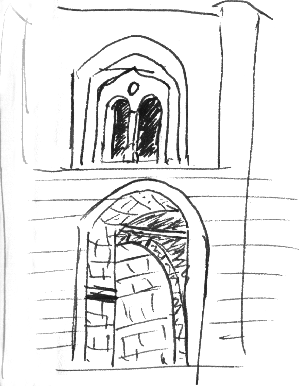

# Vendredi 24 mai, avion pour la Sicile

Les écrivains du passé revenaient de voyage avec des notes pour un livre, nous n’en revenons qu’avec quelques pages, car nos voyages ne durent pas plus de quelques jours. À ce temps restreint correspond une forme narrative, impressions fugitives glanées ça et là, nous n’avons pas la force, et pas la possibilité, d’atteindre l’essence des choses et ce concept disparaît de la philosophie. Il n’est plus qu’un songe du passé, nous devenons réalistes et matérialistes même si nous aspirons à la mystique. Notre rapport au temps explique nos œuvres. Il faudrait écrire un essai : *De l’influence de l’avion sur l’art du XXe siècle*.

### Mondello

Dans les rues de Palerme, embouteillages, circulation chahutée, lente et nerveuse. Impossible de percevoir la moindre beauté. L’hôtel de la Torre confortable, tout ce qu’il me faut. Je suis en Sicile à la poursuite de l’art roman, à la poursuite du passé, et la pire modernité m’accueille.

*Les Envoûtés* de Gombrowicz inventorie les thèmes développés dans *Ferdydurke* et dans toute l’œuvre à venir : maturité/immaturité, plèbe/bourgeoisie, forme/informe, achevé/inachevé. Un livre sans le style caractéristique de Gombrowicz, on ne le retrouve que dans le « *nooon* » que prononcent Maya et Walczak (*nooon* qui symbolise la dissolution même du langage qui caractérisera *Trans-Atlantique*). Encore un livre d’une modernité étonnante, et qui deviendra de plus en plus moderne. Efforts dérisoires de Kundera, tout au plus il perfectionne la forme, là où Gombrowicz la pousse jusqu’à l’im-perfection.

Le roman gothique connaît un âge d’or entre les deux guerres : il suffit de penser à Lovecraft. Impossible aujourd’hui de produire de tels récits, surtout avec une telle réussite. Quels sont les récits d’aujourd’hui ? Récits qui manquent de temps, restent à la surface des choses… un homme fuit Palerme effrayé par le tumulte… la fuite de jour en jour se répète, le lieu idéal n’existe plus, ou seulement dans notre imaginaire, là il existe trop et nous sommes incapables de le trouver dans la réalité. Dichotomie : manquer de temps pour découvrir l’essence des choses et chercher un lieu qui n’existe qu’en idée.

### Cloître de Monreale

La fuite s’achève, l’idée rejoint la réalité, la paix est retrouvée même si nous ne nous éternisons pas, jamais vu autant de groupes, de visiteurs allant en bandes. Auraient-ils peur des Siciliens ?

Couleur de la pierre : ocre jaune, jaune de Naples, harmonies de bruns, variations orientales.

L’art gothique ouvre une parenthèse dans l’histoire de la culture occidentale. Étranger à ce qui le précède et le suit, il s’apparente par son exotisme à l’art oriental.

Comment une époque commence et une autre s’achève ? L’art roman succède avec naturel à l’art antique, il unifie l’Égypte, la Grèce et Rome. Il revient à la matière, la valorise et l’arrache à la pesanteur du bas moyen-âge ; il revient à l’art brut, sans maniérisme, il fait comme le XXe siècle.

La cathédrale de Durham (1093 - 1128), tout en restant romane, invente la voûte en ogive, invente le gothique. Les murs se percent de vitraux et de rosaces, la nef et le cœur s’ouvrent à la lumière. Le gothique oublie la matière (le corps du Christ) au profit de l’idée (à la gloire de Dieu). Cette quête de la légèreté fait pousser aux flancs des cathédrales les arcs-boutants si étrangers à la culture occidentale. On les dirait copiés sur des squelettes de sauriens. Mais à force de crier le message divin, le gothique montre ses limites et la première Renaissance ferme la parenthèse, renonce à l’idéalisme qui avait dissous la réalité, elle revient à l’antique, à la quête du matériel, mais vite le marbre de sa surface impénétrable renverra vers l’idéalité. L’humanité oscille sans cesse.

Au début du moyen-âge, la religion chrétienne prêche d’une voie sûre et qui porte d’elle-même. La foi reste vivante jusqu’à ce qu’elle s’essouffle et que ses concepts, donc ses idées, nécessitent le soutien d’une architecture vertigineuse, qui doit faire naître une sensation d’infini que la foi seule ne peut produire. La cathédrale gothique réinvente Dieu.

La Renaissance confronte deux courants : retour à la nature (réalisme dans la représentation) et retour à l’antique (mythes, styles et idées). Ces deux aspirations cohabitent et finissent par se confondre chez les Vénitiens du XVIe ; moment où l’Orient rejoint l’Occident.

Dans le cloître de Monreale, cette union existe d’une certaine façon. Mais, au XIIe siècle en Sicile, nous en sommes encore à une époque de matière, un accord entre les textures d’Orient et d’Occident. Une double colonne d’inspiration byzantine, une autre d’inspiration romane ; alternance de doubles colonnes, jamais un endroit n’a illustré aussi vivement la dichotomie. Il faudra attendre Venise, le Carpaccio, le Titien et Véronèse pour qu’à cette union de chair s’ajoute celle de l’âme. À ce moment, il sera temps de consommer le divorce, cette histoire d’amour ne renaîtra de ses cendres qu’au milieu du XIXe siècle.

#pense_de_sicile #retroblogging #y1996 #1996-5-24-9h56
