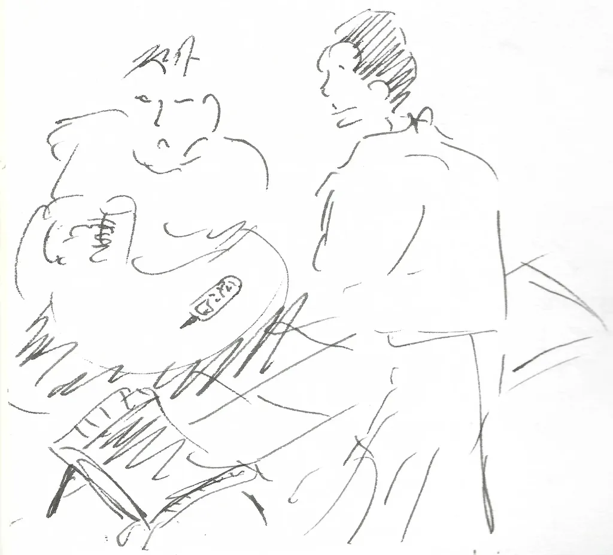
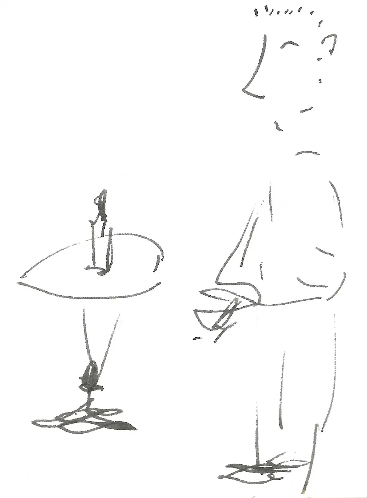
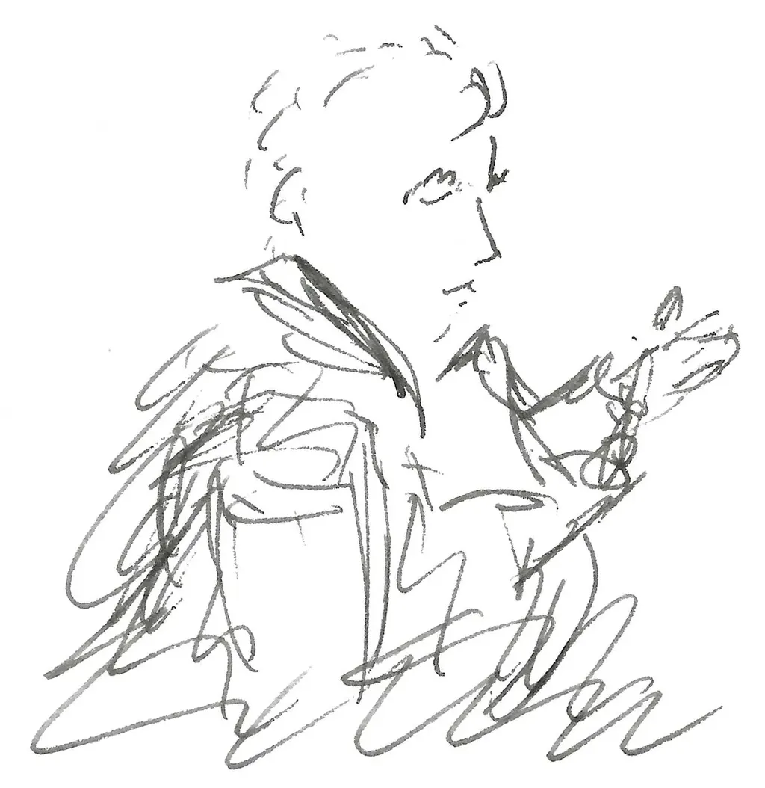

# Janvier 1999

*Depuis le décès d’Isa, incapable de me tendre vers un avenir plus qu’incertain, je me replie vers le passé et remonte au commencement de notre histoire. J’ai retranscrit mes carnets de janvier 1999, quand j’ai rencontré Isa. Nous sortions tous deux d’une histoire douloureuse. Mes notes témoignent d’une époque où déjà le numérique transforme les rapports sociaux et amoureux. Je n’envoie ce texte qu’à mes abonnés payants, peu désireux de le partager plus largement. S’il vous intéresse, je publierai février et mars. Écrire sur Isabelle me fait du bien.*

### Vendredi 1er, Balaruc

Pluie battante, obscurité, clapotis : je les ai tant aimés. Je sors d’une période dégueulasse. Je croyais devenir père, et c’était une supercherie (ne plus en parler, regarder devant). Je suis soulagé, tout en craignant la solitude. Je ne l’ai jamais supportée. J’ai toujours eu besoin d’une femme près de moi. Écrire, et ne plus me chercher d’excuse. J’étais prêt à remiser mes rêves littéraires. J’ai peut-être tout fait pour en arriver à ma situation de désespoir qui m’ouvre de beaux espoirs. Rien de conscient. Volonté de concilier les inconciliables.

### Dimanche 3, Balaruc

Demain, retour à Paris. Demain, affronter la réalité. Me remettre au travail, me consacrer à cette œuvre pour laquelle j’ai tout gâché. Quel en sera le sujet ? La souffrance ? Les opportunités ? Les paysages ?

### Lundi 4, Paris

Les amis m’aident à traverser mes déboires sentimentaux. Sans les amis, je ne suis rien.

---

La philosophie ne m’aide pas à résoudre mes problèmes amoureux, c’est une science pour les asséchés du cœur. Face à la réalité, les préceptes se désagrègent. Il ne reste que l’art, plus loquace que n’importe quelle théorie. Mon rêve : produire une œuvre qui fera parler sans fin. Pour l’instant, mes œuvres ne parlent pas. Et je parle, je parle.

---

Quelle femme voudra d’un homme meurtri ? Une femme elle aussi meurtrie. Nous irons courbés sous le poids de nos passés. Ou une jeune fille encore insouciante. Être confesseur tout aussi horrible qu’être professeur. Je peux aimer toutes les femmes pour leur corps, leur joie, leurs rires, et peut-être aucune pour elle-même. Je n’ai besoin que de l’insouciance de la passion. F m’a sauvé une première fois et je l’ai fait souffrir. Je peste contre le mal ressenti, sans admettre celui que j’impose.

### Mardi 12, Paris

Les lignes narratives de mon roman *Décalage* :

1/ Histoire d’un couple heureux dite par un ami après un drame (dont on ne connaît pas les circonstances, mais qui se traduit par une séparation définitive). C’est l’introduction et la conclusion de l’histoire.

2/ Les fantasmes d’un voyageur : ses désirs, sa jalousie, son amour…

3/ Pendant que l’homme voyage sa femme vit ce qu’il rêve pour lui-même et redoute pour elle.

4/ La rupture. L’homme tente de ranimer son amour.

### Mercredi 13, Paris

Je n’ai plus d’idée, j’attends une tempête. Pourquoi ne pas raconter l’histoire d’un homme en attente.

---

Café de la Contrescarpe, avant d’y rencontrer une fille branchée en ligne. Hier soir, nous avons passé trois heures à discuter au téléphone. Il m’était facile de parler avec nonchalance, de dire n’importe quoi, de mentir sans conséquence. Elle cherche à oublier une histoire douloureuse, nous sommes deux. J’éprouve de la lassitude à l’idée de me répéter. J’ai l’impression de tourner en rond. L’attente me remplit l’imagination.

### Jeudi 14, Paris

Deux heures du matin. J’ai passé trois heures avec la fille au café, puis elle m’a téléphoné et nous avons encore parlé trois heures. Que nous sommes compliqués. Comment supporter l’histoire tordue d’un autre ?

Je suis abasourdi par la beauté d’Iris (son pseudo), ses yeux immenses, ses longues jambes, sa sensibilité à fleur de peau. On dirait une bombe prête à exploser. C’est une intello d’un mystérieux pays d’Europe de l’Est, ex\-mannequin. Elle est sûre de ses charmes, ce qui lui donne un air prétentieux.

Me rappellera-t-elle ? Je lui ai dit de ne pas hésiter, que ça me ferait plaisir. Je n’en suis même pas sûr. Pas plus qu’avec les dernières filles rencontrées. Je manque de curiosité, aussi de désirs. Je ne suis pas prêt à l’amour (et le sexe pour le sexe ne m’a jamais intéressé).

Iris est traductrice et fauchée. Plus elle a parlé, plus ses blessures remontaient à la surface, de quoi terroriser. Je suis incapable d’envisager une nouvelle relation amoureuse.

### Vendredi 15, Paris

Hier soir, nous nous sommes revus en fin d’après-midi : promenade, cafés, discussion sans fin, besoin de verbaliser, deux intellos aux histoires entrechoquées.

Quand elle me quitte, elle m’embrasse, un baiser fougueux, un baiser terminal, un baiser désespéré : sorte de remerciement pour les mots échangés, un adieu définitif, Iris ayant répété qu’elle n’était pas accessible tant que son histoire n’était soldée. Et moi à me moquer d’elle, à lui dire que ça n’avait aucun sens puisqu’elle avait passé autant de temps avec moi.

Me rappellera-t-elle ?

---

Le célibat fabrique des histoires. C’est bon pour un écrivain.

### Samedi 16, Paris

Hier soir, je récupère Iris à la sortie du métro Bercy. Grande sur ses talons, yeux dans le vague, walkman sur les oreilles. Elle a fait comme si elle ne me voyait pas jusqu’au dernier moment. Dans la rue, tout le monde la regardait. Elle a un côté magnétique.

Nous sommes allés chez moi, nous avons parlé. Je lui ai demandé pourquoi hier elle m’a embrassé ; elle m’a dit que c’était moi qui l’avais embrassée. Alors je l’ai embrassée à nouveau, et elle m’a embrassé. Nous avons fait l’amour, elle a dormi chez moi, et nous avons fait l’amour, puis elle m’a dit que nous ne nous reverrions jamais, parce qu’elle n’avait pas prévu de me céder aussi vite, parce que sa rupture n’était pas consommée.

Je crois qu’elle ne me rappellera pas cette fois. C’est sans gravité, je ne l’aime pas, même si je pourrais l’aimer ; ce serait un amour patinoire avec forte chance de dérapages incontrôlés. Elle m’a dit vouloir profiter du célibat durant quelques mois avant de s’engager à nouveau. Je ferai bien de l’imiter.

En me quittant elle m’a dit que notre nuit resterait pour elle comme un rêve. Elle a cité Oscar Wilde : « La seule différence entre un caprice et une passion éternelle, c’est que le caprice dure un peu plus longtemps. » Avons-nous vécu une passion ou un caprice de quatre jours ?

Son dernier regard était triste. Qui était vraiment cette fille ? De quel pays venait-elle ? Quel était son vrai nom ? Elle a joui presque à la première caresse. Elle avait le plaisir à fleur de peau. Elle est partie, c’est mieux ainsi, elle était bien trop compliquée.

### Dimanche 17, Paris

Café Beaubourg. Du mal à penser les jours derniers. Pas eu le temps de connaître Iris. Alors je marche dans Paris, et atterris comme souvent au café Beaubourg, dans l’attente d’un événement que je ne saurais provoquer.

Iris appellera-t-elle ? Non, elle l’a juré. J’ai son numéro, je devrais le détruire. Mais en amour, il n’y a pas d’honneur, pas de parole, il n’y a que le désir et on ne peut que lui obéir. Je finirai par téléphoner, si je continue à penser à elle.

Dans le café en même temps que le soir avance, de moins en moins de femmes, de plus en plus d’homos. J’ai croisé au long de ma promenade de nombreux regards. Les gens perçoivent-ils ma disponibilité ? Une question d’attitude, une aura des corps célibataires ? Nous n’avons même pas besoin de cette alchimie pour nous attirer, la curiosité suffit.

Les homos se reconnaissent avec facilité par la magie de leur monde. Les hétéros de mon espèce redoutent d’importuner.

Quand un regard me scanne, je ne le remarque pas, indifférent à l’analyse critique qui pèse sur moi. J’imagine les caresses visuelles qui me balaient et que je renvoie en catimini vers d’autres.

Les corps ne m’attirent jamais en eux\-mêmes. Je me souviens de L. Je l’ai séduite pour son corps et elle m’a lassé aussitôt. Avec Iris, c’était un savant mystère entretenu à je ne sais quel dessein, que j’imagine terrible.

Parce que j’écris, je ressemble à un écrivain. Il m’arrive des histoires d’écrivain. À moins que l’écrivain ne transforme la moindre aventure en littérature ? Je n’aime pas les histoires courtes.

Comment retrouver la force de travailler ? Éprouver ne me suffit pas. Romancer ma vie pour rendre mon carnet intéressant ou laisser le hasard à la manœuvre ?

Si Iris ne me rappelle pas, je ne comprends rien à l’amour, rien aux femmes, rien aux yeux pétillants de bonheur. À moins qu’Iris ne comprenne rien à l’amour, rien aux hommes, qu’elle ait peur des histoires qui finissent en souffrances.

Joie de dormir avec une femme près de soi, abandonnée, nue et belle. C’est la jouissance extrême. Elle me manque plus que tout autre plaisir.

### Lundi 18, Paris

Journée studieuse, mais je retrouve le sentiment d’impuissance provoqué par l’absence. Iris tient parole. Je ne devrais pas m’en affecter. Après tout, je ne suis qu’un passager dans sa vie.

Qu’est-ce que je croyais ? Avoir un pouvoir sur les femmes. Je ne suis qu’un amateur, avec une médiocre expérience de l’amour, aucune de la séduction et des préambules.

Demain, Claire m’invite à dîner et me présente une de ses collègues de chez Microsoft. Je suis retourné sur les forums. Des sexes en folie derrière les mots maladroits. Pas la patience de rejouer. J’ai du travail par-dessus la tête et pas le courage de travailler. Je n’ai qu’envie de m’amuser et de profiter de ma nouvelle jeunesse. Je sais que cette illusion sera brève. Je ne suis pas un aventurier. Je ne rêve que d’un amour long et tendre.

### Mardi 19, Paris

Dîné chez Claire. Elle me présente Isabelle : belle, lumineuse, intelligente, joyeuse, cultivée. Presque trop parfaite.

### Mercredi 20, Paris

Je me remets à *Décalage*. Nombreux passages que je n’aurai plus la force d’écrire. Les dialogues ne fonctionnent pas, même s’ils disent la vie que le héros refuse, vie qui est pourtant la sienne et qu’il désire en même temps.

---

Depuis dix ans que je vis à Paris, j’aspire à la rencontre impromptue, et souvent mes rencontres découlent de rencontres antérieures.

---

J’envoie un mail à Isabelle (je l’invite à autre chose au prétexte de parler de son travail).

« Salut,

« Start \[le portail de Microsoft] s’est amélioré, mais ça reste confus : manque de hiérarchie, toutes les infos au même niveau, le regard ne sait pas où se poser ni dans quel sens aborder la page. En peinture, on appelle ça le allover (Jackson Pollock, par exemple). En mise en page, mieux vaut rester classique (je fais l’intelligent). Si tu veux parler de ça et, surtout, de tout autre chose, appelle-moi (après la politique, Internet est ce qui m’intéresse le moins). Je suis disponible comme l’air.

« A+ »

Deux heures plus tard, Isabelle me répond :

« D’abord, ça s’appelle plus Start, mais MSN (tout court) — juste pour faire plaisir aux imprimeurs qui ont imprimé "Start" partout et aussi pour faire plaisir aux marketeux (ie ma pomme), qui doivent relancer le produit sous un autre nom… et tout à fait d’accord avec tes remarques sur l’interface, je n’insiste pas.

« Jackson Pollock ne fait pas partie de mes peintres préférés (je crois même que j’aime tout sauf Jackson Pollock ! Ça n’est pas une tare ?), mais si tu as des idées de balade pour me remettre quelques neurones en place/prendre l’air entre mes dossiers MBA et MSN (genre église cachée dans un immeuble de verre ou autre endroit surprenant), pourquoi pas ? (heu, les catacombes, c’est quand même un peu glauque…) Je t’appelle samedi.

« isabelle

« PS : Internet ne t’intéresse pas ? Tu caches bien ton jeu ! »

---

Bonheur de voir surgir la phrase par surprise : tonique, sonore, puissante. Le lyrisme impose l’absolu. Écrire *Décalage* à la mode Kerouac, le laisser couler au clavier. Est-ce expressionniste ou proustien ? Le roman catastrophique d’une génération.

---

Quelle est la probabilité que deux êtres s’assemblent, que leurs histoires les amènent à se rencontrer au bon moment ? L’amour peut naître a posteriori. On le fabrique autant qu’on l’éprouve. Le coup de foudre, je m’en méfie : il n’entraîne aucune édification, et le couple n’a alors aucune chance de survivre aux crises inévitables. Entre moi et Iris, ce n’était qu’un imprévu. Je revois son corps, ses tétons durcis, aucune autre fille ne peut m’apparaître sinon la prochaine. Que se passera-t-il entre moi et Isabelle ?

## Jeudi 21, Paris

De nombreux appels sur mon répondeur, jamais de message. Est-ce Iris ? Des appels toujours lors de mes absences. Entre nous ce n’était qu’une illusion. Je repense à nos conversations, à nos regards, à notre façon de faire l’amour.

### Vendredi 22, Paris

Au Fumoir, avec une inconnue. Du mal à m’intéresser à elle. Elle est mignonne, mais trop sophistiquée. Incapable de jouer le jeu. J’échange des regards avec une autre fille, à une autre table. Je suis perdu. Je cours sous les bombes. La fille s’en va. Ça me rassure.

### Samedi 23, Paris

Je survole un essai sur la sexualité féminine, et prends conscience que ma sexualité est féminine.

---

Isabelle m’appelle. Nous parlons longuement. Nous nous donnons rendez-vous pour demain.

### Dimanche 24, Paris

Café français : crachin, grisaille, l’hiver. Je rencontre des femmes comme si je tournais les pages d’un catalogue. Le numérique change notre rapport aux autres, au sexe, à l’amour, et ce n’est que le commencement. Le jeu ne m’intéresse déjà plus.

Je pense à *Décalage*, à *Ne rien faire sans fainéanter*, à l’intertextualité, aux mécanismes qui impliquent un choix du lecteur. Quand deux textes se juxtaposent, une forme d’aléatoire en découle. Un livre où tout n’est pas à lire, où les chemins de lecture se multiplient. J’ai l’habitude de traiter les livres comme les pays. Je les visite de temps en temps, parcours quelques pages, puis les abandonne quelques mois. Des livres compagnons comme les correspondances ou les journaux intimes. Ils me font partager la vie de leurs auteurs plus que de leurs personnages. Les livres vite lus sont souvent vite oubliés. J’ai l’impression de vivre avec Flaubert. À travers sa correspondance, je vieillis avec lui à 150 ans de distance.

---

Je marche durant six heures avec Isabelle. Nous ne cessons de parler. Complicité immédiate. Je pourrais l’aimer rien que pour sa santé mentale. Jamais rencontré une personne aussi pure. Elle me conseille de lire *Soie* d’Alessandro Baricco. Je pars l’acheter.

### Mardi 26, Paris

Mail à Isabelle :

« J’espère que tu as réussi à retourner ton torticolis.

« Hier soir, j’ai lu *Soie*, d’un trait, comme un rêve. Ce livre ressemble à un film, on le regarde de loin et c’est déjà fini. Je ne suis même plus sûr de l’avoir lu, j’ai peut-être rêvé. C’est allé trop vite, une histoire précipitée, une histoire d’amour.

« Le style neutre de l’auteur, plutôt du traducteur, renforce l’effet. On dirait qu’il n’y a pas d’écrivain derrière un tel livre. J’ai toujours voulu écrire comme ça, et, à force de préciser ma pensée, mon écriture s’éloigne du rêve et s’accroche à la réalité.

« Dans *Siddhartha*, tu retrouveras la légèreté de *Soie*. La lecture ira tout aussi vite mais le livre semblera se prolonger infiniment.

« Si tu veux on va au ciné demain ou jeudi.

« A+ »

Réponse d’Isabelle :

« Non, tu n’as pas rêvé. Contente de t’avoir fait plaisir. Pour le ciné, est-ce que tu m’en veux si tu ne me vois pas avant ton retour du ski la semaine prochaine ? Je ne sais plus quand tu rentres. Mardi ? Sinon le week-end qui suit.

« Ne te casse rien.

« isabelle »

Ma réponse :

« Je serai de retour mardi en fin d’après-midi normalement. Je t’appelle. A+ »

Sa réponse :

« Je serai chez moi — si ça sonne occupé pendant des heures, pas de panique, c’est que je suis en RAS, et que tu peux me joindre par mail.

« bon ski, veinard ! »

### Mercredi 27, Paris

Je croise Iris sur le forum. Elle tient sa promesse, toujours avec cynisme. Isabelle aussi est prudente. Nous aurions pu nous revoir ce soir, elle a repoussé à la semaine prochaine. F agissait aussi avec retenue, il ne fallait montrer aucune précipitation. Isabelle est indépendante, elle tient à son indépendance. Elle m’ouvre des perspectives amoureuses d’une profondeur vertigineuse.

N me dit : « JB pense que ça ne matchera pas entre toi et Isabelle. Je suis sûre du contraire. »

Je n’ai pas connu de jeunesse vagabonde, mais une longue passion déchirante avec P. Je suis inaccompli. Aimez-vous adolescents, apprenez à vous séparer, à souffrir, apprenez à garder l’autre et à le perdre avant de vous lancer dans la grande aventure. Apprenez vite ce qu’on ne manque pas d’apprendre.

Pourquoi nos parents ne nous enseignent-ils pas l’amour ? Nous avançons sans filet. En Occident, l’humanité désapprend le social au profit de la connaissance objective. Pourquoi avons-nous renoncé aux rites initiatiques ? Nous nous croyons forts et nos vies affectives se délitent. Les humains du passé étaient-ils mieux armés ? J’en doute.

Demain, quand je serai amoureux, j’écrirai le contraire. Ma situation n’en sera pas moins maladroite malgré tout ce que j’aurai appris. Je suis si épris de perfection que toute femme me semblera imparfaite.

J’ai besoin d’amour pour œuvrer. Je ne peux le faire que quand la vie flamboie. Besoin d’amour pour prendre de la distance et plonger dans une œuvre : c’est un paradoxe. Bien l’expliquer à Isabelle, la prévenir du danger. Parler de ma complexité, le faire immédiatement et tous les jours. Ne pas l’écrire, le dire.

Nouvelle nuit sans présence, et c’est difficile. Demain tout ira mieux, et demain soir ce sera pire.

### Jeudi 28, Paris

Descartes ne publie rien avant 41 ans. Goethe avait une orthographe détestable. Je pourrais me comparer à eux.

---

Il y a un temps où tout est beau. Il dure plus ou moins longtemps, et s’achève toujours.

---

Ma réponse à la question « Où suis-je ? » posée dans un atelier d’écriture sur Internet :

« Je contemple, dubitatif, vos essais lyriques pour répondre à la question, moi je dirais simplement que je suis à Paris, sous un ciel gris et pluvieux. Je ne sais pas quelles convenances adopter, quelles sont vos habitudes, je me suis inscrit par hasard à votre atelier d’écriture, en passant. Peut-être parce que je me débats dans un néant littéraire, dans un gouffre où aucune forme ne semble convenir à ce que je voudrais dire. J’en suis là et aussi las du style, et il me préoccupe sans cesse. »

On me conseille d’écrire et de ne pas me poser de question. Ma réponse :

« J’ai expérimenté le conseil que tu me donnes il y a déjà des années. Après des milliers de pages, le problème de la forme reste central, et ce n’est pas même original, suffit de lire le journal de Gombrowicz. Le style, c’est la forme. Au dernier jour, Flaubert se posait encore des problèmes de style (ou d’harmonie). Écrire n’est pas difficile dès qu’on s’entraîne. Gagner par le style un semblant d’objectivité absorbe en revanche toute l’énergie d’un écrivain. »

On me répond encore que je n’arrive pas à écrire parce que je réfléchis trop. Et moi je réponds par une liste.

1/ Se relire sans fin n’est-ce pas un travail sur la forme ?

2/ Par forme, j’entends aussi bien celle de la phrase, du paragraphe, du livre, de l’œuvre…

3/ Qui a dit que je n’arrivais pas à écrire ? J’ai déjà écrit des milliers de pages et je n’ai pas 80 ans. Je croyais avoir répondu au sujet proposé à ma façon. En disant « je suis dans la forme », je croyais être drôle — à l’avenir, j’utiliserai des smileys.

4/ Ce n’est pas parce qu’on se pose des problèmes formels qu’on n’écrit pas. L’inférence questionnement => impuissance me paraît erronée.

5/ Qu’un journaliste ne se préoccupe pas de la forme, c’est acceptable (elle lui est souvent imposée). Mais un artiste ne peut faire autrement. Quel écrivain du passé encore connu n’a pas inventé de forme ? Tu me parles de fond mais existe-t-il sans la forme ? Certes il porte sa forme, mais une forme porte son fond. OK, la plupart des écrivains ne se posent pas la question de la forme et écrivent comme des journalistes.

6/ Excuse-moi. Ma forme se réduit souvent à des listes numérotées.

Mon correspondant se vantait de vouer sa vie à la littérature. Il me répond d’un texte banal. Je n’ai rien ajouté. À quoi bon ces jeux littéraires sans attrait métaphysique ?

*Idée.* Jouer avec cet atelier et en faire le sujet d’un petit livre de Noël.

### Samedi 30, TGV pour Marseille

Je lis *Le Discours de la Méthode*. Toute la force du « je ». En philosophie, pas d’autre forme acceptable. La seule qui reconnaît le subjectif, l’expérimental, l’erreur. Je suis incapable de remettre en question le cogito. Pourtant : « je suis donc je pense. » Selon moi, l’existence précède la pensée puisqu’il existe des choses non pensantes. Mais pour Descartes la pensée de Dieu précède toute chose. Selon lui, Dieu existe parce que certaines de nos idées nous dépassent, des idées parfaites comme celles du cercle ou du triangle. Étant imparfaits, ces idées parfaites ne pourraient qu’être d’origine divine. Pourquoi pas causées par le hasard et la nécessité ? Avant Darwin, Descartes ne pouvait pas le concevoir. Comment expliquer, selon lui, l’apparition en mathématique de nouvelles formes parfaites ?

---

Je rejoins les copains pour trois jours de ski dans les Alpes du Sud. Je pense à Isabelle.

#carnets #private #y1999 #1999-01-31-20h00
