# Mars 1999

### Jeudi 4, Paris

Je travaille et manque de temps pour écrire, et on me propose encore plus de travail. Pas même le temps de raconter que je suis amoureux d’Isabelle. Même cet amour nous n’avons pas le temps de le consommer, de le consumer. Je refuse d’attaquer une nouvelle collection avant octobre. Me donner le temps de vivre.

---

Jung parle de son âme comme il le ferait d’un être indépendant. Il dialogue avec elle ; elle lui enseigne la vie. Selon lui, les pensées possèdent une vie propre. Ça ne veut rien dire. Personne ne parlait à Jung : des pensées apparaissaient à sa conscience. Simple délire de les attribuer à un mystérieux être en lui-même.

### Dimanche 7, Ouarzazate

Arrivés hier dans la nuit. Ciel étoilé. Air vif. Nous avons roulé entre des bâtiments modernes à l’apprence ancestrale. Le soleil se lève : jaune, ocre, orange. Une palmeraie. Ciel bleu. Désir de voir, d’aimer le monde et Isabelle. Je déborde d’amour. Mur de l’hôtel : torchis ponctué de paille. Je dessine depuis la fenêtre de la chambre.

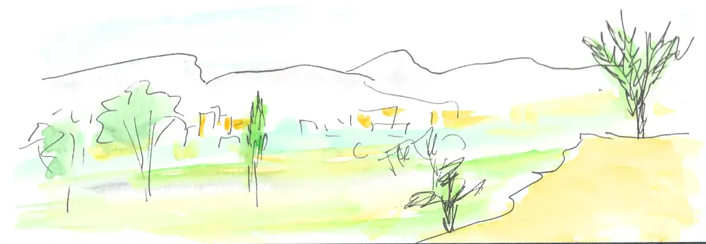

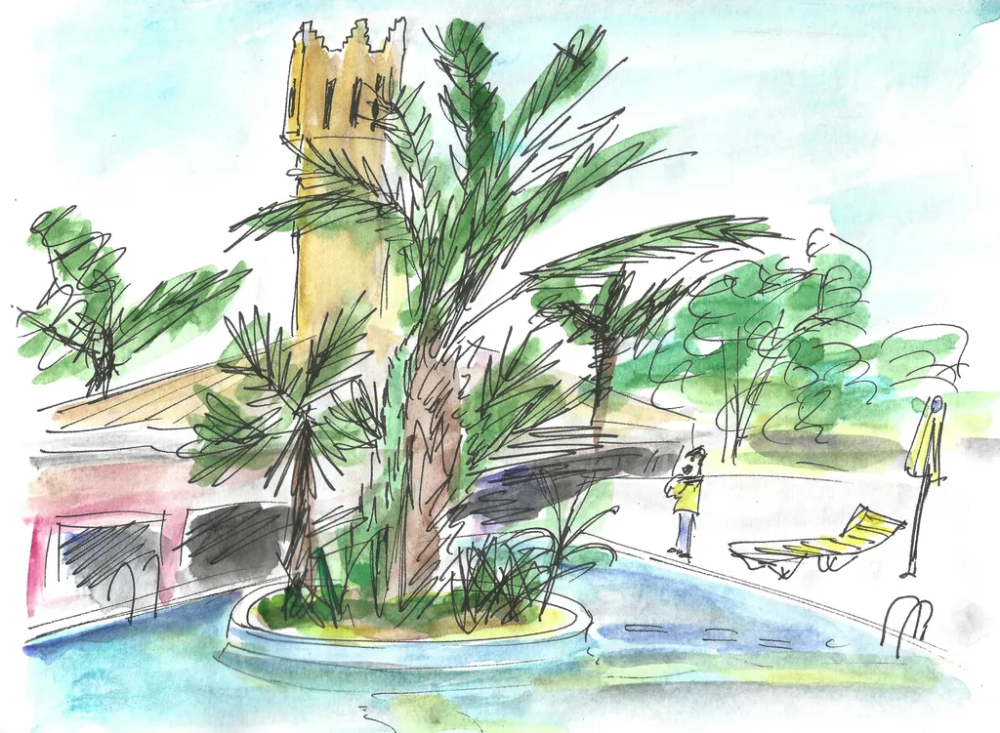

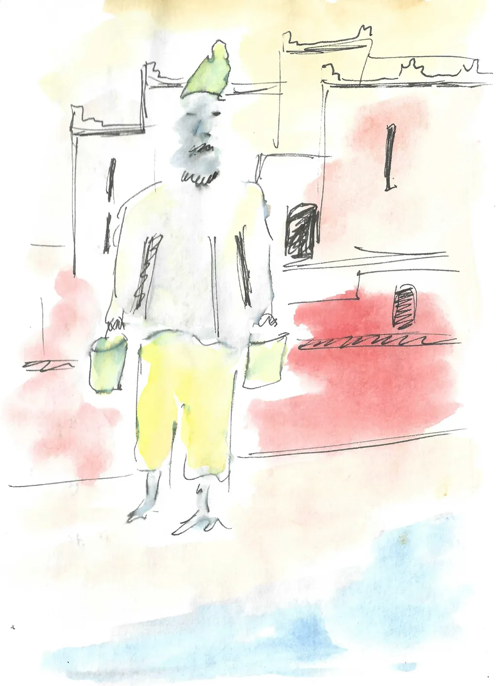

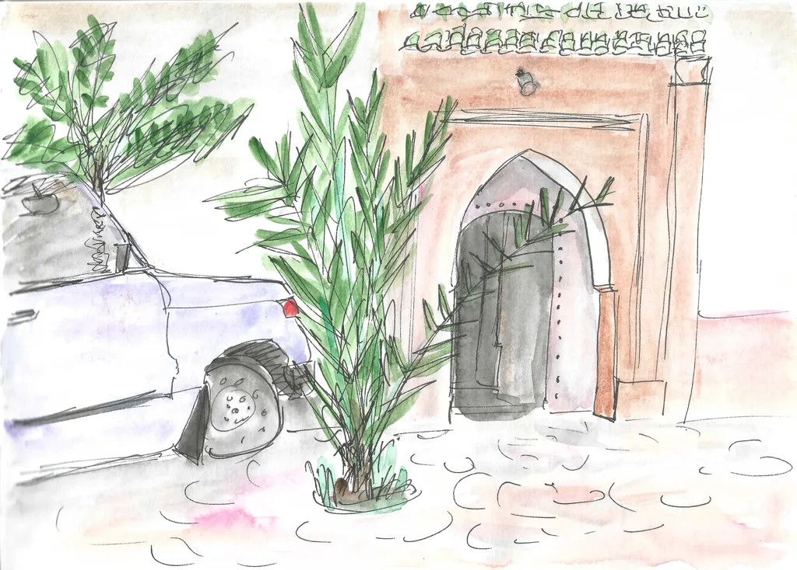

### Dimanche 7, Tinghir

Nous roulons dans une direction inconnue, sinon celle indiquée par la carte, à la recherche d’un lieu où nous poser et prendre le temps. Nous remontons les gorges du Dadès. Kasbahs de terre ocre, amandiers en fleur, odeurs enivrantes. Nous poursuivons la route jusqu’à dénicher l’[Hôtel Tombouctou](https://www.hoteltomboctou.com/hotel-tinghir/fr/) réservé à Tinghir. Un nid d’amour. Nous marchons jusqu’aux portes de la palmeraie. Des gamins nous arrêtent tous les dix mètres. C’est insupportable. Nous retournons à l’hôtel observer le coucher de soleil sur la palmeraie.

Jung : « Philémon, ainsi que d’autres personnages de mon imagination, m’apportèrent la connaissance décisive qu’il existe dans l’âme des choses qui ne sont pas faites pour le moi, mais qui se font d’elles-mêmes et qui ont une vie propre. Philémon représentait une force que je n’étais pas. »

L’inconscient comme machine à fabriquer des pensées. Je ne fabrique jamais rien. Je ne fais que prendre conscience des choses qui surgissent en moi (quand je lis, marche, discute, écris…). Le moi est purement jouissif. Il profite de la vie.

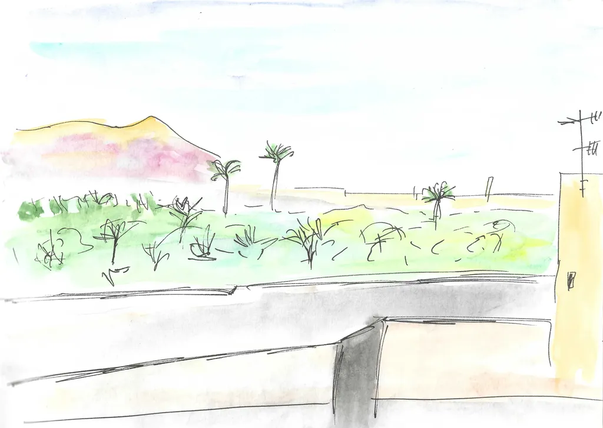

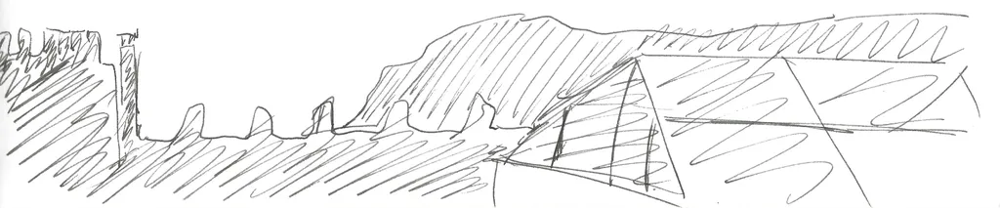

### Lundi 8, Tinghir

Nous prenons un guide pour explorer la palmeraie. Sa fonction : repousser les enfants. Nous suivons un ruisseau entre les parcelles où on cultive fève, menthe, orge, pomme de terre. Abricotiers et amandiers en fleur. Sublimes palmiers dattiers. Cueillette en automne. Figuiers argentés, encore dépourvus de feuilles.

Je dis : « Nous sommes au Paradis. » Le guide : « Il est ailleurs, mais je ne sais pas à quoi il ressemble. » Isabelle : « C’est toi et les tiens qui avez créé ce Paradis. Vous êtes Dieu. » Lui n’est pas d’accord. Il nous demande d’où viennent les hommes. Isabelle dit qu’elle l’ignore. J’invoque le hasard. Il me demande d’où vient le hasard. Moi : « Du hasard ! » Lui : « Alors le hasard, c’est Dieu. » On était tous les trois d’accord. J’ai évité de préciser que ce dieu n’est ni omniscient ni omnipotent.

---

Nous sommes notre propre fatalité.

---

Je pense à une chose, soudain à une autre : ce changement, quand je ne l’attribue pas à une cause extérieure, est attribuable à l’inconscient (soit tout mécanisme que je ne perçois pas). Jung ne dialoguait pas avec son inconscient mais avec ce qui en lui devenait conscient.

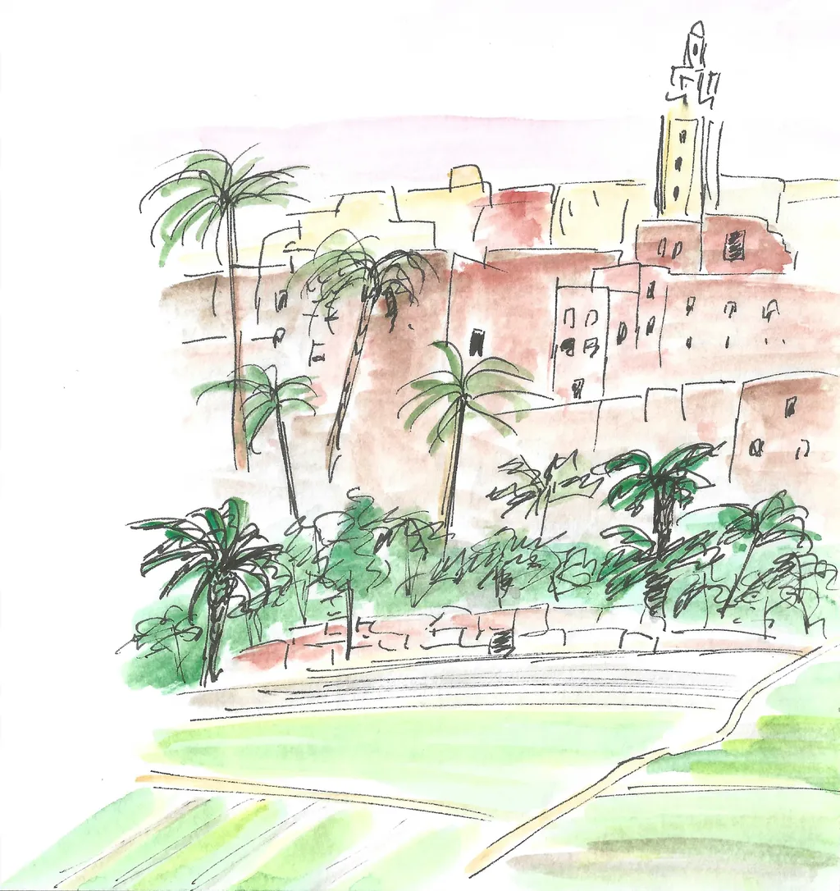

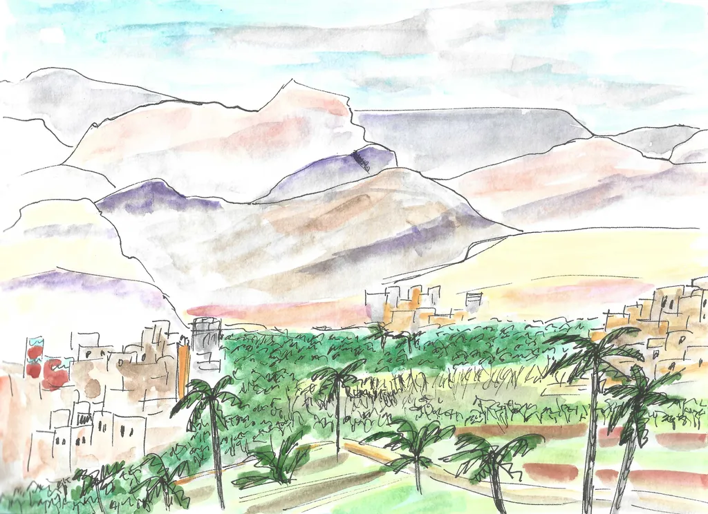

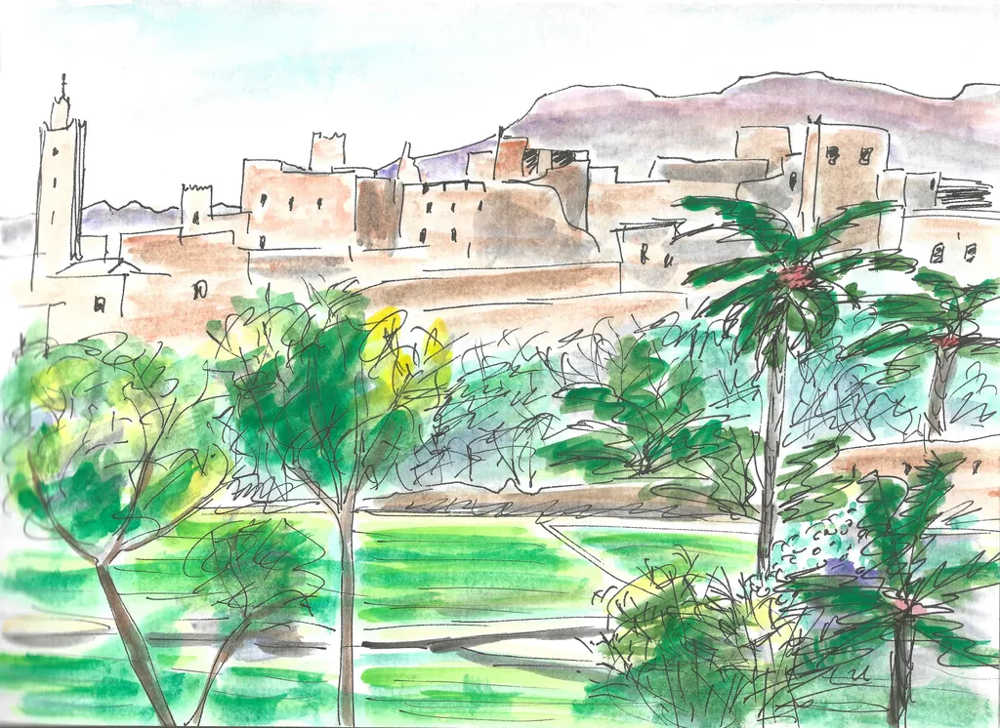

### Mardi 9, Tinghir

Comment les psychanalystes peuvent-ils croire explorer l’inconscient avec le conscient ? C’est comme si un voltmètre voulait mesurer une tension à l’intérieur de lui-même (ce que tente Jung). Il ne peut que mesurer la tension à l’intérieur d’un autre voltmètre. La conscience du psy peut-elle accéder à l’inconscient du patient ? Du mal à comprendre ce tour de magie. Je suis déjà incapable d’accéder à la conscience d’Isabelle, même si elle me donne à voir son beau sourire et sa passion.

---

Impression de rêver moins puissamment que par le passé, tandis qu’Isabelle me raconte ses rêves. Des rêves remplis d’aventures, qui pourraient faire des histoires. Hier, j’ai rêvé d’un garçon avec un sac à dos jaune comme celui que je portais pour aller au lycée. Nous faisons sans cesse l’amour et continuons à faire des rêves érotiques, comme si notre union se prolongeait durant le sommeil.

---

Je dessine nos pieds sous les draps, la fenêtre entrouverte devant nous. Isabelle adore ce dessin. Il résume notre bonheur.

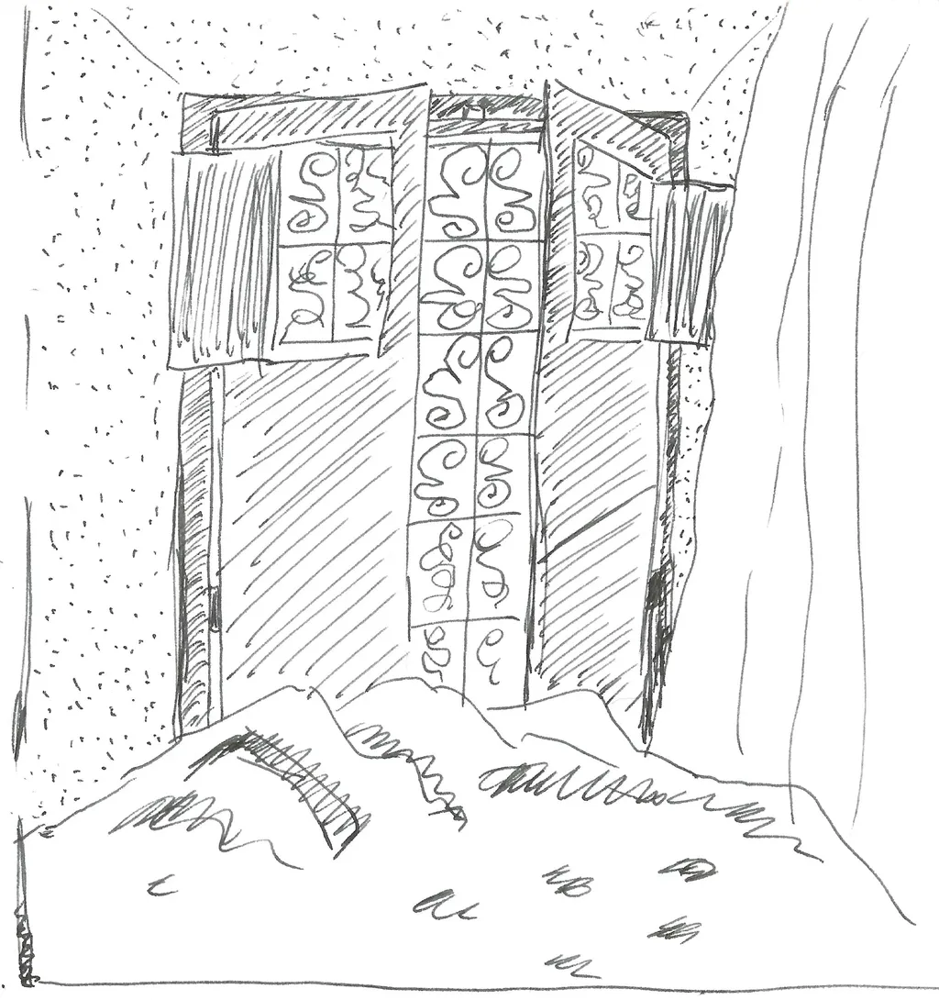

### Mardi 9, Erfoud

De faux guides tentent d’embarquer dans la voiture pour nous conduire à notre hôtel. De quoi nous dégoûter de revenir au Maroc. Pays magnifique gangréné par la pauvreté et l’illusion que les touristes sont des imbéciles vulnérables.

---

L’hôtel Derkaoua, une petite Kasbah tenue par Michel, un Français, ressemble à un fortin, un écrin de verdure entouré de murs pour le protéger du désert. Douceur de l’air, de la lumière, plaisir de sentir Isabelle près de moi. Échange de regards, chants des oiseaux, ouvriers au travail non loin, rumeurs de conversations, brise dans les palmes, eau immobile dans la piscine glacée, quelques insectes frissonnants, une bourrasque plus vive et le ciel d’un bleu immaculé. Une mouche court sur ma main pendant que j’écris. Des cendriers verts sur les tables vertes sous des parasols en rotin.

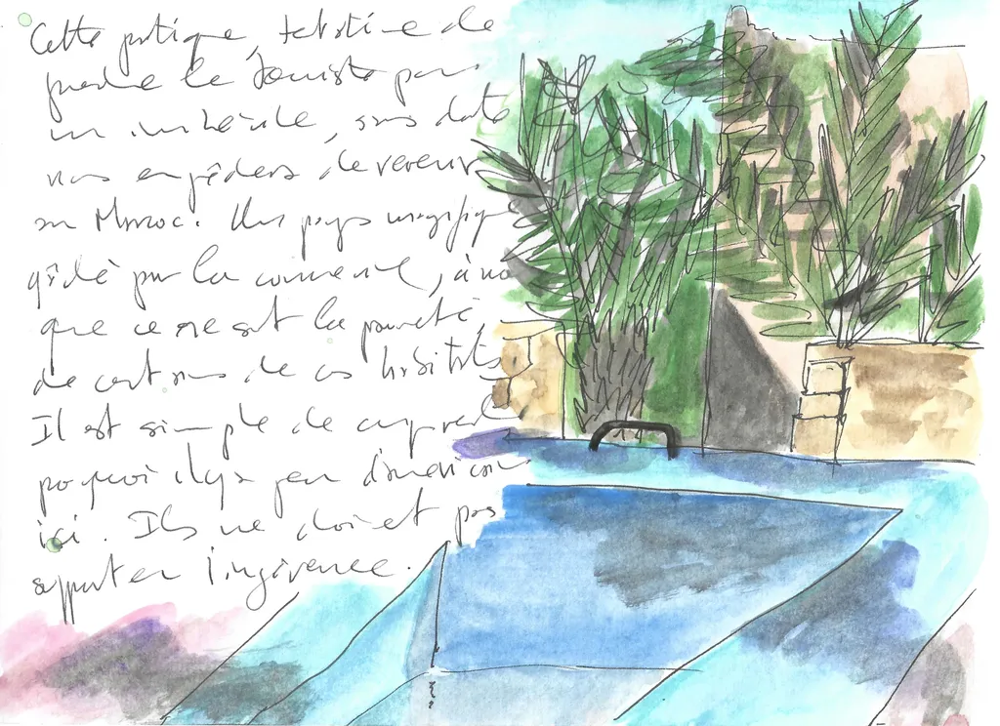

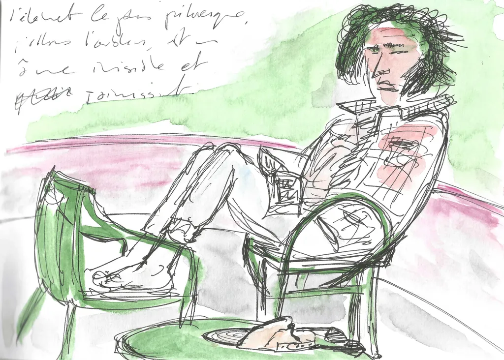

### Mercredi 10, Erfoud

Nous restons au sommet des dunes rouges de Merzouga jusqu’à la tombée de la nuit. Au retour, nous perdons la piste, roulons au jugé, sans être effrayés, mais de plus en plus persuadés que nous allons nous ensabler et passer la nuit à la belle étoile, puis nous tombons sur l’hôtel par surprise.

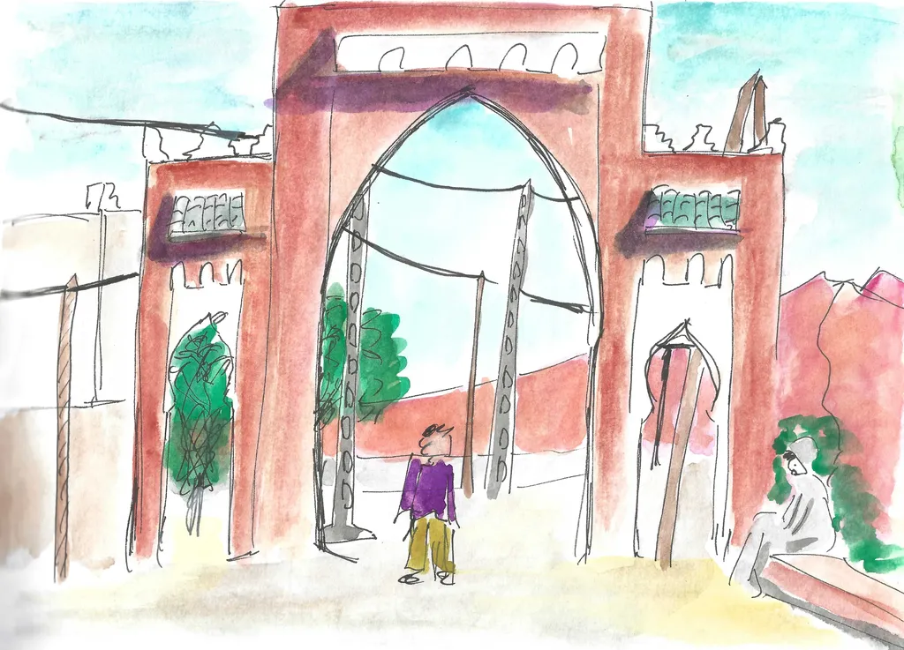

### Jeudi 11, Kasbah de Taroudant

Flânerie avant de reprendre la route vers Zagora. Je suis comblé, amoureux, repu. Je n’ai pas besoin de penser. Je pourrais reprendre sans fin la description esquissée mardi au bord de la piscine.

### Jeudi 11, Zagora

Le paradis est-il peuplé de démons ? Retournerons-nous au Maroc ?

---

Pourquoi aussi peu de mots durant ce voyage ? Parce que je suis amoureux, parce que les paysages sont merveilleux et que je ne trouve rien à leur ajouter, parce que j’ai peu lu, parce que nous nous amusons de nous-mêmes.

Je sens qu’une nouvelle époque de ma vie commence. Serai-je différent ? Moins ou plus écrivain ? J’aimerais compiler mes notes de voyage autour de la Méditerranée.

---

Regrets d’avoir quitté Erfoud et sa douceur. Quand on est bien quelque part, on ne devrait s’en aller sous aucun prétexte, surtout pas pour trouver mieux (il en va de même en amour). Nous sommes partis de chez Michel la peine au cœur. Il a fallu nous arracher des tonnelles ombragées. Notre hôtel plus moderne est moins charmant, mais la palmeraie est sublime, une fois les importuns distancés.

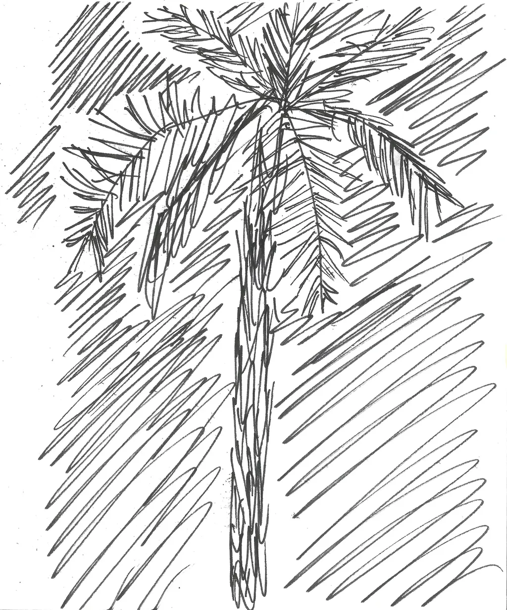

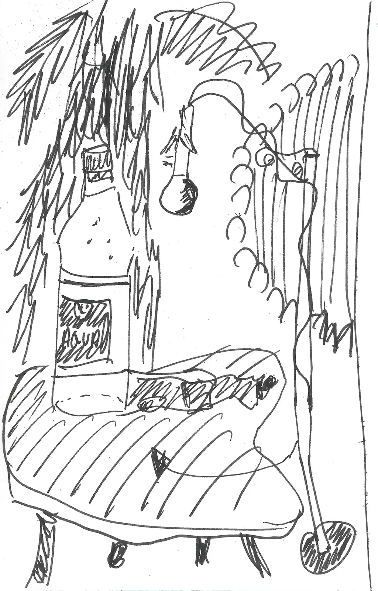

### Vendredi 12, Zagora

Dans la palmeraie, sensation de me retrouver dans une peinture romantique. Le romantisme est né dans les villes, à une époque où s’en éloigner était une aventure. La nature, lointaine, était alors idéalisée. Aujourd’hui, nous vivons le romantisme sans le théoriser. Il nous suffit de fuir la ville quelques heures.

---

En voyage, faire comme si on avait tout son temps, comme si le voyage ne faisait que commencer, et ne pas chercher à tout voir, ne pas se dire « c’est cette fois ou jamais ». De la différence entre voyage et tourisme. Je suis un voyageur de la vie, mais en voyage je cours le risque de me transformer en touriste. Le voyageur rêve, le touriste rentabilise. Isabelle et moi ne nous pressons pas. Nous pratiquons le voyage express : bien que touristes, nous sommes comme en voyage. Nous fuyons le tumulte des capitales pour le romantisme. Nous aspirons à la quiétude.

Voilà que je pense à ce que j’écris et je perds le fil de ce que je voulais écrire. Il ne me reste plus que l’écriture comme sujet d’écriture : une impasse littéraire déjà trop labourée.

Écrire un traité : *Voyager pressé*, où je montrerai que le voyage est un état d’esprit. Être à chaque instant un voyageur, donc un étranger. Ne jamais se sentir chez soi. Toujours regarder comme si on n’avait jamais vu.

Le vent s’est calmé, les palmes figées, l’eau immobile dans le ruisseau à l’ombre du mur de torchis : rouge, marron, rose, les couleurs du soleil.

Isabelle dort, elle savoure. C’est un bonheur de la voir près de moi, abandonnée, confiante. Il faudrait que cette vie jamais ne cesse. À nous deux de savoir nous y prendre, d’être aussi des voyageurs dans notre amour. Ne jamais nous laisser rattraper par le quotidien et en même temps ne jamais le fuir. Une dialectique difficile qui nous a échappé dans nos vies antérieures.

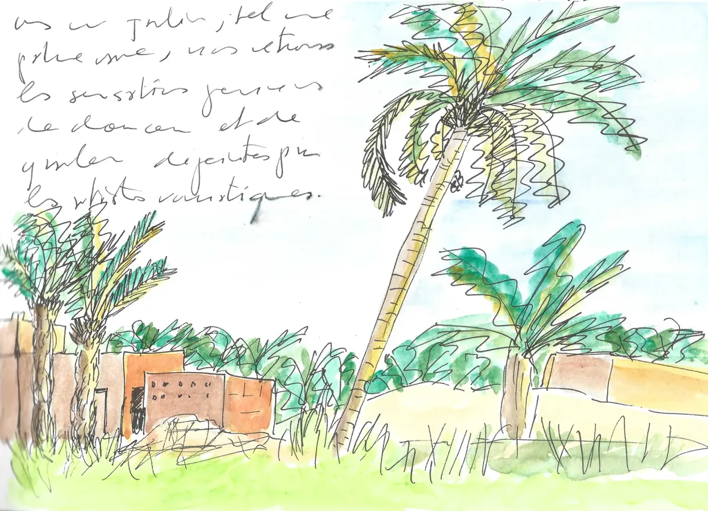

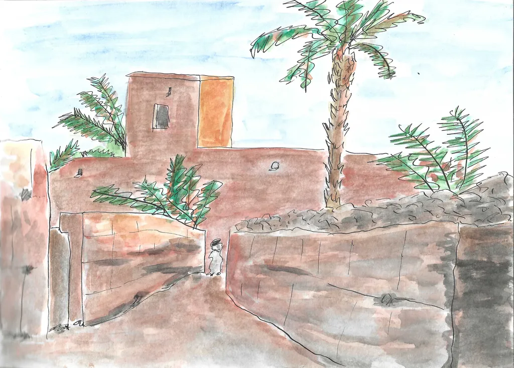

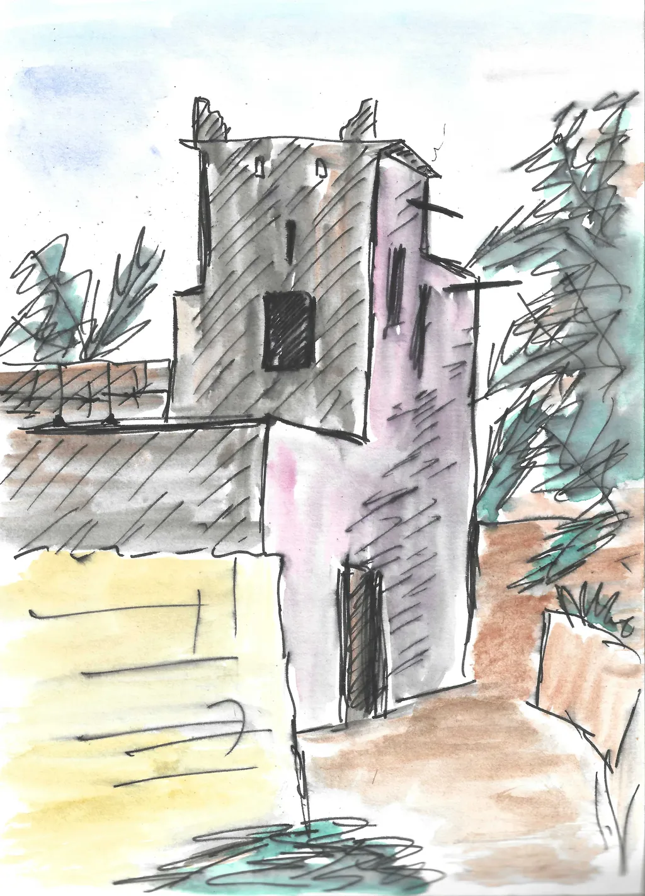

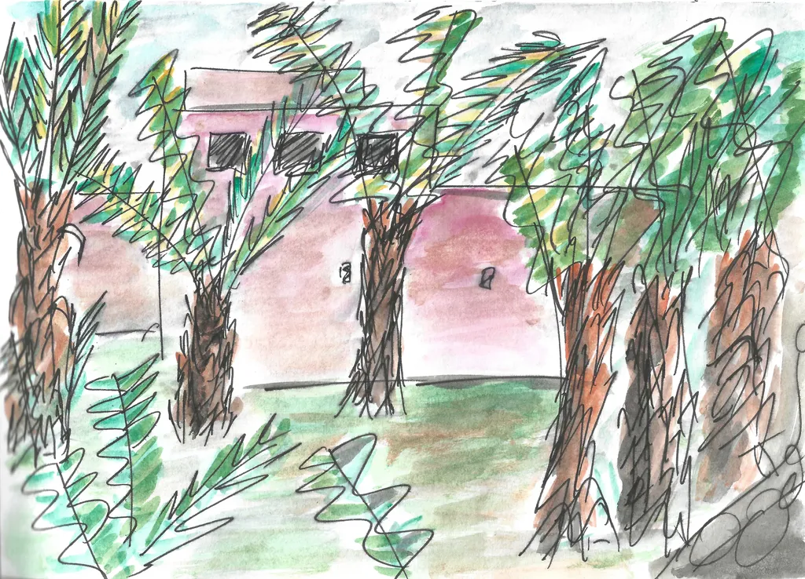

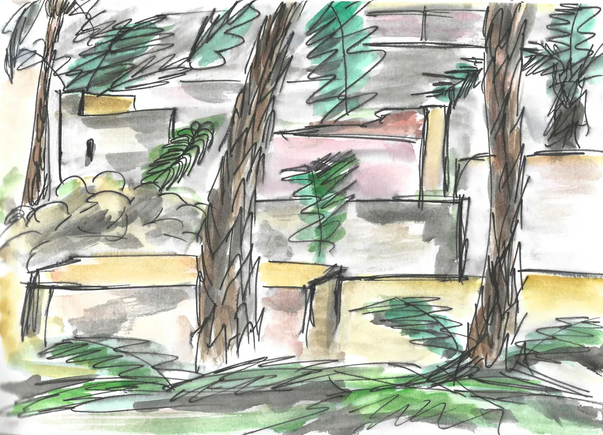

### Lundi 15, Paris

**De:** Isabelle

**À**: Thierry

**Sujet:** tu es injoignable!

:-)

Premièrement, une bonne nouvelle : demain je vais pouvoir bosser chez moi entre 2 RV, un tôt le matin, un « tard » le soir à Sèvres (tard, c’est de 17h à 19h). On se fait une pause sur le toit de la BN ? À quelle heure ?

Deuxièmement, une autre bonne nouvelle : il me reste 4 jours de congés (et non 5, mais je préfère prendre ça comme une bonne nouvelle quand même) à prendre avant le 30 mai. Portugal ou Sicile ?

xxx

### Mardi 17, Paris

Crédo des romantiques : « Réhabiliter l’art comme plus haute connaissance. » Je me vois comme postromantique. J’ignore ce que pourrait être la plus haute connaissance, mais je considère l’art comme une façon parmi d’autres — la science, par exemple — d’accéder à une forme de connaissance. Tenter l’approche objective et viser en même temps le fond des choses par la pratique artistique.

Je comprends le plaisir de John Constable devant les nuages ou de Carl Gustav Carus devant les montagnes. Dans leurs tableaux, je sens les forces physiques à l’œuvre. Contrairement à ce que croyaient les romantiques, le réalisme de la reproduction importe moins que le processus illustré. Les principes du monde agissent sur nous, que nous soyons réalistes ou non, habiles ou non, tant que nous nous abandonnons à la contemplation.

Dessiner est pour moi une forme de méditation. Mes yeux courent de place en place à la recherche de celle qui les arrête et les illumine. Quand le dessin commence, je me calme. Mes pensées vagabondent sans souffrance. Mon corps s’allège, s’efface parfois de ma conscience. Lire en extérieur me procure souvent les mêmes sensations. Mes yeux perçoivent le texte et son environnement, doublant la narration d’une autre histoire. Je m’approprie l’endroit. Il me semble le comprendre comme si j’y avais toujours vécu. Telle est ma pratique postromantique.

Je construis une vision du monde, somme de la vision physique et de la vision esthétique. Ces deux domaines de connaissance se complètent. Sans leur réunion le monde me reste inaccessible. Le bonheur m’échappe.

Plus je dispose d’instruments pour regarder, plus j’étends ma conscience. Outils : théories scientifiques, théories esthétiques, systèmes philosophiques, appareils technologiques (crayons, pinceaux, caméras…). Plus nous savons, mieux nous voyons. Ainsi, quand ma conscience s’intensifie, j’ai l’impression d’évoluer dans un monde enchanté.

Pour le postromantique, il ne s’agit pas tant de subvertir la science que de l’utiliser aux côtés d’autres outils. Il n’est pas question de construire des métathéories unificatrices, mais d’étendre son arsenal d’investigation. Cet arsenal reste fragmentaire et chacun se construit le sien. Leçon : toujours rechercher de nouveaux outils et les expérimenter pour accroître son arsenal.

Le but n’est pas de percer les secrets de la nature par le regard, mais d’inventer une nouvelle nature, de construire des mondes. La pratique postromantique n’est pas contemplative, elle s’accomplit dans le faire. La contemplation est un outil parmi d’autres, une façon de s’entraîner à l’observation.

### Jeudi 18 mars, Paris

Pour le romantique, la nature symbolise une réalité transcendante. Pour le postromantisme, elle dévoile les processus physiques mis en œuvre au cœur du monde.

Quelques caractéristiques du romantisme :

1/ Passion du Moyen Âge. Il était alors considéré comme une époque de ténèbres. Nous nous y intéressons toujours, mais pour les chefs-d’œuvre de l’art roman et gothique. Il est devenu une époque de lumière. *A posteriori* le passé se transforme par le regard rétrospectif.

2/ Abandon à l’inconscient et rêverie. Nous sommes plus réticents depuis la mode psychanalytique des années 1930 et les expériences hallucinogènes des années 1960. Je préfère poursuivre la pleine conscience. Elle me semble le but secret du romantisme, comme de toute forme d’art. La pleine conscience n’empêche pas l’abandon de la volonté.

3/ Communion avec la nature. De ce côté rien n’a changé. À force de vivre en ville, nous sommes étrangers à la campagne. Loin des murs, les sensations nous submergent et provoquent des extases presque érotiques. Il s’agit de se laisser pénétrer par les signaux naturels et non seulement culturels.

*Idée.* Mes réflexions sur le romantisme pourraient accompagner *Tourisme*. Le touriste doit être un romantique postmoderne s’il veut apprécier les régions qu’il découvre.

### Vendredi 19 mars, Paris

Autant la pensée romantique m’est agréable, autant je ne suis pas toujours à l’aise devant les peintures romantiques. Elles exagèrent les sentiments, leur cherchent des significations alors que je veux simplement éprouver.

### Lundi 22 mars, Paris

Finalement, nous réservons des billets TGV pour aller dans le Lot-et-Garonne, à Maillardou, la maison de famille et de cœur d’Isabelle.

### Vendredi 26, Paris

Je mène une vie mesquine, pas plus de deux heures quotidiennes consacrées à la littérature. Le reste du temps, je m’échine sur un nouveau livre de vulgarisation et passe un peu de temps avec Isabelle. Nous nous installons dans une routine confortable, notre amour déjà chorégraphié.

Faute de dangers, nous nous sentons moins vivre. Comme je ne lis pas et ne sors presque pas, je n’ai pas la moindre idée. Flaubert est mon seul compagnon. Avec ses lettres, il m’invective. Est-ce que je lui ressemble ou à son ami Bouillet, qui renonce, baisse les bras ?

L’homme de génie est souvent insupportable pour ses contemporains, mais on peut être insupportable et n’avoir aucun génie.

Isabelle est la première à me dire qu’elle ne comprend rien à ce que j’écris, et comme elle est la personne la plus intelligente que j’aie jamais rencontrée, je suis bien obligé de prendre en compte ses critiques. Avec une nouvelle femme, ma vie littéraire ne peut que prendre une nouvelle tournure.

Nous ne devrions pas nous voir quand nous sommes fatigués. Nous devrions nous réserver pour les apothéoses. Foutaises. Nous avons besoin l’un de l’autre. J’ai besoin d’elle pour me remettre au travail. Je devine une richesse nouvelle à explorer. Je sens une matière plus romanesque que le romanesque. Pas de mensonges.

### Lundi 29, Paris

Temps sublime. Isabelle a placé un bouquet de pâquerettes sur le balcon. Le blanc et le jaune des fleurs contrastent sur le gris des bâtiments.

---

Constable, 1832 : « Mon art limité et particulier se trouve au pied de chaque haie et dans chaque chemin de campagne, là où, par conséquent, personne ne pense à le ramasser. » Texte qui marque la fracture entre le néoclassicisme et le romantisme : il ne s’agit plus de peindre le général, mais le particulier et l’insignifiant. Nous n’avons toujours pas d’autres ambitions. Tout le monde s’intéresse au particulier, tout le monde fouille les poubelles. Reste à voir ce que personne ne voit encore. Comment peindre l’air limpide d’une journée de printemps ? Dans une époque de surconsommation et de vitesse éperdue, le chef-d’œuvre doit reconquérir le temps long.

Qu’a de particulier mon art du carnet ? Je tente constamment de généraliser. J’englobe le déjà-vu dans un tableau toujours plus vaste, morceau par morceau. Ce projet classique reste actuel parce que j’en sais l’impossibilité. Je ne peux que laisser mes textes en chantier. Des débuts jamais avancés. Puis reprendre, recommencer, sur un rythme rock. Revenir en un lieu, en répéter la description sous une nouvelle lumière, essayant de mieux voir et mieux sentir l’écoulement des choses qui basculent d’un état à un autre.

L’amour lui-même devient un sujet d’observation et d’inquiétude. J’aime et me regarde aimer, avec admiration, parfois avec angoisse à l’idée des souffrances que nous pourrions nous infliger. Lors de ma première grande histoire, je ne pensais à rien de tout ça. Maintenant je sais, et je savoure ma chance du moment.

Nous sommes conscients d’être amoureux. Nous ne nous contentons pas d’éprouver l’amour, nous le qualifions, l’analysons. Est-ce encore de l’amour ou une histoire que nous nous racontons ?

J’aspirais à une nouvelle vie débridée, exotique, fantasmatique. Et je suis revenu à la douceur d’une intimité profonde, parce que je n’aspire à rien d’autre. J’ai joué quelques semaines à l’aventurier sans en tirer la moindre satisfaction. Vivre en couple, durer, grandir l’un avec l’autre, c’est du grand art.

J’observe Isabelle endormie près de moi, déjà avec tendresse, désireux de la protéger, conscient que je pourrais la blesser avec mes erreurs passées. Reste cette idée sournoise que tout va trop vite entre nous, que je m’engage trop vite, comme si j’avais besoin de connaître d’autres femmes avant d’être sûr qu’Isabelle est la bonne pour le restant de mes jours.

---

L’artiste travaille avant tout pour lui-même, pour son propre épanouissement. Ses œuvres témoignent de son histoire, cailloux semés pour guider d’autres humains sur la route. Artiste et spectateur se confondent dans leur pérégrination. L’artiste est un guide.

Je ne cherche plus à produire des œuvres. Il ne m’arrive que des bribes au fil de mon exploration. Pourquoi alors mettre en page mes textes, les donner à lire ? Parce que le lecteur peut m’aider à objectiver mes expériences subjectives. Mais comment pourrait-il apprécier des textes non pensés pour lui ?

### Mardi 30, Paris

Il n’est pas question pour moi de peindre le beau ou le grand, ou quoi que ce soit, mais de prendre plaisir quand je peins, c’est-à-dire de prendre conscience : la conscience me procure du plaisir. Le spectateur n’a pas à aimer ou non mes dessins, je ne les lui destine pas.

Nous ne pouvons nous empêcher de poursuivre le sublime, même si nos sublimes sont relatifs. Reste que nous cherchons toujours à produire du « grand », même dans l’insignifiant.

Les anciens voulaient dire la grandeur de Dieu, les classiques rêvaient de la grandeur de l’humanité à travers les peintures historiques, les romantiques poursuivaient le même objectif en peignant la nature, les modernes célèbrent le génie humain, des génies particuliers. Quelles grandeurs nous reste-t-il à élever plus haut ? Celle de la conscience ? Dixit les expériences psychédéliques des années 1960.

Créer des œuvres pour étendre la conscience (et non pas l’altérer). Mais de tout temps les œuvres ont étendu la conscience (souvent en la manipulant comme une drogue). Elles avaient aussi des ambitions : raconter des histoires, porter des idées ou des symboles. L’œuvre d’aujourd’hui est grande si elle nous ouvre les yeux. Sorte d’amplificateur cérébral. Alors la conscience éveillée a le pouvoir de saisir des histoires dans le monde autour d’elle.

Je décris mon époque comme si je n’y vivais déjà plus. En même temps, je tente de définir mon programme esthétique. Comment on nous décrira plus tard ? Illusion du progrès, degré zéro de la communication, enfermement… tout ça déjà à l’ordre du jour au XIXe siècle.

J’aimerais cesser de critiquer, et seulement donner à percevoir. La vie n’est pas une prison, mais un enchantement. Qu’importent les souffrances quand elles préparent les bonheurs suivants ?

Optimisme, hédonisme, joie ont peu de rapport avec les modes du temps : violence, répression, agitation. Dans ce bordel, je passe des heures à discuter avec Isabelle plutôt que de participer aux soirées à la mode, où on nous invite encore, surtout Isabelle.

Constable voulait démontrer la supériorité du paysage sur les aux autres genres. Les jeunes croient que la musique de leur génération est la plus sublime. Pourquoi se vouloir plus grand ? L’orgueil ?

Je ne sais plus ce que je veux créer. Je ne sais plus quelle est ma pratique : je la vois dans les interstices. Des notes pour conscientiser, pour provoquer des décharges mentales.

Quand j’écrivais des romans, je voulais rivaliser avec les génies passés. Le carnet est expérience d’écriture, expérience de lecture. C’est une forme d’art non compétitive. Je prends ce qui vient. Je ne peux que vivre de façon à créer de l’inattendu et provoquer des phrases nouvelles. Capter la source au plus près de son jaillissement. Révéler les secrets du monde par d’autres outils que ceux de la science. Ma méthode n’est pas réfléchie, elle me satisfait. Je suis une machine à percevoir, une machine faite pour l’amour.

---

*Note (18/3/2026) : Je ne cessais de parler du jaillissement qui deviendra le thème central de* Rush *un quart de siècle plus tard. Tout change pour que rien ne change.*

---

Nous sommes des récepteurs d’informations. Nous fabriquons le monde dans lequel nous vivons. Nous fabriquons la laideur comme la beauté.

---

Le mystique converse avec ce qui n’existe pas encore et reste à inventer. Il ajoute à la nature.

---

**De:** Isabelle

**À:** Thierry

**Sujet:** Maillardou

Il paraît qu’il grêlait samedi dernier à Maillardou…

---

**De**: Thierry

**À:** Isabelle

**Sujet:** RE: Maillardou

Alors on fera des bisous, des bisous et encore des bisous…

### Mercredi 31, Paris

Temps sublime. L’année dernière, en Bretagne, le même jour, il faisait tout aussi beau. Clin d’œil à travers les pages de mes carnets.

---

Au XIXe et au début du XXe, les artistes menaient encore des combats, comme abolir les classifications héritées des classiques. Quels sont nos combats ? Je n’en perçois guère dans les arts médiatisés. Et moi ? Je peste dès que j’entends prononcer le mot « roman » comme s’il n’y avait pas d’autre issue littéraire.

Au Salon du livre, un auteur me dit : « J’ai tout de même publié un roman », comme pour me prouver qu’il a du talent. On se lance dans le roman sans se poser de question, comme s’il n’existait pas d’échappatoire. C’est la forme la plus codifiée, en même temps la plus fourre-tout. Il nous faut tout faire péter : trouver des formes neuves.

Je lis *Small World* de Martin Suter comme je regarderais une émission TV, une fois épuisé après une journée de travail. Ça marche, mais quel ennui. Le roman est un genre endormi, étriqué, peut-être épuisé.

---

Je classe mon passé littéraire, mes échecs romanesques, me prépare à une nouvelle vie, qui ne sera possible qu’une fois le passé soldé.

*Note (18/3/2026) : Impression de répéter le même travail sur le passé en mettant à jour mes carnets de 1999. Avec la mort d’Isa, il y a quelque chose de plus définitif. Et je repense à l’écrivain du Salon du livre, devenu par la suite un ami très proche, [Alain Gilles Minella](https://fr.wikipedia.org/wiki/Alain-Gilles_Minella), lui aussi mort beaucoup trop jeune d’un cancer foudroyant.*

#carnets #y1999 #1999-03-31-20h00
