# Avril 1999
Ma première visite à Maillardou

### Jeudi 1er, Paris

La beauté d’Isa n’est pas tant dans son corps que dans ses méandres intérieurs. Ils m’attirent et il m’arrive néanmoins de trouver d’absurdes défauts physiques. Trop d’images stéréotypées dans ma tête. Besoin de tout désapprendre pour réapprendre la beauté pure, non trafiquée, la beauté du cœur. Il paraît que l’amour charnel use les corps. Isabelle m’a dit : « Si tu veux une poupée, trouve-toi une autre femme. Tu feras bonne figure en société. Moi, je serai la vraie femme. »

Se jurer de tout se dire est une utopie. Il y a des choses dont on ne peut pas parler comme l’a relevé Wittgenstein, des choses sur lesquelles on ne peut même pas agir. Comment dire je n’aime pas ça ou ça de toi ? C’est monstrueux. Bien plus intéressant de parler du sublime. Je t’aime toi, qui parles, souris, penses à la vitesse de la lumière. Tu es plus belle que toutes celles dont j’aurais pu rêver, car tu dépasses les rêves. Tu étais inimaginable parce que c’est toi et toi seule.

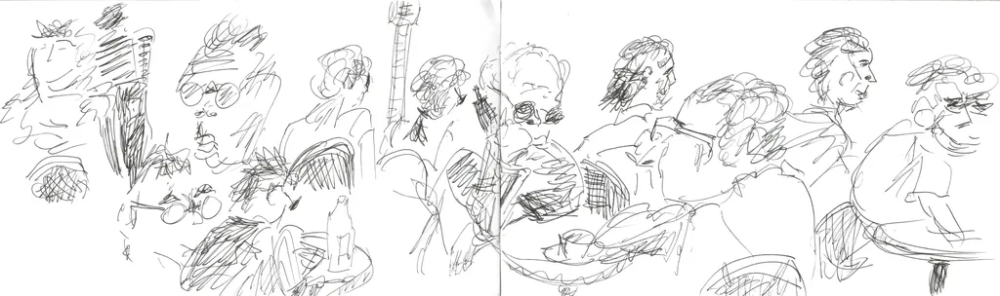

### Vendredi 2, Maillardou

Hamlet : « Il y a plus de choses au ciel que sur la Terre. » Voilà ce que supposaient les romantiques. Ils ne parlaient bien sûr pas du ciel astronomique, mais du ciel divin. Je ne vois de choses qu’en nous, qu’entre nous ou dans nos œuvres.

### Samedi 3, Maillardou

Isabelle lit *De toujours à jamais* et y découvre des incohérences quand on se place du point de vue des personnages. Quand l’un d’eux ferme les yeux, Isabelle me dit que la description ne peut plus être visuelle, alors que pour moi c’est l’écrivain qui voit, pas ses personnages.

J’ai toujours en ligne de mire le mensonge romanesque. Je ne cherche pas à être réaliste. Mais je comprends que ça puisse emmerder un lecteur. Tout ça ne me donne pas envie de revenir au roman. Quand j’écris ici, tout est vraisemblable, vécu dans l’instant, même mes pensées défectueuses. Isabelle me démontre l’échec de mon vieux projet romanesque, puisque d’un côté je voulais écrire un roman réaliste, de l’autre le roman du roman, c’est-à-dire raconter son écriture.

---

Je m’intéresse aux choses plus qu’aux gens.

---

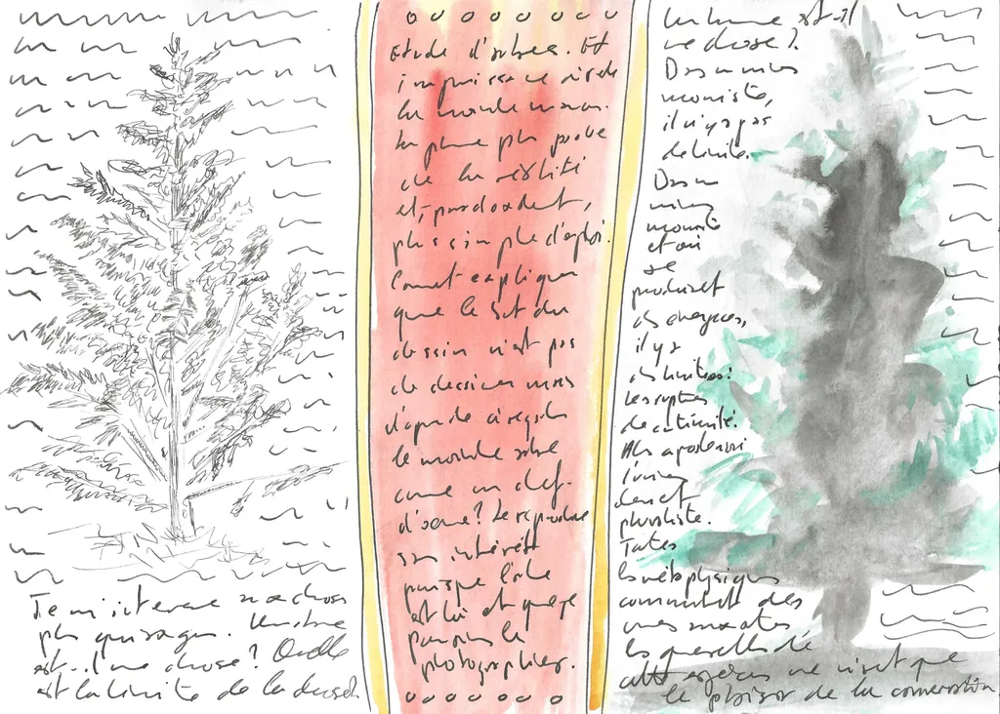

Le but du dessin n’est pas de représenter mais d’apprendre à regarder le moindre arbre comme un chef-d’œuvre. Le reproduire avec fidélité n’est pas une obligation, puisque je peux le photographier.

---

Toutes les métaphysiques sont convertibles les unes aux autres. Le pluralisme intègre le monisme qui lui-même peut se diviser en pluralisme.

---

Le XXe siècle aura découvert que la question « un arbre est-il une chose ? » n’a aucun intérêt. Qu’est-ce qu’une chose ? La réponse ne peut être que relative à une scolastique.

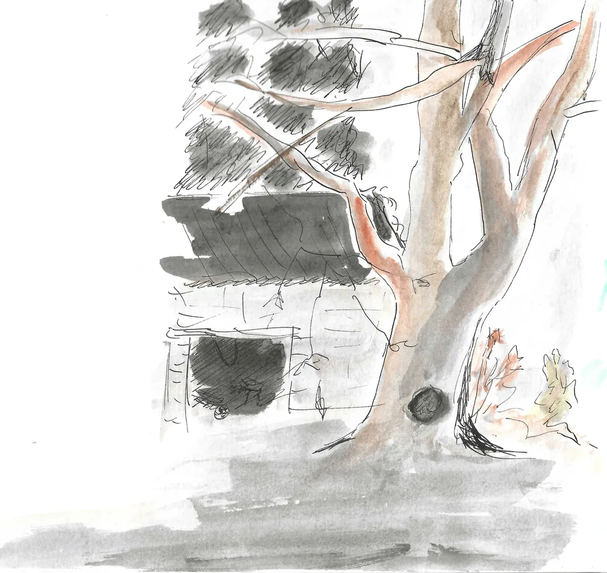

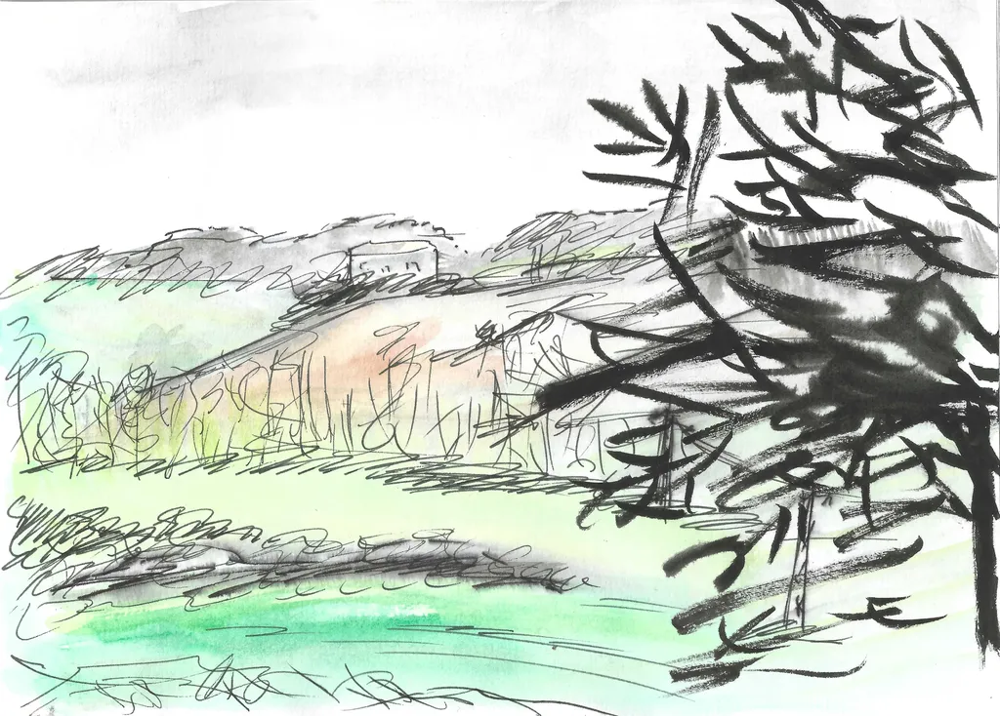

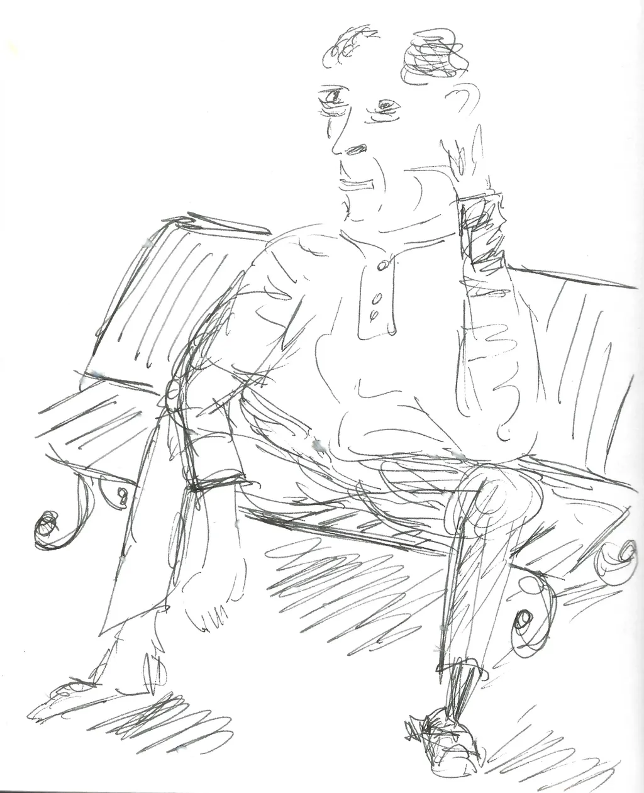

### Dimanche 4, Maillardou

La limite entre les choses n’existe peut-être qu’à cause du mot chose qui, pour exister, doit avoir une définition. Mais je vois bien une limite entre l’arbre et l’air. Dans une chose, comme l’air ou la planète, des choses peuvent émerger qui se détachent avec une identité propre.

---

Isabelle me fait visiter Monpazier, une bastide entourée de jardins. Je pense à Bologne, Ferrare, visitées comme en rêve en une après-midi. Je rêve aujourd’hui encore. La douceur du printemps et mon bonheur n’exigent aucune explication.

Le bonheur et les mots : le bien heureux a-t-il besoin d’écrire ? L’écriture ne me détourne-t-elle pas du bonheur, d’Isabelle, qui lit près de moi pendant que je dessine et que j’écris ?

Le bonheur est-il possible durant une hyperconscience ? Un hyperbonheur ? L’hyperconscience s’achève par un retour à la conscience ordinaire et l’hyperbonheur redevient bonheur, ce qui est déjà extraordinaire. Et demain tout changera.

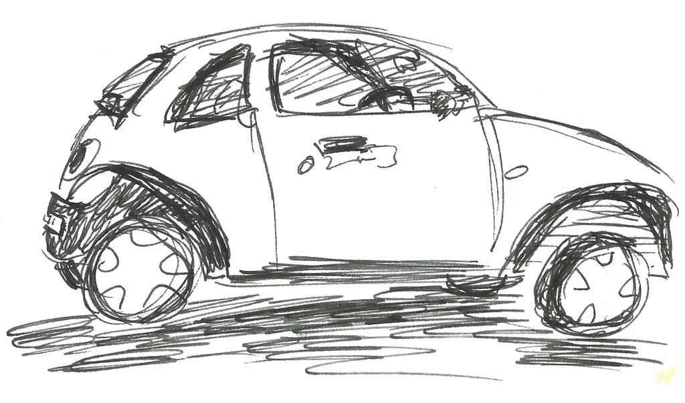

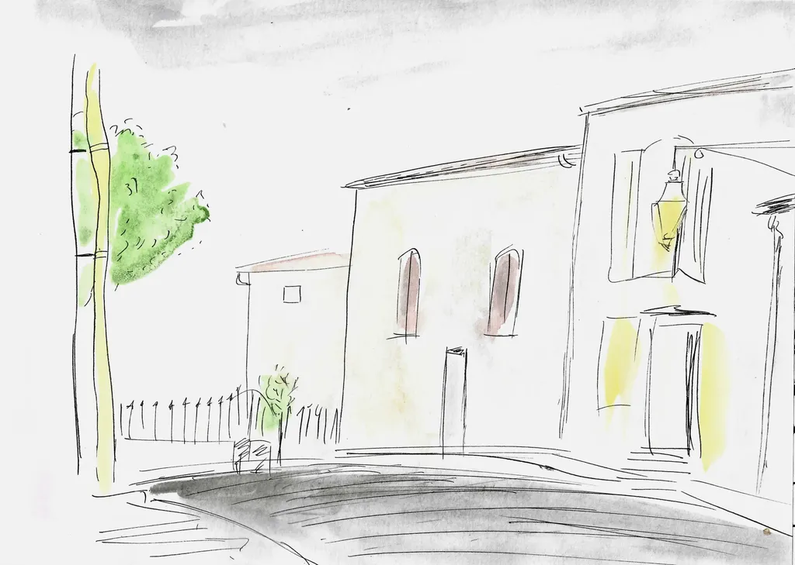

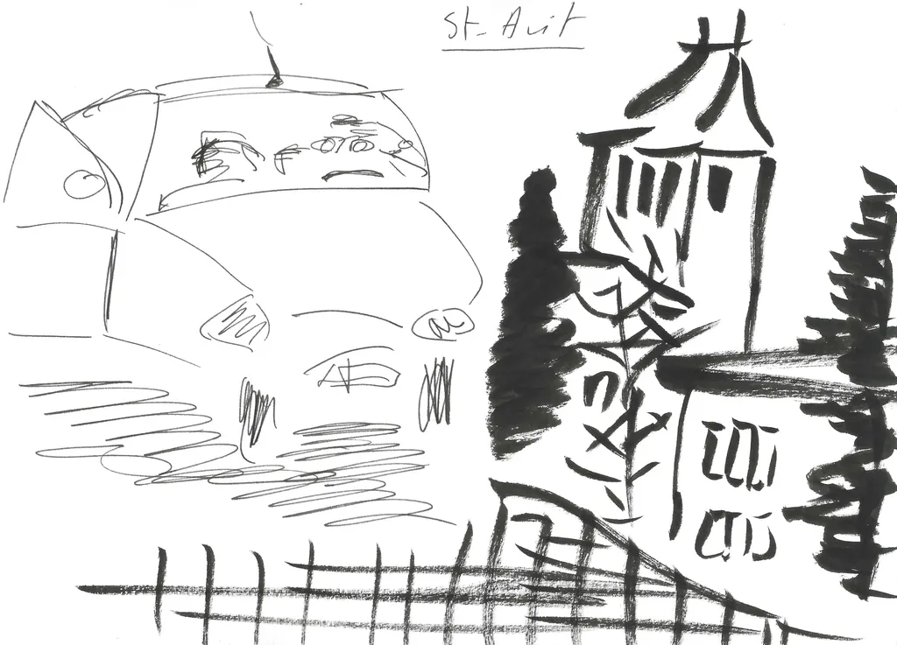

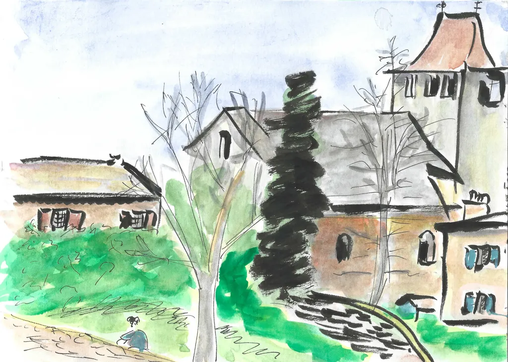

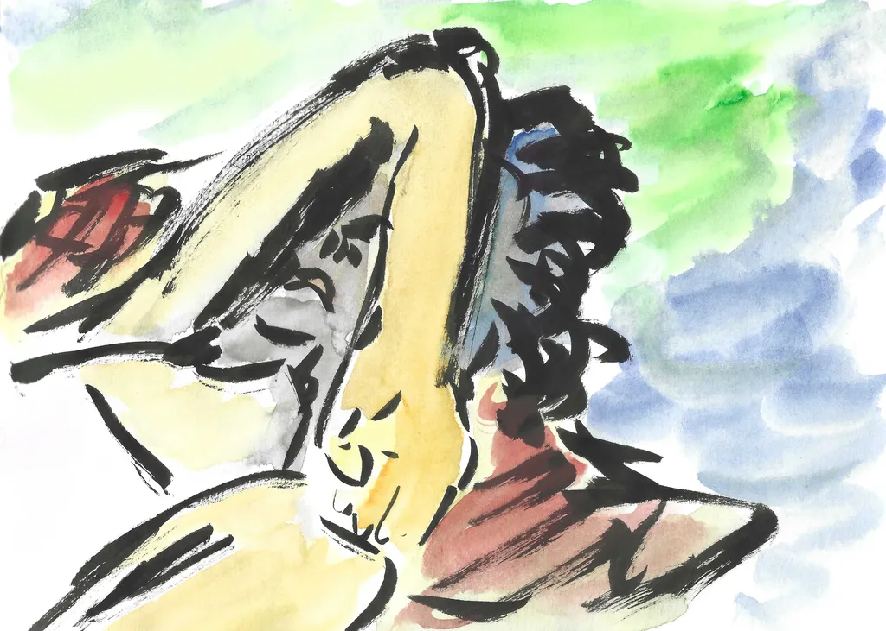

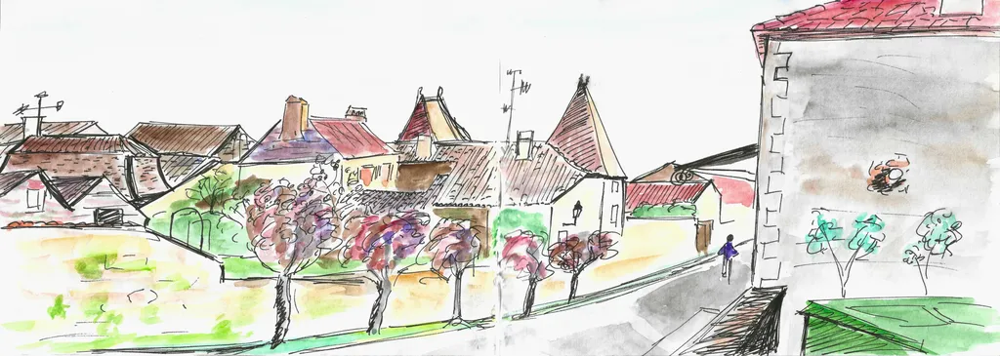

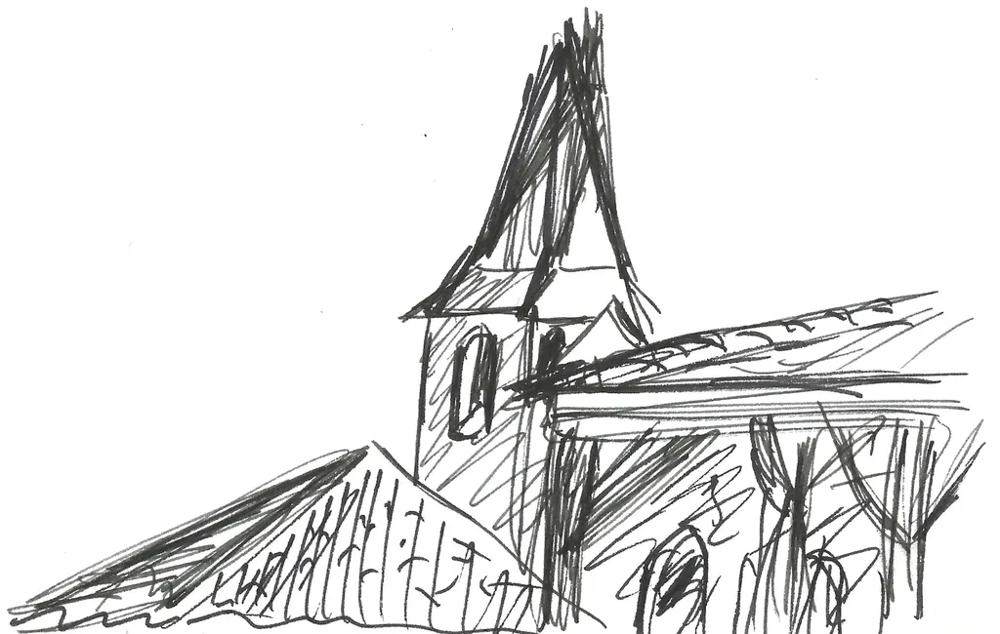

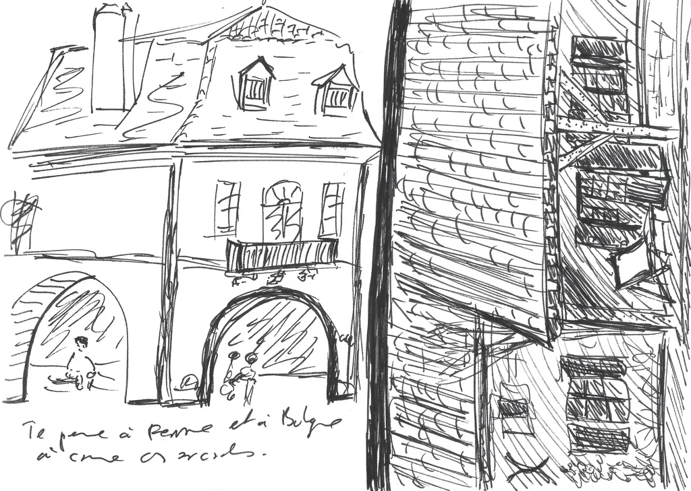

*Note (6/4/2026) : ces dessins me rappellent cet après-midi sublime. Nous étions côte à côte, ensemble, en communion. Isa lisait, me parlait de ce qu’elle lisait, me regardait dessiner, commenter. Nous étions en train de découvrir la symbiose coopérative de la suite de nos vies.*

### Lundi 5, Maillardou

Pourquoi rêver sa vie avant de la vivre ? Se rêver riche, aventurier, champion, artiste… aide peut-être à le devenir. Sans rêve, il ne m’arriverait rien. Mais que m’arrive-t-il ? Un amour ! Le hasard seul ne suffit pas. Il faut apprendre à le diriger, à lui donner sa chance.

Un homme sans rêve qui gagne une fortune ne peut que s’ennuyer de sa fortune. Le rêveur ne joue pas au loto, il joue sa vie, il la risque. Alors risquer l’amour pour ne pas le transformer en prison.

---

C’est déjà l’été, même si les chênes restent imberbes. Un vent frais balaie les prairies. Les oiseaux chantent et les mouches bourdonnent. En bas du vallon, sur la route invisible, on entend parfois une voiture. Un coq en plein jet lag s’abandonne à quelques vocalises. Le soleil nous éclabousse. Le clocher de Montagnac sonne onze heures.

L’énumération est-elle la seule façon de décrire le délectable sur le vif ? Juxtaposer des impressions et des images pour que le lecteur réédifie en lui. Et le clocher répète onze heures, au cas où nous aurions mal compté ses coups.

Apollinaire a tenté de peindre avec des mots agencés sur la page. Des énumérations en 2D plutôt que classiquement linéaires.

### Mercredi 7, Paris

Que pensait Louise Colet au moment de la publication de *Bovary*. Que devenait cette femme si précieuse à l’élaboration du roman ? Elle devait être fort triste et commandita peut-être quelques-unes des cabales contre Flaubert. Les personnes aimées nous deviennent étrangères une fois la passion amoureuse dépassée. On ne partage que sa propre réussite. Le succès des amis, tout au plus, nous réjouit. Flaubert était seul.

---

Je lis quelques pages du journal de voyage de M au Mexique. Style télégraphique, zapping textuel, trop vite expédié. Je lui suggère d’épurer et de mettre en évidence les dessins, le texte devenant une illustration comme en BD. Son enthousiasme me rappelle le mien il y a dix ans. M devrait redoubler d’efforts pour prendre conscience de la littérarité.

### Vendredi 9, Paris

De: Thierry

À: Isabelle

Sujet: Le smiley juste!

Voici un petit bisou

:-x

En voici un gros

:-X

---

De: Isabelle

À: Thierry

Sujet: RE: Le smiley juste!

xxxxxxxxxxxxxxxxxxxxxxxxxxxxxxxxxxxxxxxxxxxxxxxxxxxxxx

### Samedi 10, Paris

Film : [*Trois ponts sur une rivière*](https://fr.wikipedia.org/wiki/Trois_Ponts_sur_la_rivi%C3%A8re). Ce n’est pas un chef-d’œuvre, loin de là, mais fait avec l’intention de l’être, c’est déjà ça. Deviner cette intention me rend heureux, me donne de la force pour mes recherches. Nous voulons aller plus loin, sans rabâcher les formes éculées, nous essayons de trouver la nôtre, ce qui explique l’imperfection et l’inachèvement.

Voilà où nous conduit le rejet des écoles : nous sommes seuls. La plupart des spectateurs préfèrent un film réussi à un film qui cherche à inventer. Je préfère l’échec de celui qui a pris des risques. Pourquoi raconter une histoire déjà connue ? Nous devons essayer de parler de ce qui nous échappe. On ne sait pas comment ça commence ou finit. On le vit tout simplement.

Hier, nous voyons *Paris nous appartient* de Rivette. Là aussi il était question de ce qui ne peut se dire, de façon trop didactique peut-être.

### Lundi 12, Paris

Passé l’après-midi à colorier de multiples fois ma vue panoramique de Monpazier. Une possibilité nouvelle offerte au peintre : il peut se repentir et découvre la littérarité picturale. Grâce à la retouche d’image, la peinture entre dans la temporalité.

Au XIXe siècle, le roman était plus théâtral, ou plus proche du jeu de rôle. On le lisait à voix haute devant ses amis, c’était l’occasion de bonnes soirées. C’est aujourd’hui impensable. On va au cinéma ou regarde la télé. On manque de patience. Nous sommes saturés d’histoires.

Demain, on m’arrache mes deux dernières dents de sagesse. Est-ce la fin de ma jeunesse ? Je repense à ma dernière entrevue avec P. Conversation stérile dans une brasserie du VIIe, un jour d’automne 1998. Nous ne nous reverrons peut-être plus. Est-ce ainsi la vie ? Une autre histoire commence. Aurons-nous après la force de nous retrouver face à face ?

La dernière lettre de Louise Colet à Flaubert, ma dernière rencontre avec P, mon dernier mot. Depuis le futur, une vie n’est qu’une succession de dernières fois.

*Note (7/4/2026) : la dernière fois où j’ai parlé à Isa, la dernière fois où je l’ai prise dans mes bras… Je ne m’étais pas préparé à cette dernière fois, on ne se prépare jamais aux dernière fois, sinon la vie serait infernale. Alors je rêve de nouvelles premières fois.*

### Mardi 13, Paris

Dans deux heures, je me fais charcuter les dents. Les deux monceaux de moi-même en moins altéreront-ils ma conscience ? La douleur le fera plus certainement. Quelle autre transformation plus intime surviendra ? Mes dents stimulaient peut-être mon cerveau.

Peu à peu les tables du café se remplissent. Les garçons vont et viennent. Une jeune fille téléphone sur un air de musique. Je suis épuisé de décrire, de percevoir, j’accumule des sensations au point d’exploser, j’ai besoin de dormir, de me fabriquer un autre regard.

---

Me voilà chez le dentiste à attendre la douleur. Déjeuner avec Claire. Elle a lu *Décalage*. Elle a bien aimé même si elle pense qu’il manque une fin. Je pourrais ajouter tant de notes écrites depuis 1995. *Décalage* est un roman devenu réalité. Un roman prémonitoire de la douleur affective. Deux interprétations : j’ai approché d’un universel ou je n’ai fait que deviner l’inévitable.

### Mercredi 14, Paris

Une goutte au printemps,  
Un orage en été,  
Des nuages par la suite.

### Jeudi 15, Paris

Carus et de nombreux romantiques voulaient peindre l’histoire naturelle plutôt que politique. Je cherche à peindre celle d’un homme, moi-même, et de son regard sur le monde. Observer la nature, mes semblables, leurs œuvres, c’est étudier ce qui agite le monde et le constitue à des niveaux structurels différents.

### Samedi 17, Paris

Je ne suis pas dans mon assiette. Est-ce à cause des antibiotiques pour mes dents ? Est-ce parce que je refrène la douleur avec mes exercices de méditation ? Quand je secoue la tête, mon cerveau se promène dans mon crâne, sans que j’aie mal à la tête. Je suis d’un calme inusuel. Parce que j’ai faim ? J’ai le vertige.

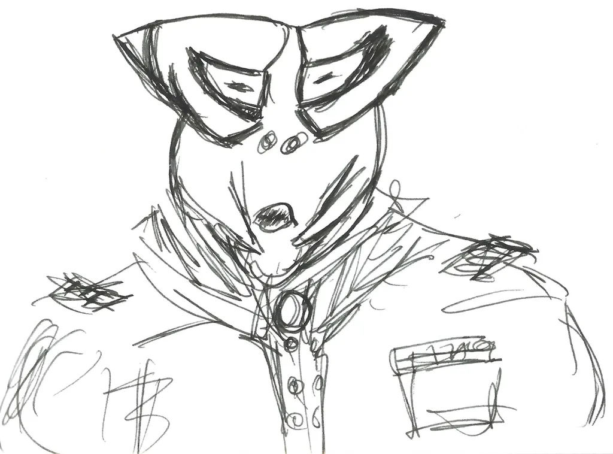

### Lundi 19, Paris

Épuisé par le travail. Je m’avachis quai de l’Arsenal, sous un faible soleil. Un passant, touché par mon laisser-aller, me demande : « Vous êtes chômeur ? » Moi : « Non, je regrette le temps où je l’étais. C’était la plus belle époque de ma vie. » Le passant s’éloigne, peu satisfait de ma réponse.

---

Dans *Lipstick Traces*, Greil Marcus décrit la révolte des punks contre le travail, l’argent, les conventions, l’ordre établi, les privilèges. Du danger de réédifier l’histoire, de vouloir prêter à ses acteurs passés des intentions qu’ils n’avaient pas. Les punks que j’ai connus étaient beaucoup plus primaires, révoltés oui, mais sans grande idéologie politique.

L’histoire est toujours une réédification. Dans mon carnet, je réédifie le présent. Nous faisons tous comme ça avec notre image du monde. Nous interprétons, relions avec des théories, sans prendre la peine d’en tester la validité.

Ma légère douleur aux dents m’empêche de penser. Je reste à la surface. Un jour, je retrouverai ma conscience sans conscience.

*Lipstick Traces* fait des Sex Pistols des héros. Johnny Rotten devient un précurseur immature, alors qu’il n’était que le mensonge de son époque, malgré lui, sans aucun dessein. Il en est mort. On peut faire dire n’importe quoi au passé, surtout aux morts.

Je me traîne jusqu’au café des Phares. Touristes, soleil vague, vague à l’âme. Pourquoi écrire ? Pour chercher quoi ?

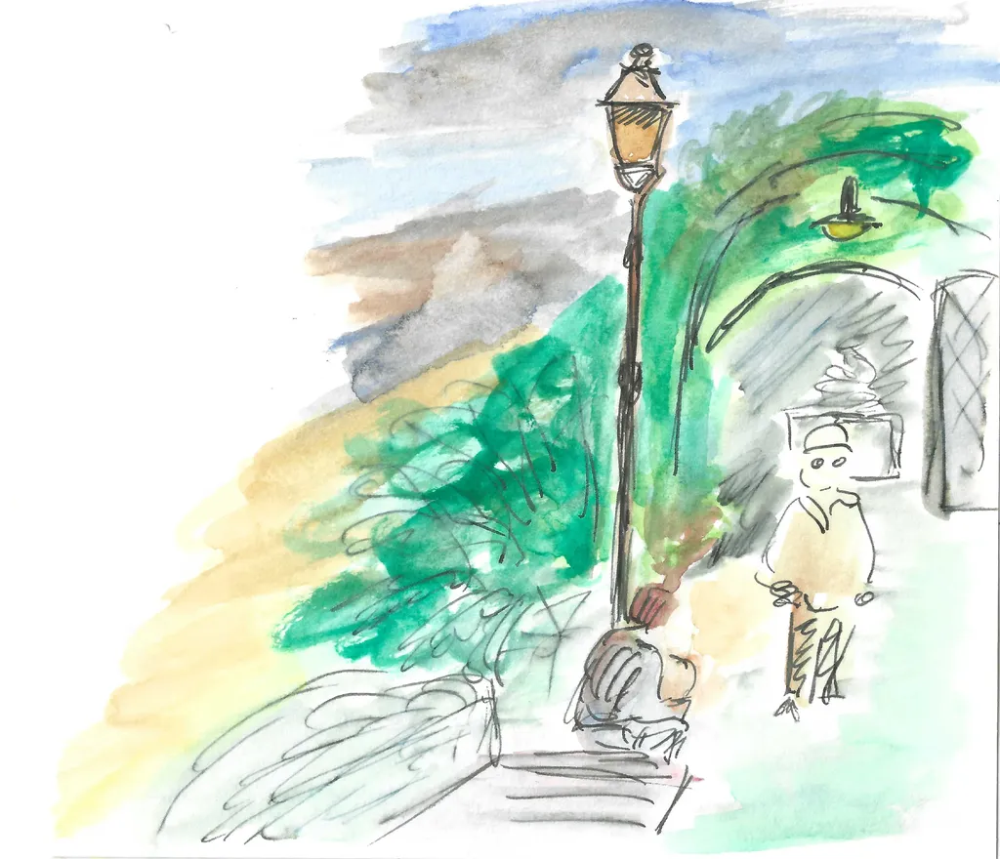

### Jeudi 22, Paris

Je ne dessine que pour observer le monde. J’écris pour la même raison, surtout ici dans le carnet. Ma conscience décroche de mon corps, le survole avec détachement. Isabelle me raconte qu’enfant elle réussissait à se décorporer. « Je me cachais dans l’angle supérieur de ma chambre et je me regardais. Il ne pouvait plus rien m’arriver. »

*Note (23/3/2026) : Isa a peut-être quitté son corps avant de mourir et qu’elle me regarde maintenant. J’aimerais tant lui envoyer des signaux, lui montrer les dessins retrouvés, et la mémoire de notre jeunesse qui revient.*

Mes dessins ne peuvent tenir seuls. Impossible de les dire artistiques, pas plus que les points ou les virgules dans mes phrases. Le carnet est l’œuvre, pas ses composantes. Comme toute œuvre, il n’existe que par le discours qui l’entoure. Pour le moment, je suis le seul à en parler.

Je gribouille des paysages, de minuscules aquarelles, pendant que les peintres de mon époque taguent les murs de couleurs explosives. Je suis discret pendant qu’ils veulent être vus. Ils se trompent, tout le monde se trompe, personne ne comprend ce qui est important, là, maintenant. Il ne restera peut-être que des photos de la fin du XXe siècle.

Goethe avait le projet d’unir l’art et la science. J’en reste là. Ne délaisser aucune activité de l’esprit, aucune de celles qui provoquent des plaisirs. Sans oublier l’amour, travaillé par Goethe jusqu’à son dernier souffle.

Établir des barrières entre les genres est grotesque. Une peinture comme une photo deviennent des images manipulables sur ordi. Les barrières d’hier sautent avant celles d’aujourd’hui.

L’ordi : outil pour tendre vers l’universel. Je cherche à juxtaposer textes et dessins, sans qu’une solution ne s’impose longtemps. J’écarte les montages de Delacroix dans ses carnets. Je cherche une forme éditable, transposable.

*Notes (7/4/2026) : je cherchais une solution à la publication multisupport, papier et web. J’ai créé des dizaines de compositions non linéaires à cette époque.*

---

Pierre Watt : « Le fragment est comme l’œuvre, il n’est pas l’œuvre. » Je préfère le terme d’échantillon, en référence à la musique numérique (collection d’échantillons sonores). Les échantillons sont des parties incomplètes. Quand on les rassemble, on aboutit à l’œuvre par réédification (passage de la discontinuité numérique à la continuité analogique). On voit la toile se dessiner, l’œuvre se matérialiser. En elle, les échantillons ne disparaissent pas. Ils gardent leur autonomie et leur mobilité, laissant la possibilité de réédifier une infinité d’œuvres (analogie du jeu de Lego).

« Le fragment naît d’un double mouvement de concentration et d’expansion : il est à la fois présentation de l’infini dans le fini et ouverture du fini à l’infini. »

Mon art postromantique diffère de l’art romantique en cela que je le dépouille de sa dimension divine, plaçant l’humain au centre de la création.

>Fragments infinis (au sens d’inachevés) => Œuvre finie par assemblage des fragments d’une façon déterminée (mon carnet par exemple).

>Fragments finis (au sens où ils existent de façon définitive — comme des photos) => Œuvre infinie (car elle peut être sans cesse recomposée).

Ne voilà que des mots, des théories, des jeux. Ils n’aspirent à aucune vérité, seulement à titiller la conscience, à réveiller le regard, à lui faire reconsidérer le déjà vu.

### Samedi 24, Paris

Longue promenade avec Isabelle dans les rues de Paris. Nous nous arrêtons dans le square devant la mairie du XIVe. Au soleil et sous la pluie. C’est le printemps, avec tous ses contrastes, autant dans la passion que dans les tracas. Ne pas écrire pour ne pas dire de bêtises.

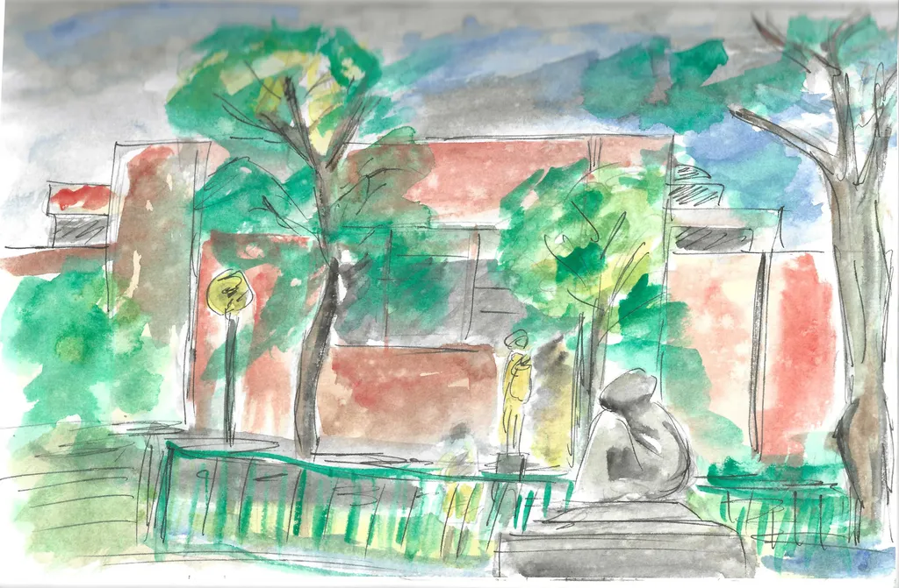

### Mardi 27, TGV

Pourquoi l’homme est-il aussi différent des singes et des gorilles alors que nous avons la même origine ? Que s’est-il passé pour nous ? Elaine Morgan relève que les différences entre les trois espèces devraient être égales. C’est oublier qu’un petit accident a produit chez l’homme une rupture de continuité : une émergence. Pour Morgan, la différence proviendrait de l’isolement de nos ancêtres dans un environnement lacustre.

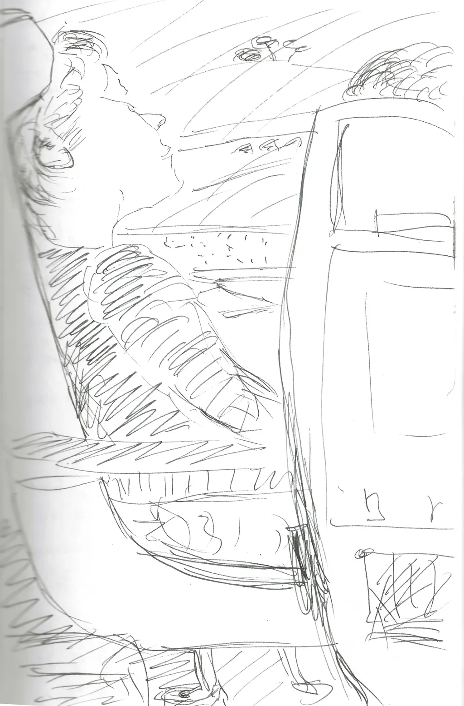

### Jeudi 29, Balaruc

L’été arrive, le rhume avec.

---

La théorie d’Elaine Morgan : la mer envahit la forêt, les singes se laissent tomber dans l’eau et y marchent debout. Voilà ce qui pourrait être la cause de la brusque divergence entre les singes et les hominidés. Cette théorie expliquerait notre passion pour les paysages maritimes et les îles, notre bien-être au bord de l’eau, alors que les singes n’apprécieraient pas l’eau. Quels sont les arguments contre cette théorie aquatique ? Morgan ne donne pas la parole à ses détracteurs, ce qui est plutôt gênant.

*Note (22 mars 2026) : Cette théorie reste marginale et fortement réfutée. Aucune preuve empirique. Beaucoup d’erreurs d’analyse ont été depuis relevées. Avec Isa, on adorait cette idée, sans y croire vraiment.*

### Vendredi 30, Balaruc

Jean-Pierre Le Bail me dit avoir toujours voulu peindre les 101 vues du mont Saint-Clair en hommage à Hokusaï. J’ai la même idée, j’ai même déjà produit quelques aquarelles.

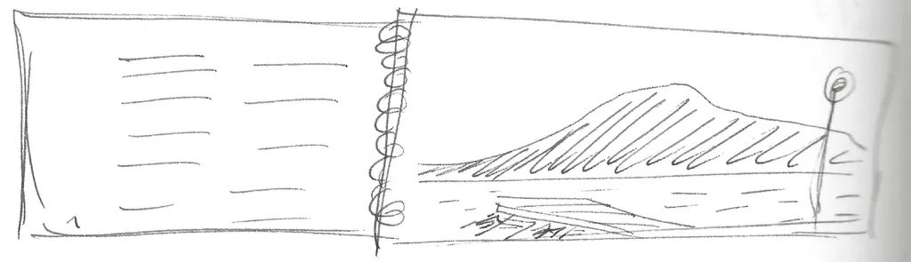

Ce matin, je m’éveille avec l’idée d’un texte qui opposerait à chacune des vues du mont Saint-Clair un texte : *Contre la peinture abstraite*. Alors je commence à l’écrire.

1/ Par abstrait, on entend communément un art qui ne cherche pas à figurer. Cette définition n’exclut pas toute la figuration : les BD de fiction, sans être abstraites, ne figurent souvent pas le monde mais le réinventent et figurent un monde possible. Une définition plus générale de l’abstraction serait : un art qui ne représente pas. Dans ce cas, un peintre expressionniste qui traduit en taches de couleur ses états d’âme ne serait pas abstrait. Mesurer le degré d’abstraction d’une œuvre est quasi impossible.

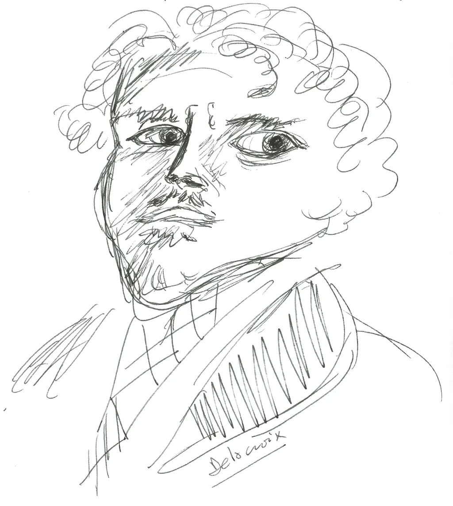

Tout en téléphonant à Isabelle, je griffonne un visage. Je ne suis même pas conscient de dessiner, c’est un acte involontaire, quasi automatique, je ne cherche donc pas à représenter, pourtant mon dessin est figuratif. Mais un ami devant mon dessin ne verra peut-être pas de visage, il verra un gribouillis, donc le considérera abstrait. Ainsi la définition de l’abstraction ou de la figuration ne peut que prendre en compte l’état d’esprit de l’artiste ou du spectateur. Cet exemple met en évidence l’impossibilité de définir.

Je lis que l’artiste abstrait « ne nomme plus, il exprime. Au spectateur de saisir dans ses réactions la signification de ce qui est exprimé. » Belle définition de l’abstraction, mais on pourrait dire belle définition de l’art. L’artiste figuratif fait pareil. Seul l’écrivain nomme et, encore, son propos se cache le plus souvent dans le non-dit. Il revient toujours au spectateur d’interpréter ses perceptions. L’intention de l’artiste n’a aucune importance, sinon on serait incapable d’apprécier les œuvres d’artistes oubliés.

2/ En voulant produire de l’abstraction par un procédé matériel, les peintres abstraits ne s’affichaient pas comme de fins logiciens. La peinture, matérielle et concrète, ne peut engendrer que du matériel et du concret. Les abstraits l’ont appris à leurs dépens : en tentant de se libérer de tout symbolisme, ils ont inventé l’art le plus symbolique. Une aquarelle abstraite de Kandinsky peut faire penser à un champ de fleurs, un monochrome bleu de Klein aux profondeurs abyssales, une toile trouée de Fontana à la surface de la lune, une mosaïque arabe au pavage d’un patio andalou… Pour échapper à la représentation, les abstraits ont alors invoqué les mathématiques. Mais, là encore, avec un peu d’imagination on voit réapparaître les formes partout présentes dans la nature. On peut presque toujours *a posteriori* établir un lien entre une œuvre abstraite et la réalité.

Les œuvres abstraites ne représentent pas la nature macroscopique, mais une nature subtile et difficile à percevoir. Elles sont souvent d’un réalisme fascinant (en tout cas pour le physicien). Une toile abstraite peut représenter à fort grossissement un morceau de quelque chose (le monochrome blanc représente un mur blanc ou une page blanche) ou cacher en son sein une forme (comme les paréidolies dans les nuages).

En détournant les formes de leur contexte, la peinture abstraite est conceptuelle. De deux choses l’une : l’abstrait échoue dans son désir d’échapper à la représentation (il devient figuratif malgré lui) ou il représente ce que nous ne voyons pas habituellement (il stimule notre conscience). On pourrait définir l’abstraction en disant qu’est abstrait tout ce que nous n’avons jamais vu.

À partir des années 1950-60, les conceptuels résolvent le problème logique des peintres abstraits. Ils renoncent à la peinture, manipulent des idées et leurs représentations en mots. Tenter d’être abstrait en art plastique n’a plus de sens. Les abstraits postmodernes (ceux d’après 1950-60) sont souvent réalistes, voire figuratifs.

Prenez n’importe quelle toile figurative, agrandissez une parcelle, vous obtenez une toile abstraite. La figuration enferme l’abstraction comme l’abstraction la figuration.

3/ Les modernes s’intéressent aux combinaisons chromatiques inexplorées. Ils étudient le monde, s’entraînent et nous entraînent à mieux voir les harmonies discrètes et subtiles de la lumière. Cette première investigation achevée, ils cherchent à traduire directement en couleurs leurs émotions et leur vitalité, d’où l’expressionnisme. Il subsiste une tension vers le monde, celui de notre esprit et de nos passions, mais elle devient plus subjective, donc moins communicable. La représentation d’un état d’âme ne nous aide pas à prendre conscience de nos propres états d’âme que si nous avons une connivence préalable avec l’artiste. Les œuvres renoncent à l’universalité. Les artistes se bâtissent des cénacles d’admirateurs.

D’une certaine façon, les primitifs tentaient de traduire leur ferveur religieuse. Ils représentaient des visages tordus de douleur, le Christ ensanglanté sur la croix ou des scènes de bataille. Ils utilisaient un code explicite et familier, celui des corps. Leurs œuvres visaient l’universel symbolisé par Dieu.

Durant la Renaissance, on dit moins explicitement la douleur : la peinture renonce à l’expression directe, devient plus narrative et plus littéraire, plus universelle encore dans ses visées. À partir du maniérisme, les émotions extrêmes réapparaissent jusqu’à revenir en force à l’époque romantique. Sur cette lancée se constitue la modernité. Van Gogh culmine dans la violence figurative. Pour aller plus loin, il faut malmener la figuration, voire la détruire, au risque de ne plus être compris. Les premiers expressionnistes découvrent des raccourcis simples, les suivants se spécialisent, réduisent le cénacle des initiés.

4/ À partir de l’impressionnisme, puis surtout avec le fauvisme, les figuratifs découvrent de nouvelles possibilités chromatiques avant que les abstraits poussent plus loin l’investigation. De même, les premiers expressionnistes sont figuratifs avant qu’apparaisse un expressionnisme abstrait. Il semble plus facile d’inventer de nouveaux courants à partir de la figuration, puis de les pousser à l’extrême avec l’abstraction.

5/ La peinture abstraite atteint un niveau d’abstraction minimal, pour ne pas dire primaire, comparé à celui atteint par le scientifique ou le philosophe.

6/ Voir dans les galeries des amoncellements de toiles abstraites, banales, déjà vues, me donne la force d’écrire cet essai. C’est aussi pour me justifier de me contenter de peindre de petites aquarelles suivant une technique éculée. Je peux m’infliger les critiques assenées contre les abstraits.

7/ Je ne dis pas qu’il n’y a plus d’évolution possible pour la peinture abstraite ; je constate qu’il ne se produit guère d’innovation, disons depuis Basquiat, qui d’ailleurs n’était pas franchement abstrait, mais plutôt un figuratif barbouilleur comme nous le sommes tous quand nous avons un stylo en main pendant une réunion ennuyeuse.

8/ Au-delà des jeux de couleurs ou de la rage, la peinture abstraite ne m’aide pas à mieux voir. Je lui préfère la peinture figurative. Toutefois, une courbe mathématique, bien plus abstraite que n’importe quelle peinture, me donne à voir la dynamique de processus naturel ou logique avec une précision inégalée.

9/ Les grands abstraits, de Kandinsky à Pollock, n’ont pas produit de nombreuses toiles. L’abstraction lasse. Seule la peinture du réel laisse place à la surabondance inventive.

10/ Les grands abstraits sont venus à l’abstraction au therme d’une quête mystique. Quand leurs successeurs commencent par l’abstraction, ils doivent voyager vers une autre mystique, celle de la nature par exemple. Aujourd’hui, l’abstraction est démystifiée.

11/ Est abstrait ce que personne n’a encore vu. À ce titre, tout artiste est abstrait puisqu’il doit nous ouvrir les yeux. Seul varie le temps nécessaire à l’ouverture : immédiat chez les réalistes ; plus long, mais jamais infini, chez les abstraits.

12/ Voir des gens répéter les gestes d’autres gens me dérange quand ils se prétendent artistes.

J’ai écrit d’un jet ces réflexions. Il me faudrait nuancer et m’expliquer en détail. Il faudrait aussi retracer l’histoire de l’abstraction : 101 étapes dans l’histoire de l’abstraction : début des mathématiques, de la philosophie, invention du zéro, l’islam, Kandinsky, Pollock, Soulages…

Toute représentation use de raccourcis et de symboles, même la photographie. Une représentation n’est jamais la réalité.

L’artiste met en œuvre dans sa pratique les lois de la nature ; il ne peut produire que du naturel. Quid de l’art numérique ?

#carnets #private #y1999 #1999-04-30-20h00
