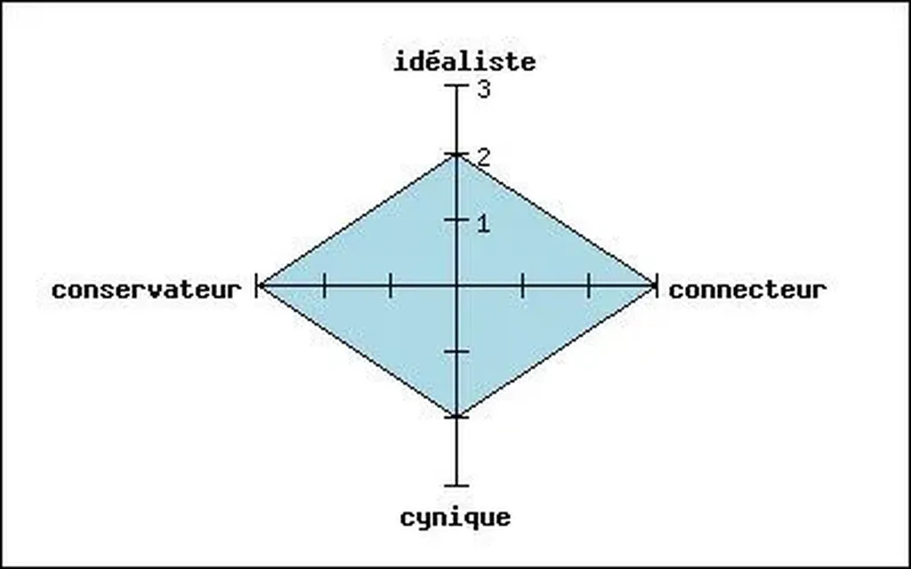

# Réponse aux lecteurs de Pouic

Le post de [pouic](http://www.blogger.com/comment.g?blogID=3674054&postID=113136228127123953) a soulevé quelques questions auxquelles j’essaie de répondre. Les connecteurs forment un peuple naissant. Le parfait connecteur, tel que je l’idéalise dans mon livre, n’existe pas encore, sinon notre monde serait radicalement différent. Toutefois, en chacun de nous, du moins je l’espère, sommeille une part de connecteur. Nous pouvons, par exemple, rejeter le centralisme étatique (connecteur) tout en croyant qu’il est nécessaire d’établir des lois de plus en plus précises et nombreuses (conservateur).

Nous sommes tous un peu connecteur, mais aussi un peu conservateur, un peu cynique et idéaliste. À la fin du sondage, il est assez logique d’obtenir un graphique en étoile. Si nous apparaissions tous comme des connecteurs, mon livre n’aurait pas lieu d’être.

Comme l’a remarqué **troudair**, il suffit de répondre au choix 1 pour être conservateur, au choix 2 pour être cynique, au choix 3 pour être idéaliste et au choix 4 pour être connecteur, j’ai pas essayé de brouiller les cartes.

Les questions du sondage essaient de proposer une quatrième voie par rapport à celles couramment proposées. Je sais que les questions sont schématiques, trop simples, qu’elles manquent de nuance, mais le sondage est avant tout un jeu, il ne va pas remplacer le livre.

#dialogue #y2005 #2005-11-14-21h45
