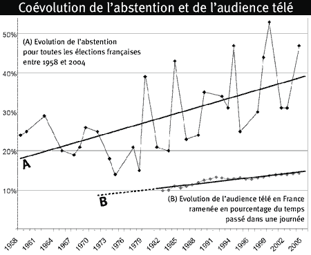

# TV égale abstention

Plus nous regardons la télé (pas moi… je l’ai pas), moins nous votons. C’est une idée dans l’air.

 

Dans mon prochain livre, je vais publier et commenter ce graphique qui parle de lui-même. Je l’ai concocté en corrélant diverses études ([le taux d’abstention aux élections depuis 1958](http://www.tns-sofres.com/etudes/dossiers/d_abstention.htm) et la traditionnelle étude [Médiamétrie](http://www.mediametrie.fr/contenu.php?rubrique=tv&rubrique_id=355&menu_id=198) que j’ai reconstituée en glanant à droite à gauche). Si quelqu’un connaît d’autres sources, je suis preneur.

Mon analyse est simple : la télévision a transformé la politique en spectacle, un spectacle réservé à une élite, un spectacle auquel nous participons de moins en moins. Cette distanciation de plus en plus grande, nous a conduis à nous engager de moins en moins.

Je crois maintenant qu’Internet va inverser la tendance. Pour étayer cette thèse, j’aimerais publier un autre graphique. Tracer la courbe de l’évolution du nombre d’internautes et la comparer avec l’évolution du nombre d’adhérents à des partis, le nombre de syndicalistes, le nombre de gens qui travaillent dans les associations…

Je sais que le nombre d’encartés vient de faire un bond. J’ai l’intuition que plus Internet se développe, plus il nous redonne goût à la participation, donc à l’engagement sous toutes ses formes (le vote étant la forme la moins exigeante à mes yeux).

Pour le moment, je n’ai pas assez de données pour tracer une quelconque courbe, même une courbe qui viendrait contredire mon analyse. Là encore, si l’un de vous connaît des sources… ça m’intéresse. Si je ne trouve rien de prémâché, je contacterai un à un les partis pour connaître leur nombre de sympathisants sur les dix dernières années.

#noepub #politique #dialogue #y2006 #2006-10-7-20h38
