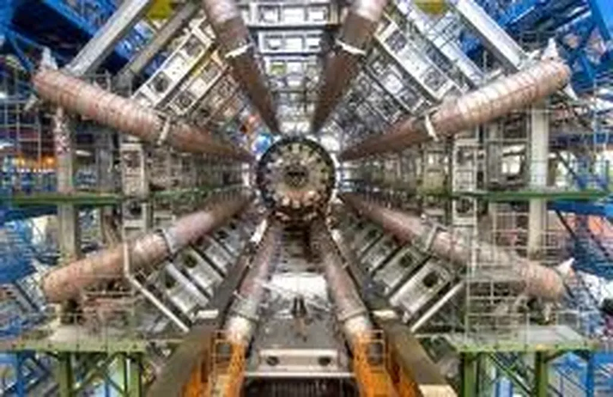

# Un connecteur à Genève

Hier, j’ai donné une conférence privée au CERN. Après mon laïus, nous avons visité le tout nouveau [détecteur de particules Atlas](http://fr.wikipedia.org/wiki/Atlas_(CERN)) : 25 mètres de haut, 40 mètres de long, un poids égal à la Tour Eiffel, le tout situé dans une caverne de béton creusée 100 mètres sous terre.

Imaginez la base de lancement de fusée lunaire dans *Objectif Lune* d’Hergé. Des ascenseurs dans tous les sens, des passerelles bleues, des tubes colorés comme à Beaubourg, tout ça compacté dans un espace immense mais rempli à craquer de technologie de pointe.

En débouchant sur la passerelle à mi-hauteur de la caverne, j’ai éprouvé le même sentiment que lorsque je suis entré pour la première fois dans la pyramide de Khéops. J’ai été frappé par le génie humain, soulevé d’un enthousiasme invraisemblable pour ma propre espèce. Si nous pouvons construire des structures aussi immenses avec une aussi grande précision, nous ne pouvons qu’être de merveilleuses créatures.

Pendant quelques instants, j’ai oublié nos pires penchants. Je me suis dit que tous les enfants devraient visiter le CERN, juste pour se convaincre que la vie est précieuse parce qu’elle est capable de merveilles qui, peu importe leur utilité, produisent du rêve pour nous donner envie d’aller plus loin.

Je n’ai pu m’empêcher de me projeter dans l’avenir, d’entrer dans la peau du touriste du futur qui visitera le CERN, qui le verra comme moi je vois les pyramides avec quatre mille ans de distance. Je suis sûr qu’il éprouvera encore les mêmes sensations que moi face à la folie de notre génie.

La machinerie d’Atlas lui apparaîtra ridicule par sa taille démesurée, beaucoup de physiciens la juge déjà ridicule d’ailleurs, mais il restera frappé par ce besoin que nous avons d’accomplir les choses les plus impossibles.

#conf #connecteur #y2006 #2006-11-24-14h52
