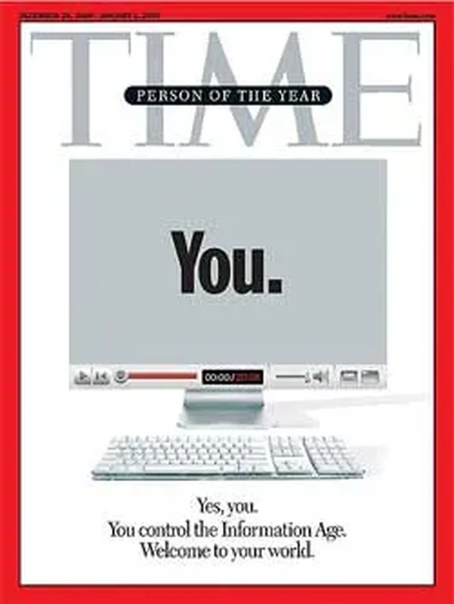

# Il se passe quelque chose

Le cinquième pouvoir est partout, même en couverture du [*Time*](http://www.time.com/time/covers/0,16641,20061225,00.html). Pour le prestigieux magazine, le personnage de l’année, c’est vous… vous qui êtes en train de prendre le pouvoir. Au sujet de 2006, on peut lire :

> C’est une histoire de communauté et de collaboration déployée à une échelle jamais vue. […] Nous avons l’opportunité de construire une entente internationale, non pas de politicien à politicien, de grand homme à grand homme, mais de citoyen à citoyen, de personne à personne.

Un des articles du dossier s’intitule *Power to the People*. C’est exactement ça le cinquième pouvoir. Tout ça ne fait que commencer. Je vous avoue que je suis assez excité de vivre cette époque. Voir beaucoup de gens s’enfermer dans des partis poussiéreux m’attriste. L’avenir n’est pas dans les chapelles mais dans les réseaux ouverts à l’interconnexion. L’avenir appartient aux connecteurs comme le montre le *Time*.

Nous arrivons à la conjonction de beaucoup de choses… business, culture, politique, technologie… c’est la grande convergence. Est-ce encore une bulle qui va exploser ? Je ne le pense pas. Les citoyens vont vraiment prendre le pouvoir et démontrer qu’ils n’ont pas besoin de la mainmise des grands hommes.

J’ai passé quatre ans à écrire la vie d’Ératosthène (un roman que je n’ai pas encore publié). Trois siècles avant JC, il a, lui aussi, été au cœur d’une merveilleuse convergence qui a mal terminé. Nous devons rester sur nos gardes.

*PS1 : Ce n’est pas en prenant la place des oppresseurs qu’on changera le monde mais en inventant un monde avec moins d’oppresseurs. On n’a pas besoin de représentation mais de travailler ensemble dans l’esprit du mouvement open source.*
*PS2 : Je ne trouve pas Wikipedia de mauvaise qualité, ni en français, ni en anglais. Il y a des mauvais articles, d’autres bons, c’est comme la vie. La majorité des articles me paraît plutôt bonne.*

#politique #y2006 #2006-12-18-12h22
