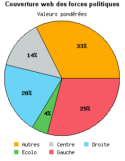
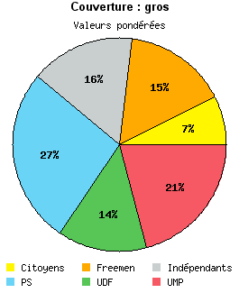

# La France serait coupée en deux

C’est en tout cas ce qu’affirme Claire Chazal lorsqu’elle [interviewe François Bayrou sur TF1](http://johnpaullepers.blogs.com/john_paul_lepers_leblog/2006/12/bayrouchazal2.html).

 

Quand je regarde la représentation des forces politiques dans la blogosphère, je ne voix pas du tout ce que Claire Chazal veut dire. La droite et la gauche ensemble ne représentent que [49 % des forces politiques françaises](http://www.bonvote.com/parts.php) : même pas la majorité. La force la plus grande est celle des autres : ce fameux cinquième pouvoir inféodé à aucune chapelle.

En regardant les ensembles les plus représentatifs, je ne peux que constater que le paysage politique n’est pas aussi simpliste qu’on veut nous le faire croire. On accuse souvent François Bayrou de ne pas avoir d’idées originales. Il n’a qu’à se baisser pour les ramasser dans le camp des autres, un camp totalement étranger aux deux forces historiques.

Ces analyses qui ne concernent que la blogosphère ont-elles un quelconque rapport avec l’opinion publique générale ? Je suis persuadé que oui. Les blogueurs sont des citoyens comme les autres. Ils sont souvent des voix anonymes qui disent tout haut ce que tous pensent tout bas. Je rappelle juste qu’en juin un sondage a montré que [70 % des Français ne se reconnaissaient ni dans les idées de la droite, ni de la gauche](../6/extraordinaire-hypocrisie.md). Si François Bayrou, ou un autre d’ailleurs, réussit à incarner l’espoir de ces Français, il a une chance.

*PS : Bayrou pour le moment est trop timide, pas assez innovateur. Son discours est bon mais il faut maintenant qu’il fasse de vraies propositions. Il ne suffit pas de dénoncer un système, faut construire du neuf.*

#politique #y2006 #2006-12-4-9h3
