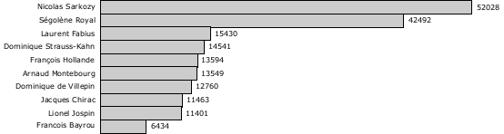
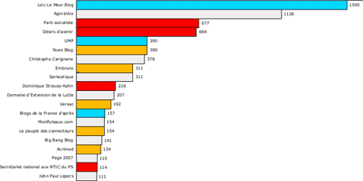

# La longue traîne politique 2

J’aime bien les images en ce moment. Suite au billet de [ludovic](http://www.lbcd78.fr/2006/12/15/suivre-levolution-de-la-representation-des-candidats-a-la-presidentielle-sur-internet/), je viens de classer les personnalités politiques en fonction du buzz sur les blogs d’après les mesures bonVote.com. On a une longue traîne, voir le classement complet.

Après, j’ai voulu vérifier si le classement des blogs politiques de bonVote.com dessinait aussi une longue traîne. Bingo !

La note correspond à l’indice de popularité, les couleurs à l’appartenance politique. Ici, la longue traîne avec les 100 premiers blogs. Pour la correspondance des couleurs, voir ici.

#buzz #y2006 #2006-12-20-10h17
