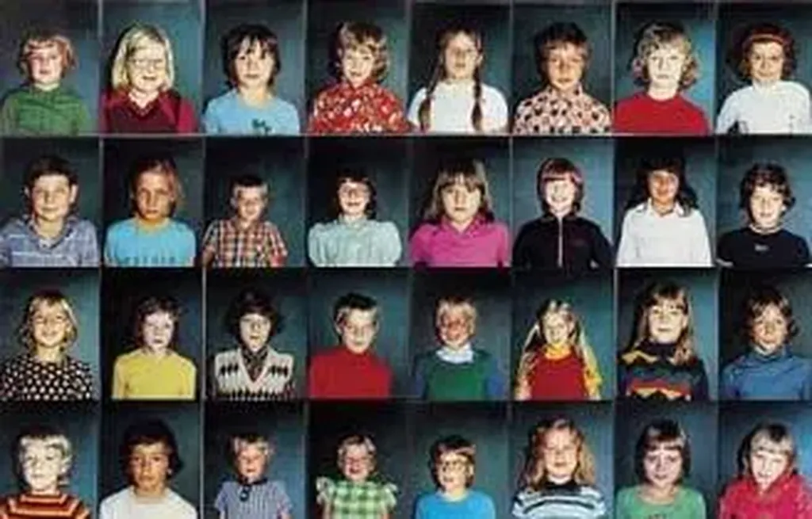

# Saupoudrage politique

Quand je regarde les programmes politiques des uns et des autres, je constate l’absence de pensée directrice. Chacun y va de ses mesures chocs sans rechercher la moindre cohérence. Le marketing est devenu le principal moteur des programmes. Les partis ont divisé l’électorat en multiples cibles et adaptent leurs promesses pour chacune de ces cibles.

Cette technique conduit à un émiettement des programmes : ils prennent d’ailleurs souvent la forme d’une liste de mesures où tout et n’importe quoi se côtoie. La cohérence logique de l’ensemble n’a plus aucune importance. Les politiciens se moquent des contradictions. Ça me choque.

 

Certes, je suis heureux de vivre une époque qui n’est pas dominée les idéologies. Nous avons beaucoup de liberté de penser. Mais pensons-nous vraiment ? J’ai l’impression que les politiciens ont oublié de faire marcher leur cerveau. Adeptes du patchwork marketing, ils s’égaillent dans toutes les directions. Ils mettent au même niveau des problèmes qui n’ont pas la même importance, pas la même gravité.

Cette approche, appelée allover en peinture, devraient pourtant me séduire. Dans *Le peuple des connecteurs*, j’ai fait l’éloge de l’échantillonnage. Par exemple, pour un artiste, c’est montrer plusieurs images d’un même objet et laisser le spectateur les assembler mentalement pour se créer sa vision unique. Je devrais donc être comblé par les programmes de tous les partis. Mais non, chez eux, la multiplication des angles de vue vise avant tout la séduction. Je suis incapable de réassembler le puzzle à ma sauce.

Au contraire, devant une œuvre comme celle de Boltanski, toutes les images se mettent à danser et forment un tout cohérent. L’artiste de génie ne choisit pas ses images au hasard. Il place côte-à-côte celles qui ensemble dépasseront leur singularité. Les programmes politiques que je découvre sont incapables de cette transcendance, ils ne dépassent pas leurs parties. Ils manquent de colonne vertébrale. À leur lecture, je ne suis pas emporté vers un avenir meilleur.

J’arrive à un paradoxe. D’un côté, je prône le bottom-up, les constructions qui partent de la base et qui prospèrent en s’auto-organisant. De l’autre, je reproche à certaines de ces structures, les programmes politiques en l’occurrence, de manquer d’unité, unité qu’on retrouve habituellement dans les œuvres d’un seul homme. Suis-je moi-même incohérent ?

Je ne crois pas. Le bottom-up et l’auto-organisation ne sont fécondes que si elles s’appuient sur un jeu de règles. Ces règles doivent être en nombre réduit mais elles doivent exister, sinon il ne se passe rien. Un jeu de règles peut être considéré comme un système de pensée minimaliste, une sorte de prisme, une façon de voir le monde qu’on tentera de pousser le plus loin possible.

Pour un mathématicien, cela revient à poser un postulat et à essayer d’en tirer toutes les conséquences. Que le raisonnement, que la progression vers le résultat s’effectue par une succession d’accidents et de crises ne pose aucun problème. Ce qui compte c’est l’impulsion initiale, c’est la direction qu’on s’est donnée. Rien n’empêche d’en changer en cours de route, de revoir les règles, mais il faut qu’elles sous-tendent tout ce qui arrive.

Je me rends compte que j’ai beaucoup de mal à me positionner. Je veux me tenir au point de transition de face entre l’ordre et le désordre. C’est un point minuscule où il est difficile de se maintenir. Du côté de l’ordre, il y a les idéologies. Du côté du désordre, le melting-pot trop chaotique\*. Je veux essayer de joindre le meilleur de ces deux mondes, un peu comme Proust dans *La recherche du temps perdu*.

Si je crois qu’il ne faut pas systématiser, je crois en revanche qu’il ne faut pas avoir peur de jouer quelque temps avec un système et de voir jusqu’où il nous mène. Cet exercice me paraît intéressant. J’ai commencé à le faire avec ma [déclaration d’interdépendance](declaration-d%e2%80%99interdependance.md), je vais continuer en écrivant mon prochain livre : *Politique 2.0*.

\*Le melting-pot, assimilé pour moi au désordre, est abondamment employé par les adeptes d’une [gouvernance forte](gouvernance-forte.md). Cela démontre une totale contradiction entre le fond du discours et sa forme. Nos politiques sont schizophrènes.

#politique #y2006 #2006-6-29-9h19
