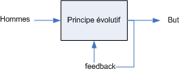

# Chaordic Age

Comme me l’a suggéré [Freddy Mallet](../6/rponse-un-lecteur/#comment-30.md), je viens de commencer la lecture de [*Birth of the Chaordic Age*](http://www.amazon.fr/gp/product/1576750744/402-5334915-1934535?v=glance&n=52042011) de Dee Hock, fondateur de VISA. Je m’en veux de ne pas avoir lu ce livre l’année dernière lorsque j’écrivais *Le peuple des connecteurs*. J’y aurais trouvé des dizaines d’exemples d’auto-organisation dans le business. Le livre commence par deux définitions.

> **Chaord** 1. N’importe quel système auto-organisé, autocontrôlé, adaptatif, non linéaire, qu’il soit un organisme, une organisation ou une communauté, qu’il soit physique, biologique ou social, qui montre simultanément des comportements ordonnés et chaotiques. 2. Entité dont le comportement montre des propriétés qui ne sont pas gouvernées et expliquées par les règles qui gouvernent et expliquent ses parties.

Chaord est en fait synonyme de complexe, en tout cas dans le sens que l’utilisent les scientifiques.

> **Chaordic** 1. Comportement de n’importe quel système auto-organisé qui montre des comportements ordonnés et chaotiques. 2. Système dominé ni par l’ordre ni par le chaos. 3. Caractéristique des principes organisationnels fondamentaux de l’évolution et de la nature.

Ma [définition de connecteur](http://www.tcrouzet.com/connecteurs/connecteur.php) aurait pu venir après. Un connecteur est quelqu’un qui a compris qu’il vivait dans un monde chaordique et qui exploite le chaord. Dee Hock est, en ce sens, un merveilleux connecteur.

Dès le début du livre, il annonce que l’âge industriel touche à sa fin, car il implique des modes d’organisation hiérarchique inadaptés au monde de plus en plus complexe dans lequel nous vivons. Pour Dee Hock, les organisations que nous connaissons, qu’elles soient commerciales, politiques ou sociales, sont incapables d’atteindre les buts qu’elles se fixent.

Dee Hock insiste sur la nécessité de se fixer des buts. Je me rends compte que je n’ai jamais été clair sur mon propre but. Quand j’ai discuté de la nécessité d’une [déclaration d’interdépendance](qu%e2%80%99est-ce-que-l%e2%80%99interdependance.md), j’ai énoncé un principe pour atteindre un but que je n’ai pas donné.

Quel est mon but ? Quel pourrait être le but de tous ceux qui se reconnaissent dans une déclaration d’interdépendance ? Je pourrais dire être heureux, mais c’est un peu vague. Je pourrais dire que notre but est de maintenir le monde dans un état propice à la vie sociale. C’est encore vague. Que notre but est de maximiser la liberté des individus pour qu’ils prennent leur destin en main. Que notre but est de construire un monde où chacun est son propre chef. Que notre but est de vivre dans un monde durable.

Je tourne autour de ces idées sans m’arrêter sur une, mais je sens qu’il faut en choisir une et puis agir. Des gens se rassemblent et poursuivent un but en respectant un principe. En cours de route, le principe évolue grâce à une boucle de feedback. Le but et le principe peuvent être proposés par un petit groupe, puis la machine est lancée. C’est ainsi que Dee Hock créa VISA. Je crois que c’est en procédant de la sorte que nous construirons un monde meilleur (encore un but très vague).

#politique #y2006 #2006-7-18-9h44
