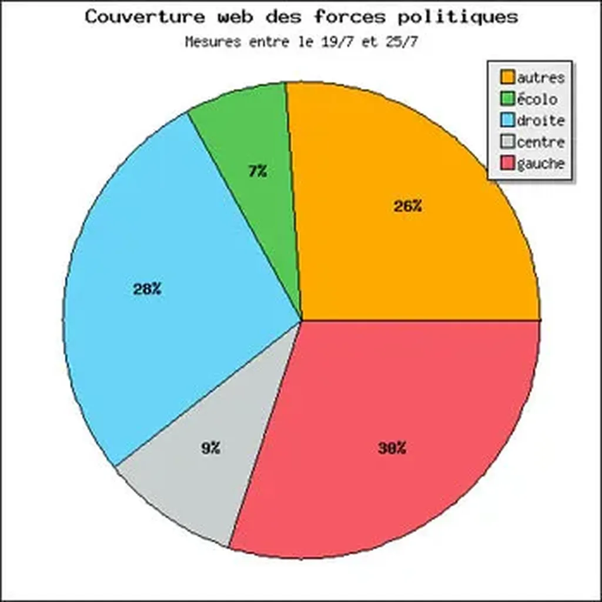

# La deuxième force citoyenne

Lors du référendum pour le traité de Constitution européenne, internet aurait fait pencher la balance en faveur du non. Le même scénario se répétera-t-il en 2007 ? Internet jouera-t-il un rôle central ? Quelques statistiques grossières laissent penser que oui.

 

Je viens de lire étude publiée le 19 juillet par [Pew Internet & American Life Project](http://www.pewinternet.org/PPF/r/186/report_display.asp) qui décrit la blogosphère américaine, notamment son rapport à la politique.

**8 %** des internautes américains bloguent (soit 12 millions de blogueurs).

39 % des internautes lisent des blogs (soit 57 millions d’internautes).

37 % des blogueurs parlent de leur vie (sujet de prédilection).

**11 %** des blogueurs parlent de politique (second sujet de prédilection).

54 % des blogueurs ont moins de 30 ans.

La parité homme-femme est respectée.

72 % des blogueurs s’informent en ligne au sujet de la politique (contre 58 % pour les internautes).

Dans ces chiffres, je vois la démonstration qu’une nouvelle génération de citoyens est en train de naître aux États-Unis. Si 11 % de 8 % des internautes américains bloguent politique, cela signifie qu’un peu moins de 1 % des internautes américains bloguent politiques. Cela nous donne près de 1,5 million d’internautes hautement engagés.

En comparant ces chiffres avec ceux de [typepad](http://customerlistening.typepad.com/baroblogs/BaroBlogs-FRance-crmmetrix-June-06.pdf), il y a une assez grande similitude avec la France. Si chez nous aussi 1 % des internautes bloguent politique, nous nous retrouvons avec 250 000 citoyens hautement engagés (il y a un peu plus de 25 millions d’internautes en France).

L’ensemble des partis politiques doivent regrouper environ 700 000 adhérents (c’est une estimation à la louche). En comptant les membres des conseils municipaux, nous devons avoir environ 200 000 élus en France (je ne connais pas le chiffre exact et je l’estime encore une fois à la louche). Il est probable qu’une grande partie des élus sont des adhérents, même si dans les petites communes nous avons beaucoup d’indépendants. Vraisemblablement, il y a donc moins de 800 000 citoyens impliqués directement dans la vie politique française.

Il serait alors intéressant de connaître le taux de recouvrement entre les 250 000 blogueurs politiques et les citoyens déjà politisés. Intuitivement, je croyais ce taux relativement faible. Comme j’ai l’habitude de fréquenter les blogs politiques indépendants, j’avais tendance à les croire majoritaires. Lorsque le 28 juin dernier, je me suis rendu à la soirée [république des blogs](http://www.republiquedesblogs.net/), j’ai été surpris de constater que nous étions peu de libres penseurs. Les encartés étaient majoritaires.

La web politique n’est-elle alors qu’une image de la politique tout court ? Joue-t-elle uniquement sur le traditionnel axe gauche-droite ? Je ne le crois pas. D’après mes statistiques, illustrées par le camembert et réalisées sur [bonVote](http://www.bonvote.com), les blogs politiques indépendants représentent 26 % de la blogosphère politique. Une nouvelle force est donc en train de naître : elle rassemble sans doute déjà plus de 60 000 activistes.

Mes statistiques ne reposent que sur les mille blogs politiques déjà référencés par [bonVote](http://www.bonvote.com), mais elles montrent que la bataille politique a déjà commencé sur le web. Pour la faire pencher dans un sens ou dans un autre, les citoyens doivent créer des blogs pour défendre leurs idées. Un jour prochain les 26 % de libres penseurs deviendront sans doute 50 % et même plus. La politique aura alors un nouveau visage. Enfin !

#politique #y2006 #2006-7-26-8h45
