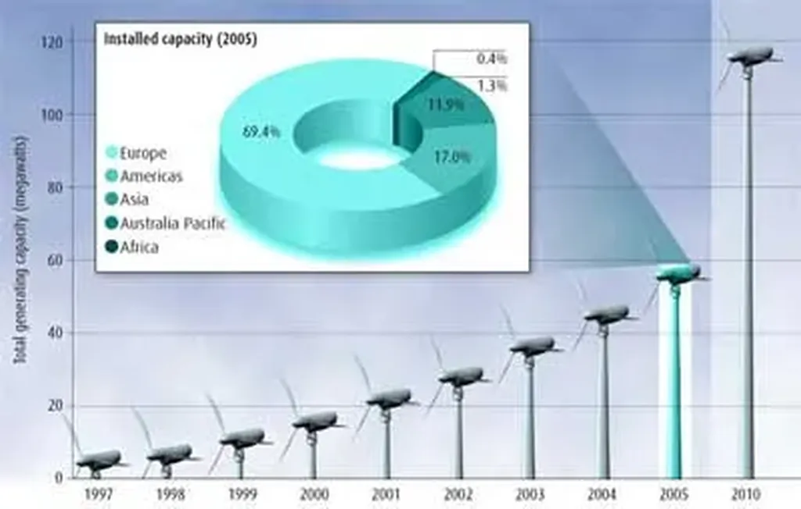

# Bon sens écologiquement dangereux

Les gens avec un rythme cardiaque irrégulier ont plus de chances d’avoir un problème cardiaque. Dans les années 1980, le bon sens dicta aux médecins d’administrer un traitement pour réguler le rythme cardiaque de tous les arythmiques. Résultat : la mortalité a été multipliée par deux, voire par trois, pour ceux qui ont une arythmie faible ! Le bon sens n’est pas toujours fiable. Il nous dit d’ailleurs que la Terre est plate !

Nous aurions dû nous méfier de lui, mais non, nous lui faisons toujours confiance, comme quand [nous nous croyons capables d’anticiper l’avenir](../7/l%e2%80%99irresponsabilite-des-politiques-bis.md). Ces dernières semaines, j’ai lu plusieurs articles qui questionnent le bon sens écologique. Et qui nous montrent combien nous devons être prudents avant d’adopter de nouvelles technologies.

**Les éoliennes**

Il nous paraît évident qu’elles permettent la production d’énergie propre ; peu importe leur bilan économique. Le bon sens dicte de construire de plus en plus d’éoliennes même si elles gâchent les paysages et massacrent souvent dans leurs pales les oiseaux de passage. Ce risque est connu, il vaut la peine d’être pris. J’ai toujours été de cet avis. En 2005, la production mondiale d’énergie éolienne a augmenté de 43 % pour atteindre 60 000 mégawatts, 12 fois la consommation énergétique de l’Irlande.

Mais faut-il se fier au bon sens avant de prendre une décision ? Quel est le coût réel d’un champ d’éoliennes ? Combien de CO2 sera dégagé lors de la construction de l’infrastructure, combien lors de la fabrication des éoliennes ? Toutes les pollutions ne doivent-elles pas être comptabilisées ?

Quand on construit un champ d’éoliennes, on cherche des endroits peu peuplés, par exemple dans les tourbières en Irlande. Le coût de l’infrastructure est alors toujours élevé, les travaux sources d’important dégagement en CO2 et autres gaz à effet de serre. Et ils perturbent l’environnement. Suivant les calculs les plus pessimistes de [Richard Lindsay](http://www.savewesternny.org/news/The_hidden_cost_of_wind_turbines.html), il faut alors 16 ans pour qu’une éolienne, qui a une durée de vie de 25 ans, annule la pollution que sa construction a engendrée !

Face à la complexité, le bon sens défaille. Il oublie de tenir compte de toutes les implications. Il ne peut d’ailleurs y parvenir. Que faut-il faire alors ? Plutôt que construire d’immenses champs d’éoliennes, il est sans doute préférable d’opter pour la micro-génération suggère Richard Lindsay. Plutôt que se lancer dans des projets géants impossibles à maîtriser, il vaut mieux que chacun de nous place une [petite turbine](http://news.com.com/Micro+wind+turbines+are+coming+to+town/2100-11398_3-6037539.html) sur son toit. C’est un bel exemple qui devrait nous pousser à agir par nous même, localement.

**Les arbres**

Un autre article, aussi publié dans [*NewScientist*](http://www.newscientist.com/article/mg19125604.100.html), m’a interpelé. Le bon sens nous incite à planter des arbres pour lutter contre la pollution. Du coup, le traité de Kyoto propose aux pays incapables de réduire leurs émissions d’avoir la main verte.

Est-ce vraiment une bonne idée ? Une étude vient de révéler que les feuillages dégagent du méthane, un des gaz à effet de serre les plus nocifs. Les experts ne sont pas encore arrivés à un accord sur les volumes mais le dégagement est avéré.

Le bon sens est encore une fois mis en question. Les solutions les plus évidentes ne sont pas nécessairement les meilleures. Plutôt que se lancer dans de vastes projets pour réduire les gaz à effet de serre, projet dont personne ne peut maîtriser les tenants et les aboutissements, n’est-il pas préférable d’attaquer le problème à la source, là où se produisent les pollutions, c’est-à-dire chez nous ?

Il est un peu facile de polluer d’un côté et de planter des arbres d’un autre en croyant qu’on règle le problème. Les pollutions doivent être évitées à tout prix. Il n’y a pas de compensations possibles.

*PS1 : Ai-je dit que les éoliennes étaient une mauvaise chose ? Je n’ai pas dit non plus que leur rendement était plus mauvais que celui du pétrole ou du nucléaire. J’ai juste insisté sur la nécessité de prendre en compte tous les coûts avant se lancer tête baissée. Si on ne fait pas ça, le nucléaire est la panacée d’ailleurs. Richard Lindsay met juste en garde sur le développement sauvage des champs d’éoliennes, voir l’article de la* [*BBC*](http://news.bbc.co.uk/1/hi/scotland/4557255.stm)*. Il y a aussi des risques environnementaux avec les énergies dites propres. Et les statistiques ne nous aident en rien dans cette histoire. Que les probabilités soient favorables ne nous empêche pas de nous engager dans des voies catastrophiques. Les probabilités ne nous aident pas à prévoir l’avenir, ni même à estimer les avenirs possibles. Ce servir d’elles pour agir est suicidaire, surtout à l’échelle globale.*
*PS2 : Pour le méthane, l’article dont je parle évoque une première étude qui indique une production pour les végétaux entre 62 et 236 millions de tonnes par ans, donc un volume du même ordre que celui produit par les ruminants et l’activité microbienne. Cette étude n’est pas confirmée.*
*PS3 : Je reste toujours persuadé que l’éolien est une vraie solution. Mais sans doute est-il préférable de le déployer de façon distribué plutôt que de façon concentré comme c’est le cas aujourd’hui.*
*PS4 : J’ai pensé à un autre article* [*NewScientist*](http://www.newscientisttech.com/channel/tech/mg18925351.400.html) *où il est question de la micro-génération énergétique. Elle produit déjà plus que le nucléaire ! Et elle prouve que la production décentralisée est la véritable solution. Ça renforce mon idée que l’approche locale doit souvent être privilégiée.*

#dialogue #y2006 #2006-8-7-11h24
