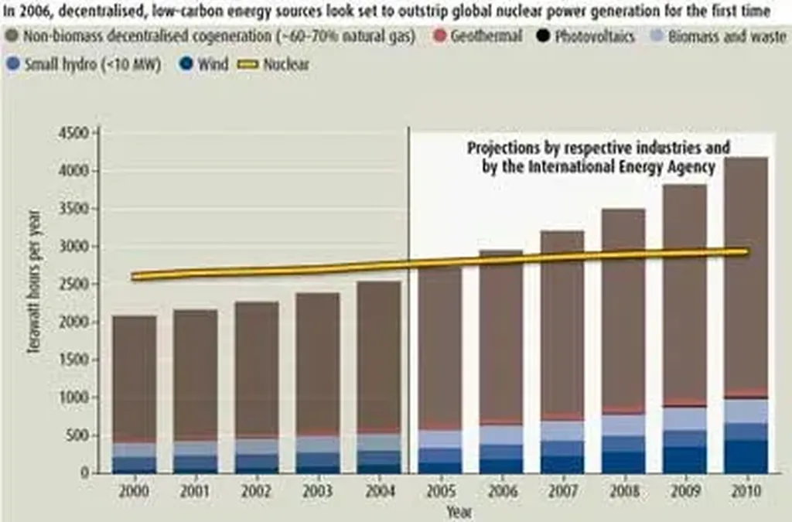

# L’énergie sur les toits

Pour faire suite à l’article de ce matin, j’ai pensé à un autre [article de NewScientist](http://www.newscientisttech.com/channel/tech/mg18925351.400.html) où il était question de la micro-génération énergétique. Elle produit déjà plus que le nucléaire ! Et elle prouve que la production décentralisée est la véritable solution. Ça renforce mon idée que l’approche locale doit toujours être privilégiée.

 

#buzz #y2006 #2006-8-7-19h21
