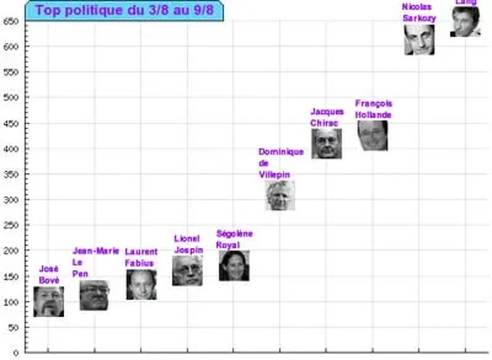

# Politisation des blogs

Depuis une dizaine de jours, j’ai ajouté un petit robot à [bonVote](http://www.bonvote.com) qui recherche dans les posts de tous les blogs référencés quelques [termes](http://www.bonvote.com/buzz.php) chargés politiquement. Résultat, il est facile de savoir de qui on parle, c’est-à-dire de mesurer le buzz, sans qu’on sache s’il est positif ou négatif. Sans vouloir concurrencer [buzz-blog](http://presidentielle-2007.buzz-blog.com/) ou [politibuzz](http://scanblog.blogs.com/politibuzz/), j’obtiens en temps réel, par exemple, un [classement de nos hommes politiques](http://www.bonvote.com/buzz.php?mode=homme).

Il sera amusant de voir si les petits candidats apparaissent dans le top 10 et de comparer ce graphique avec les résultats des sondages. Nous pourrons ainsi savoir si les blogueurs sont en phase ou non avec les autres Français. Je ne crois pas que ce graphique nous permettra d’aller beaucoup plus loin. C’est un gadget de plus lancé dans la blogosphère.

#buzz #y2006 #2006-8-10-9h48
