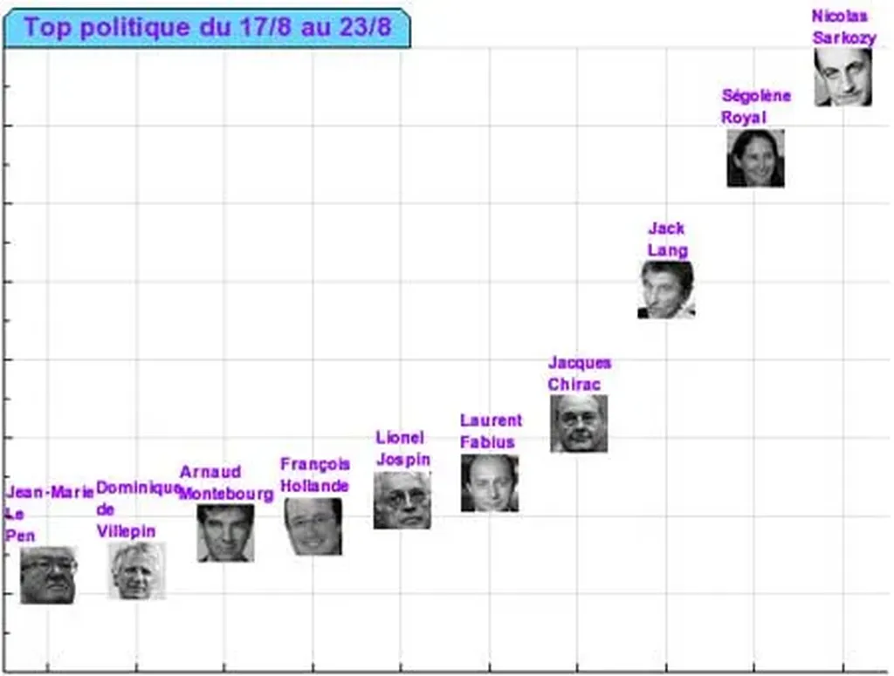

# Une surprise est toujours possible

Hier, 13 heures, quelques amis et moi sommes attablés dans la cuisine du [domaine de Montagenet](http://www.domaine-de-montagenet.com/index.asp). Notre hôte, [José Ferré](http://carnetsdenuit.typepad.com/carnets_de_nuit/), vient de nous servir ses œufs brouillés aux truffes quand mon téléphone sonne. Tout le monde me fait signe de ne pas répondre mais je décroche.

Mon attachée de presse me demande de contacter Frédérique Roussel chez *Libération*. José fait les gros yeux mais je quitte la table et j’appelle cette journaliste que je ne connais pas et qui prépare un papier sur les blogs politiques et, plus particulièrement, sur les méthodes pour évaluer leur notoriété.

Je lui ai parlé une dizaine de minutes mais je ne suis pas sûr d’avoir été clair. La veille avec mes amis nous avions passé la moitié de la nuit à refaire le monde et nous étions un peu dans le coltard. Je vais essayer de remettre au clair ce que j’ai dit ou, plutôt, ce que j’aurais dû dire.

Pour mesurer la notoriété d’un blog politique, il y a deux possibilités. Se référer à son audience ou évaluer son influence.

**Audience** Il n’existe des mesures objectives que pour les sites disposant d’un trafic important. En juin, [NNR](http://www.nielsen-netratings.com/) a classé le blog Le Meur en 3748e position par rapport à l’ensemble des sites français, avec 45 000 visiteurs uniques/mois. De l’aveu même de NNR, cette mesure n’est pas fiable car l’échantillon utilisé pour l’étude n’est pas significatif au vu du faible trafic du blog de Le Meur. Quand Le Meur regarde ses données serveur, il voit des valeurs doubles, ce qui est le cas pour tous les sites. Mais 100 000 visiteurs uniques par mois ce n’est encore pas beaucoup par rapport aux gros sites français. Avec [bonWeb](http://www.bonweb.com), par exemple, nous faisons le même score chaque jour. Les autres blogs politiques, bien moins fréquenté que le blog de Le meur car plus ciblés, n’apparaissent même pas dans le panel NNR.

**Influence** Comme il est quasi impossible de connaître l’audience des blogs politiques, on préfère parler de leur influence (notoriété serait sans doute plus juste comme me l’a fait remarquer José). Elle se mesure en comptant les liens qui pointent vers un blog. Ainsi, plus les articles d’un blog ont été cités par d’autres blogueurs, plus le blog est dit influent. [Technorati mesure cette influence](http://www.bonvote.com/technorati_top.php) pour les millions de blogs référencés dans son annuaire.

Pour établir le classement des blogs politiques de [bonVote](http://www.bonvote.com), nous avons pondéré l’indice technorati en fonction de la régularité de publication et de la présence dans les résultats Google pour la requête "blog politique". Voir la [méthodologie précise](http://www.bonvote.com/methode.php). Dans les jours prochains, nous pondérerons cette note en fonction du [degré de politisation](http://www.bonvote.com/teneur.php) des blogs. Cette approche n’est pas la panacée mais elle aide à y voir un peu plus clair dans la blogosphère politique.

En observant [le top cent de bonVote](http://www.bonvote.com/topvote.php), on voit immédiatement que les sites des hommes politiques connus et des partis y sont minoritaires, bien moins de 20% ! J’interprète assez simplement ce phénomène. Nos politiciens ne comprennent rien au web. Ils font des efforts mais ils sont soit mal conseillés, soit totalement à côté de la plaque. Je devine qu’ils doivent commencer à panique en ce souvenant du [TCE](retour-sur-le-tce.md).

[Le cinquième pouvoir](le-cinquieme-pouvoir.md) risque de leur rafler la mise. Des petits candidats plus habiles en marketing web risquent de causer quelques surprises, souvenons-nous de Howard Dean aux USA en 2003. Ces jours derniers Roland Castro est monté en quatrième position du [top politique de bonVote](http://www.bonvote.com/buzz.php?mode=homme).

Je développerai ces idées dans mon prochain livre. Mais, dès à présent, je ne saurais que conseiller à nos politiciens de courir s’attacher les services d’une agence comme [heaven](http://heaven.fr/) qui, en France, est la grande spécialiste du marketing viral, le seul véritable marketing qui fonctionne sur internet. Le Séguéla de la prochaine campagne sera peut-être François Collet de heaven.

La maîtrise du marketing viral est capitale. Quand un blogueur parle à 10 000 personnes et que parmi elles 100 répercutent ses propos à 5 000 personnes, nous nous retrouvons avec 500 000 personnes touchées. Si parmi elles, d’autres encore répercutent, nous avons vite des millions de personnes sous influence. C’est la terrible puissance du marketing viral. Un blogueur qui n’a pas beaucoup de lecteurs peut au final toucher autant de gens qu’un grand média. C’est une révolution.

Sur ce, je me suis précipité dans la cuisine pour rejoindre mes amis et terminer les œufs brouillés qu’ils m’avaient abandonnés.

#politique #y2006 #2006-8-24-8h36
