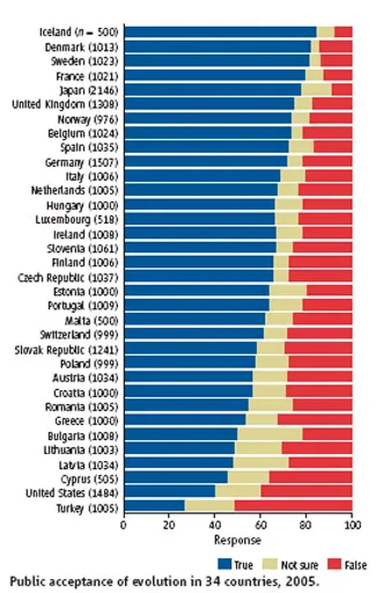

# C’est pas gagné

Une étude publiée dans [*Science Magazine*](http://www.sciencemag.org), montre que 60 % des Américains rejettent la théorie de l’évolution ! On pourrait avoir envie de se moquer d’eux mais ce n’est guère plus glorieux chez nous où 23 % des gens font plus que douter du darwinisme. Dorénavant, je serais moins surpris quand je verrai sourire à l’évocation des idées des connecteurs. Comme leur acceptation présuppose au préalable une acceptation de l’évolution, il reste beaucoup de travail.

Je comprends les craintes de [Vincent](http://grosvinz.typepad.com) qui se demande parfois si nous ne resterons pas éternellement des rêveurs isolés. Quand je regarde [sa carte qui géolocalise des connecteurs](http://www.frappr.com/connecteurs), il y a de quoi flipper, c’est sûr. Mais il ne faut pas oublier que Darwin était presque seul en son temps.

#coup_de_gueule #y2006 #2006-9-2-8h46
