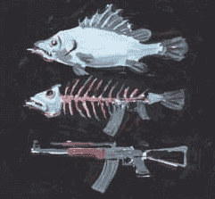

# Le cauchemar des politiciens

Les politiciens, élus pour nous protéger de nos propres horreurs, finissent souvent par commettre des horreurs à leur tour. C’est une fatalité.

J’ai souvent expliqué que les structures sociales complexes n’avaient pas nécessairement besoin pour s’épanouir de chef et de commandement central. C’est le fameux exemple des oiseaux avec lequel s’ouvre *[Le peuple des connecteurs](http://www.tcrouzet.com/connecteurs/)*.

On me répond souvent que les loups vivent en hordes structurées. C’est vrai. Les mammifères aiment les chefs car ils présentent un avantage dans les structures sociales simplifiées. Mais chez les hommes d’aujourd’hui les structures sociales sont devenues complexes. Alors pourquoi avons-nous encore des chefs ? Pourquoi multiplions-nous les couches hiérarchiques qui, d’un point de vue opérationnel, sont inefficaces dès que de réelles difficultés se présentent ?

Dans *La Guerre et la Paix*, Tolstoï propose une réponse magistrale. Après avoir démontré que les chefs n’avaient aucun pouvoir réel, leurs ordres arrivant souvent trop tard, étant souvent inapplicables ou, quand ils sont appliqués, conduisant à des résultats opposés à ceux escomptés, il se demande à quoi servent les chefs :

> Les hommes se mettent en marche d’Occident en Orient, massacrent leurs semblables, et cet événement est accompagné de discours sur la gloire de la France, la perfidie de l’Angleterre, etc. […] Ces justifications libèrent les hommes qui participent à l’événement de leur responsabilité normale. Ces buts provisoires jouent le rôle des balais placés à l’avant de la locomotive pour nettoyer la voie. Ils aplanissent la route devant le sentiment de responsabilité morale.

Pour Tolstoï, le chef a pour fonction, non de diriger les événements, mais d’en justifier la nécessité, parfois l’horrible nécessité. Quand les chefs disent qu’il faut tuer pour le bien de la nation, les hommes pillent, violent, tuent… Ils mettent leur sens moral en veilleuse et se transforment en bêtes sauvages.

Cette théorie de Tolstoï se justifie d’un point de vue évolutif. Les hordes de mammifères, en se dotant de chefs, gagnent un avantage certain. Lorsqu’une horde devient société, chez les humains, sa complexité devrait faire disparaître la nécessité de chefs, car l’auto-organisation est alors plus efficace. Mais ça ne se passe pas de cette façon.

Chez nous, il y a encore des chefs parce que leur présence procure un avantage qui compense leur inefficacité. Quel est cet avantage ? Nos sociétés complexes se développent avec la conscience des individus qui, pour vivre ensemble, développent peu à peu un sens moral. Mais ce sens moral, indispensable au quotidien, peut s’avérer problématique en temps de crise. Il faut alors le désactiver : tel serait le rôle du chef. C’est sans doute pour cette raison que le pouvoir séculaire s’associe historiquement presque toujours au pouvoir religieux, car son domaine est la moralité.

Nous aurions besoin de chefs pour nous déresponsabiliser. Et je comprends mieux maintenant pourquoi la plupart des gens s’accrochent [au droit de vote](droit-vote-question.md). Il les ramène à l’ancien régime, à ce chef divin capable de les absoudre de leurs pêchés. Peu importe que ce chef soit un monstre, un bandit, un truand. Ce qui compte c’est que, de temps en temps, il paye pour nos égarements sauvages.

Une société sans chef, ça fait peur. Terriblement peur. Qui dès lors va me confesser et me pardonner ? Contre qui vais-je me retourner si ça tourne mal ? Contre moi-même ? Nous ne sommes peut-être pas encore près pour ce grand saut.

Mais les idées de Tolstoï sont-elles encore valables ? J’entends des voix chuchoter : « Nous ne sommes pas en guerre. Nous ne commettons pas d’horreurs. Nos hommes politiques ont d’autres fonctions que nous absoudre. » Je crois le contraire. Nous sommes des monstres, nous avons comme par le passé besoin d’être pardonnés. Maintenant que les psychanalystes remplacent les curés, maintenant que les neurologues ridiculisent les psychanalystes, il ne nous reste comme confesseur que nos politiciens.

Pourquoi donc acceptons-nous leurs malversations et leurs magouilles ? Pourquoi osent-ils faire leur comme back politique après un séjour en prison ? Ils purgent leur peine et reviennent comme si de rien n’était. Et des gens voteront pour eux. Ils voteront parce qu’ils les aiment, ils les aiment pour le service inestimable qu’ils leur rendent. Et peu importent qu’ils soient des crapules, la plupart des rois aussi étaient des crapules. Comme ils n’ont aucun autre rôle sinon celui de nous donner bonne conscience, on se moque bien de leur propre moralité. D’ailleurs, pour laver nos pêchés, il faut bien qu’ils aient l’âme endurcie, il faut qu’ils soient prêts à commettre eux-mêmes des horreurs. Nous sommes obligés de leur pardonner comme ils pardonnent pour nous. C’est très chrétien. Matthieu écrit :

> Si vous pardonnez aux hommes leurs offenses, votre Père céleste vous pardonnera aussi ; mais si vous ne pardonnez pas aux hommes, votre Père ne vous pardonnera pas non plus vos offenses.

Ainsi chacun de nous commet chaque jour des horreurs. Il suffit de voir [Le Cauchemar de Darwin](http://www.darwinsnightmare.com/) pour s’en persuader. Nous cautionnons d’infâmes trafics dans nos centres commerciaux et nous finançons les guerres avec nos impôts. Nous sommes en guerre même si nous n’allons pas nous même sur le champ de bataille. Comme à l’époque napoléonienne, nous tuons chaque jour, sans scrupule. Tout ça parce que ILS, nos politiques, sont responsables à notre place. Nous fermons les yeux parce qu’ils sont là.

En fait, je les applaudis. La vie est plus facile grâce à eux. Mais bon, il est peut-être temps de devenir responsables, non ?

Article aussi publié sur [Le Monde Citoyen](http://lemondecitoyen.com/2006/09/05/le-cauchemar-des-politiciens/) et sur [Agoravox](http://www.agoravox.fr/article.php3?id_article=13049).

#noepub #politique #dialogue #y2006 #2006-9-5-8h51
