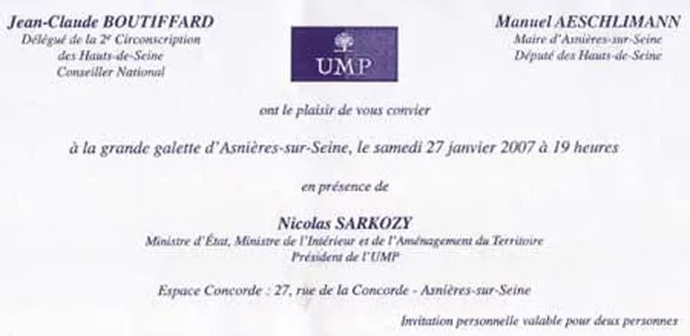

# Sarkozy au pied du mur

À Asnières, sous le règne du député-maire UMP Manuel Aeschlimann, c’est le Far West. Samedi 27 janvier, Nicolas Sarkozy aura l’occasion de dénoncer cette dérive du pouvoir. Le fera-t-il ?

Nicolas Sarkozy sait ce qu’il veut et a confiance en ses moyens. Il est persuadé qu’il peut presque à lui seul sortir la France de l’ornière où l’immobilisme fonctionnarisé l’a plongée. Son goût pour l’action passe par-dessus la fainéantise politique de nombreux citoyens. « Ils ne veulent pas se bouger, moi je vais bouger pour eux, semble-t-il dire sans cesse. »

Je respecte ce courage volontariste mais il ne faut pas oublier quelques villages d’irréductibles Gaulois qui n’ont pas attendu l’avènement d’un nouveau régime pour se mettre au travail. Au nord-ouest de Paris, entre Courbevoie et Gennevilliers, à Asnières-sur-Seine, un camp retranché, fédéré par le blog citoyen [asnierois.org](http://asnierois.org), lutte depuis trois ans contre les abus de pouvoirs de ceux qui, à force de vouloir changer la France, bafouent les droits des citoyens.

Tout commença en 2004, lorsque quelques Asniérois découvrirent que la municipalité squattait les [panneaux publics d’information](http://asnierois.org/fw/html/modules.php?name=News&file=article&sid=553). Ils ouvrirent un blog, montèrent des expéditions pour arracher les affiches officielles qui n’avaient rien à faire sur les panneaux réservés aux citoyens et s’attirèrent peu à peu l’animosité de l’équipe de Manuel Aeschlimann.

La situation se détériora rapidement. Le député-maire attaqua en diffamation nos blogueurs, puis en accusa d’autres d’appartenir à un mouvement sectaire, les poussant à [liquider Mayetic](http://www.agoravox.fr/recherche.php3?q=mayetic), leur société, et à s’expatrier en Californie. Au fil des mois, une véritable [guerre juridique](http://juridoscope.asnierois.org) s’engagea entre la municipalité et les animateurs du [cinquième pouvoir](../../page/le-cinquieme-pouvoir).

Je ne veux pas ici me substituer à la justice. Je veux juste rappeler que les blogueurs n’ont à ce jour [perdu que deux procès sur quatorze, et encore par vice de forme, malgré les appels successifs de Manuel Aeschlimann](http://juridoscope.asnierois.org). Vu de l’extérieur, ce qui est mon cas, j’ai l’impression qu’Asnières s’apparente à une "zone" où le dialogue est rompu entre la municipalité et le contre-pouvoir citoyen. La méthode Aeschlimann m’apparaît d’un autre temps. D’ailleurs ce cher député-maire est le premier élu de notre République mis sous [patrouille citoyenne par le cinquième pouvoir](http://japarthur.typepad.com/).

C’est d’autant plus dérangeant que Manuel Aeschlimann est un proche de Nicolas Sarkozy. Il serait intéressant de connaître l’avis du Ministre de l’intérieur et surtout du candidat UMP à la présidentielle au sujet de la [situation à Asnières](http://asnierois.org/fw/html/modules.php?name=News&file=article&sid=662). Je crois qu’il doit se positionner. Cautionne-t-il oui ou non les pratiques de celui qui fut un temps le chargé de communication de l’UMP ? Pense-t-il que le cinquième pouvoir va trop loin ou qu’il n’est pas objectif ?

**La grève des blogs**

Afin de poser ces questions, [16 des 25 blogs citoyens d’Asnières feront grève le samedi 27 janvier 2007](http://www.collectif-asnieres.fr/). Pourquoi ce jour là ? [Parce que Nicolas Sarkozy est attendu à Asnières, à l’invitation de Manuel Aeschlimann, pour la galette de l’UMP.](http://blog.tcrouzet.com/images_tc/20070126umpb.jpg)

S’il vient sans évoquer les "affaires", c’est qu’il les juge anodines, c’est qu’il part du principe que les abus de pouvoir sont inévitables pour un élu… position qui, émise par notre futur Président potentiel, serait pour le moins inquiétante.

À mon avis, Nicolas Sarkozy doit se positionner. Il peut approuver la méthode Aeschlimann, la réprouver ou s’abstenir en trouvant une excuse pour refuser l’invitation au dernier moment (ce qui reviendrait à réprouver gentiment).

En mettant en cause un de ses amis, Sarkozy légitimerait par ailleurs le travail patient du cinquième pouvoir à Asnières. Je ne demande pas à Sarkozy de juger les procès en cours à la place de la justice mais de reconnaître le droit pour les citoyens de faire respecter la loi et, au-delà, d’être une force de proposition.

Un élu peut se fourvoyer, il suffit d’être transparent pour que les choses rentrent dans l’ordre. Parfois je comprends mal pourquoi nos politiciens s’arcboutent sur des positions intenables maintenant que le cinquième pouvoir s’éveille. Vous n’êtes plus seul à gouverner. Nous améliorerons le monde tous ensemble et non pas en luttant les uns contre les autres.

#coup_de_gueule #y2007 #2007-1-26-12h3
