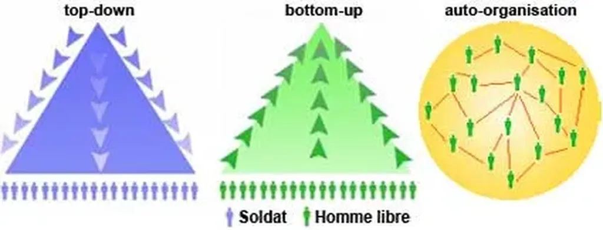
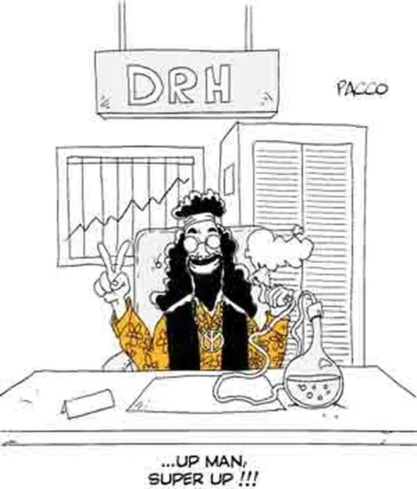

# Confusion autour du bottom-up

Lors des échanges qui ont suivi [ma critique du Modem](../9/modem-centric.md), j’ai noté que beaucoup de gens avaient une idée erronée du bottom-up. Nos politiciens autocrates les ont piégés par un dévoiement dont ils ont la spécialité.

Le haut-en-bas ou top-down évoque la société hiérarchique dans laquelle quelques-uns ordonnent à tous (le citoyen étant écrasé par la hiérarchie). Par exemple, quelques médias alimentent en informations tous les citoyens. Il est clair qu’il y a un mouvement descendant. Il part d’une élite et se propage à tous. Dieu, quelle que soit son incarnation, règne au sommet de la pyramide et nous vivons à ses pieds.

On oppose souvent à ce système le bottom-up ou bas-en-haut mais, paradoxalement, on le schématise souvent par une pyramide. La base du triangle ferait converger des informations ou des idées vers un point de focalisation, un point dans lequel il est facile de retrouver Dieu.

Ségolène Royal, et de nombreux autres politiciens, au Modem notamment, professent cette version pour le moins réductrice du bottom-up. Le peuple ferait émerger des idées qui remonteraient jusqu’au sommet de la pyramide, jusqu’à Dieu, qui les sélectionnerait, les améliorerait avant de les réexpédier comme un miroir déformant sur le peuple.

J’entends souvent parler du up-and-down comme d’une révolution alors que, au nom de la consultation citoyenne, le principe du bottom-up est totalement dévoyé en faveur du modèle pyramidal. On cherche à nous faire croire que nous participons mais, au final, nous subissons encore et encore les décisions divines, nous les subissons d’autant mieux que nous croyons qu’elles viennent de nous.

Nicolas Sarkozy a au moins le mérite de ne pas tricher. Les idées viennent de lui et quand il se plantera ce sera de sa seule faute. Je préfère encore avoir au pouvoir un autocrate lucide qu’un autocrate qui s’ignore.

Mais bien sûr je préfèrerais ne pas avoir d’autocrate au pouvoir. La solution, c’est le véritable bottom-up ou l’auto-élévation de la société. Par exemple, nous ne faisons pas remonter des informations, nous nous plongeons dans un champ d’informations engendré par nous. Nous baignons dans nos propres idées collectives. Dans ce champ, tout le monde influence tout le monde.

Des leaders peuvent apparaître qui focalisent certaines idées et leur donnent plus de force mais ils ne nous les imposent pas. Voici l’utopie dans laquelle j’aimerais vivre, une utopie en partie à l’œuvre au cœur d’internet depuis que le réseau a échappé à ses géniteurs.

Pour résumer le bottom-up tel que je l’entends, j’aime évoquer la métaphore de la marmite. Imaginez que nous sommes des molécules d’eau. Lorsque la chaleur augmente, nous nous élevons tous ensemble. Le bottom-up décrit un mouvement ascensionnel mais pas dirigé vers un but, pas au service de quelques-uns.

Quand le bottom-up est en action, c’est toute la société qui en bénéficie (ou l’entreprise, ou le parti…). Lorsqu’un individu acquière de nouvelles connaissances, il participe à ce mouvement ascensionnel. Lorsqu’il est plus heureux aussi. Les artistes participent au bottom-up. Les actions individualistes comme collectives peuvent l’engendrer.

Une société bottom-up ressemblera à une hyper-sphère : un univers sans bord et sans centre. La base devient en quelque sorte tout le système qui évolue sans cesse. Certains points y brilleront plus que d’autres parce qu’ils seront plus connectés mais ils ne seront pas autocratiques. Le cinquième pouvoir doit s’efforcer de faire migrer la société du top-down vers le véritable bottom-up. Il ne peut d’ailleurs réellement existé que dans ces circonstances.

Je crois que je vais cesser de parler de bottom-up. L’idée qu’il y a un bottom et un up nous renvoie trop au modèle pyramidal. Il nous faut inventer une nouvelle terminologie. Elle doit traduire l’idée que chacun influence tous les autres et que ce n’est qu’ensemble que nous pouvons nous dépasser. Je n’ai pas trouvé mieux qu’auto-organisation.

D’un côté, nous avons le modèle pyramidal, sous sa forme classique top-down ou sa forme démagogique up-and-down ; de l’autre, nous avons l’auto-organisation, largement employée par les structures biologiques.

Ces deux formes d’organisation coexistent donc dans nos sociétés humaines. Elles ne sont pas antinomiques. L’auto-organisation est la plus répandue, elle marche si bien, si naturellement, que nous n’y prêtons pas attention, nous focalisant au contraire sur le pyramidal.

Je crois que nous devons apprendre à mieux reconnaître l’auto-organisation. Ainsi nous amoindrirons l’importance du pyramidal et l’empêcheront d’entraver la complexification de la société (complexification qu’il a un temps aidé il est vrai).

#netculture #dialogue #y2007 #2007-10-1-9h32
