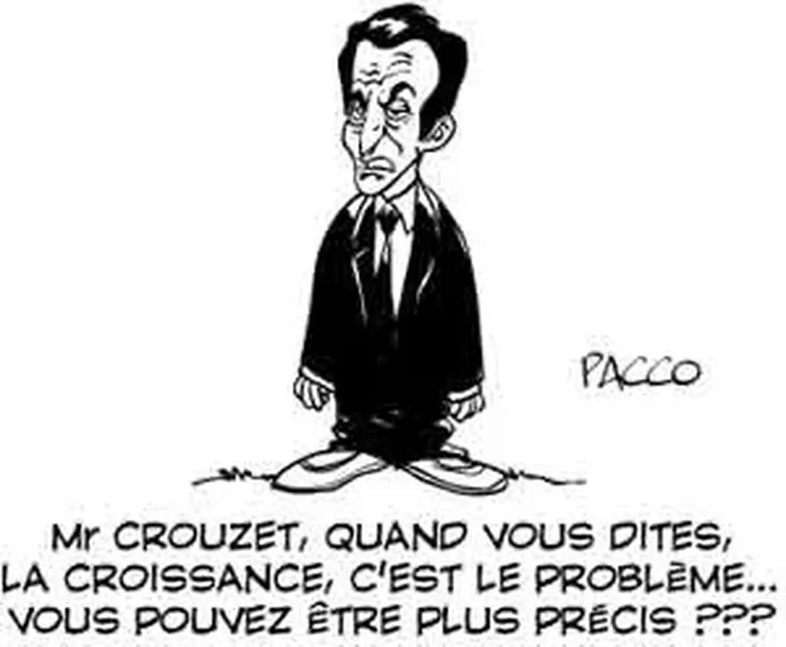

# La croissance, c’est le problème

Comme toujours je ne suis pas l’actualité, j’entends juste des bruits qui me parviennent au sujet de la [commission Attali](../9/liberation-de-la-croissance.md). Cet homme est un vieux qui propose de vieilles idées à un Sarkozy encore jeune. Sans doute vaudrait-t-il mieux l’ignorer et s’occuper d’avancer mais je ne peux m’empêcher de relever l’anachronisme de ses propositions.

Est-ce que les arbres croissent indéfiniment ? Est-ce que les animaux grandissent indéfiniment ? Qu’arriverait-il si c’était le cas ? Ils crouleraient sous leur propre gravité. Ils auraient besoin de plus de nutriment qu’ils ne pourraient en trouver. Ils finiraient par être si grands qu’ils ne pourraient plus qu’être seuls.

L’évolution découvrit très vite qu’il existait des tailles optimales en fonction des différents métabolismes qu’elle inventait. Les feedbacks maintenaient les équilibres. Quand les nutriments manquaient, les populations déclinaient jusqu’à ce que des temps meilleurs surviennent ou que des innovations permettent d’explorer de nouvelles niches écologiques.

Nous devrions avoir la sagesse d’observer la nature et ses mécanismes. Si elle ne s’est pas lancée dans une croissance débridée, c’est pour de bonnes raisons. En revanche, elle n’a jamais cessé d’innover, d’essayer de nouvelles combinaisons et adaptations. Nous sommes le fruit de ces expériences.

La croissance quantitative n’est plus possible une fois la taille adulte atteinte. La population humaine approche sur Terre de sa maturité. Nous avons encore de la marge mais nous devons cesser de nous vouloir de plus en plus gros. Nous devons maintenant chercher à nous vouloir de plus en plus différents. Plutôt que de poursuivre le quantitatif, lançons-nous dans le qualitatif. Par exemple, plutôt que fabriquer du jetable fabriquons du durable.

L’analogie biologique me paraît féconde. Soit nous avons quelques arbres immenses et solitaires, soit des forêts épaisses avec une multitude d’arbres de maturités différentes. En voulant favoriser la grande distribution, Attali penche en faveur des super-séquoias. Il voudrait que la grenouille soit plus grosse que le bœuf… mais je me demande quel bœuf. Attali ignore que nous entrons dans des marchés de longues traînes.

Est-ce qu’un des membres de la commission Attali a lu le livre de [Chris Anderson](../../2006/12/la-longue-traine-politique.md) ? J’ai des doutes. Nos savants économistes ignorent qu’une révolution économique est en cours. Ils continuent à nous rabâcher leurs livres de cours écrits durant les années 1970.

Aujourd’hui la croissance n’est pas à chercher dans la grande distribution qui joue sur la rareté de l’offre mais dans la micro-distribution qui propose une offre infinie. À la quantité, un supermarché vend beaucoup de fois peu de produits, on oppose la qualité, un petit producteur vend quelques produits de qualité en petite quantité (sinon il ne pourrait prétendre à la qualité).

Nous sommes face à deux choix de société. D’un côté, l’hyper-capitalisme du XXe siècle ; de l’autre, la longue traîne du XXIe siècle naissant. D’un côté, le mythe de la croissance infinie ; de l’autre, le pragmatisme, la prise de conscience de la durée et la gestion des ressources disponibles.

Le développement d’internet favorisera les longues traînes que nos gouvernants le veuillent ou non. En favorisant la grande distribution, ils ont le choix d’aller contre, de ralentir l’avènement d’une nouvelle société. Mais ils devraient au contraire l’accompagner et nous faire gagner du temps, nous évitant au passage quelques déconvenues, y compris la guerre.

Le feront-ils ? J’ai des doutes. Ils appartiennent à l’ancien monde. Élus grâce à ses finances, ils ne peuvent le trahir. Ils ne sont même pas conscients de se fourvoyer tant leur modèles mentaux sont désuets.

Les médias eux-mêmes partagent les mêmes stéréotypes de pensée. Ils sont incapables de voir les choses qui changent tant ils n’ont appris qu’à voir toujours les mêmes choses. Voilà pourquoi je ne les consulte pas. Ils ont le don de me déprimer.

#coup_de_gueule #y2007 #2007-10-18-11h51
