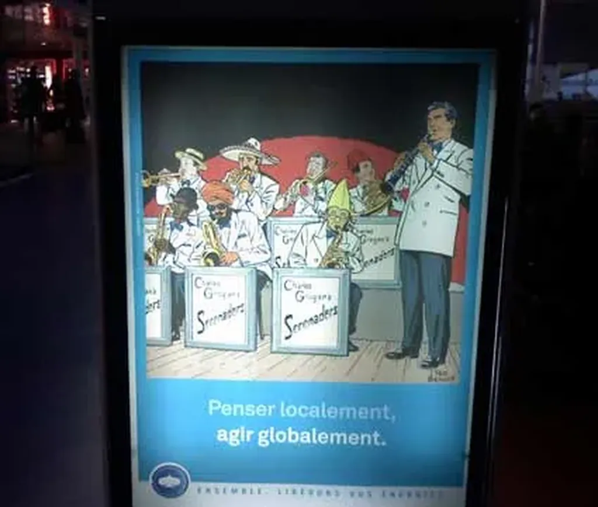

# CapGemini !

Hier soir, en partant à [La Réunion](les-pirates-de-la-reunion.md), la tête totalement dans le sac car fiévreux, je trouve le moyen de m’énerver en voyant à Roissy une pub pour [CapGemmini](http://www.fr.capgemini.com/).

Je me suis dit que j’avais eu de la chance il y a vingt ans de ne pas commencer ma carrière dans une telle boîte. Renverser les slogans, c’est toujours amusant mais je n’avais pas envie de rire.

« Penser local, agir global » c’est ce que font les hommes depuis le début de la révolution industrielle. Ils ont une idée dans leur coin, sans tenir compte de l’interdépendance, et l’applique au nom du profit à la planète entière. On connaît les conséquences.

Qu’une boîte puisse se revendiquer d’un tel slogan m’énerve, surtout quand il s’agit d’une boîte de cravatés, de gens qui veulent toujours monter plus haut… qui ne rêvent que croissance.

#politique #y2007 #2007-11-26-16h53
