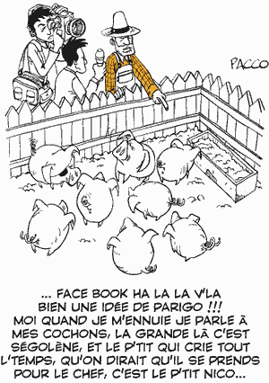

# Facebook et la politique

Après les blogs, c’est maintenant au tour des réseaux sociaux d’attirer les politiciens. Une journaliste du [Parisien](http://www.leparisien.fr) m’a posé quelques questions au sujet de Facebook et a publié un mini résumé de notre conversation le 24 octobre.

*-- Comment peut-on expliquer le succès de ce site ?*

-- Facebook combine plusieurs fonctions jamais réunies jusqu’alors : les e-mails, la messagerie instantanée, le blog, le forum… des milliers d’autres applications qu’on peut ajouter d’un clic. Sa force repose sur la propagation « virale » d’informations et d’applications vers un grand nombre d’utilisateurs.

*-- Pourquoi les hommes politiques sont-ils séduits ?*

-- Facebook leur permet de se créer une image jeune et branchée. C’est également une manière de faire exploser la structure pyramidale qui prévalait jusqu’alors entre les hommes politiques et les électeurs. Un personnage très connu peut ainsi devenir individuellement « ami » avec des milliers d’inconnus et mobiliser de nouveaux soutiens.

*-- Les États-Unis ont, dites-vous, une longueur d’avance...*

-- Barack Obama et Hillary Clinton, tout deux candidats démocrates à l’investiture, ont effectivement un réseau Facebook beaucoup plus puissant que celui des hommes politiques français. Pour preuve, ils ont respectivement plus de [150 000](http://www.facebook.com/person.php?id=2355496748) et [500 000](http://www.facebook.com/group.php?gid=2243510858) amis», contre [3 100](http://www.facebook.com/profile.php?id=665093145) pour Bertrand Delanoë, le politicien français le plus populaire sur Facebook. Certains utilisateurs américains ont même développé des logiciels pour récolter de l’argent à destination des différentes équipes de campagne... Ce site peut donc avoir beaucoup d’influence.

Dimanche prochain Michel Field m’invite sur Europe 1 pour reparler de Facebook et de la politique. Il y a beaucoup à dire, notamment à rappeler qu’une des plus belles histoires politiques sur internet, celle d’Howard Dean en 2003 aux États-Unis, se joua grâce à [Meet-up](http://www.meetup.com), un autre réseau social.

Si le blog est propice à l’expression d’idées et au débat, il est moins adapté au buzz, qu’il soit politique ou non. Sur Facebook, pour propager une nouvelle, il suffit de cliquer sur un bouton. Sur un blog, il faut écrire un article. Le blog est d’une certaine manière plus élitiste. Là où il exige des compétences journalistique, Facebook exige simplement d’inviter des amis dans son réseau ou dans son groupe.

La théorie des six degrés de séparation de Milgram n’a jamais été aussi d’actualité. Mark Zuckerberg, le fondateur de Facebook, rêve d’ailleurs de créer le social graph qui réunira l’ensemble de l’humanité. Les outils de type Facebook réduiront alors nos degrés de séparation comme j’en fais l’hypothèse au début du *[Peuple des connecteurs](../../page/le-peuple-des-connecteurs)*.

Chacun de nous sera capable de propager des informations vers des millions d’autres personnes. Il suffira de trouver les sujets qui buzzent et que les amis auront envie de propager. Facebook transforme le buzz en une espèce de jeu vidéo et nous rapproche en même temps du degré zéro de l’information.

Les politiciens ne pouvaient pas rêver mieux. En France, je me suis déclaré ami avec [Bertrand Delanoé](http://www.facebook.com/profile.php?id=665093145), [François Bayrou](http://www.facebook.com/profile.php?id=678402559&highlight), [Jean-Marie Cavada](http://www.facebook.com/profile.php?id=541042339), [Thierry Solère](http://www.facebook.com/profile.php?id=597658045). J’ai eu le plaisir d’être invité par [Corinne Lepage](http://www.facebook.com/profile.php?id=524213587). J’essaierai d’étendre la liste. Si j’avais l’intention de me ranger dans un camp, si je n’étais pas un électron libre, il me suffirait de me rapprocher de la personnalité avec laquelle je compte le plus d’amis en commun.

Au-delà de cet aspect anecdotique, les réseaux sociaux vont bouleverser la politique comme je l’annonce dans *[Le cinquième pouvoir](../../page/le-cinquieme-pouvoir)* (voilà d’ailleurs une des raisons pour lesquelles j’ai refusé d’appeler ce livre *BlogPower*). En créant leur réseau, les politiciens fédèrent autour d’eux leurs sympathisants sur un mode non pyramidal. Ils font un pas vers la politique non hiérarchique et vers la société des connecteurs.

S’ils oublient l’idée de pair à pair, elle risque vite de leur revenir dans la figure. Si un politicien peut informer son réseau, les membres du réseau peuvent informer le politicien, ils peuvent même exercer de terribles pressions sur lui. Le réseau social est l’outil de prédilection du cinquième pouvoir.

### Notes

1. En septembre 2006, François Bayrou m’avait présenté la structure de son site de campagne pour la présidentielle 2007. Je lui avais conseillé d’oublier l’aspect blog et de créer un réseau social. Un an plus tard, cette idée a fait son chemin.
2. Avec Facebook et Cie, nous tressons notre réseau, accumulons les amis et les amis d’amis. Nous n’activerons ce réseau que de temps à autres lorsque nous aurons quelques choses à dire ou à faire savoir. Alors que le blog exige d’entretenir une audience, le réseau social permet d’atteindre une immense audience instantanément. C’est l’outil de buzz idéal.
3. Plus que des informations, nous pouvons faire circuler des applications… et les applications, par leur usage, peuvent changer la société plus certainement que les idées. Dans notre monde technologique, l’application est la mise en pratique des idées.
4. Cette diffusion des applications différencie le web d’un média. Il s’affirme plus que jamais comme un [territoire](../../2006/7/internet-comme-territoire.md). C’est le retour du cyberspace. Tous ceux qui l’oublieront ne traverseront pas la révolution qui se joue en ce moment.
5. Je ne crois pas à l’avenir de Facebook à moins d’un changement très rapide. Facebook est une solution centralisée et fermée. Les développeurs préfèreront suivre l’[Open Social de Google](http://www.zdnet.fr/actualites/internet/0,39020774,39375054,00.htm?xtor=RSS-1) sur la voie de l’ouverture et de l’interconnexion.

#politique #y2007 #2007-11-5-19h11
