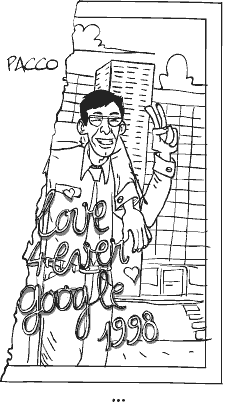

# Google et moi : une histoire personnelle

La théorie découle presque toujours de l’expérience. Ma philosophie n’est rien d’autre que ma vie. J’éprouve le besoin de vous raconter un petit bout de cette vie pour relativiser [ce qui m’arrive avec Google](google-hegemonique.md).

Lorsque j’ai quitté la presse en 1994, je me suis juré de maximiser mon temps de liberté. J’ai décidé de gagner ce dont j’avais besoin pour vivre et de consacrer le reste de mon temps à l’écriture. En quelque sorte, j’ai renoncé à la croissance, au toujours plus. Certes, j’ai parfois des goûts de luxe et, si mon minimal est supérieur à celui de beaucoup de gens, je n’ai jamais cherché à dépasser cette limite auto-imposée. Je me suis simplement positionné à la place qui me permettait de mener une vie d’écrivain.

En 1996, avec le début d’internet grand public, j’ai vu une opportunité dans l’écriture de livres de vulgarisation. À l’époque, les éditeurs me dirent que je ne pourrais jamais vivre de mes livres, qu’ils seraient un à côté. J’ai eu alors beaucoup de chance avec l’avènement de la bulle. En travaillant deux mois par ans d’arrache-pied, souvent 16 heures par jour, tous les jours, je gagnais plus qu’il ne m’en fallait car les livres marchèrent au-delà de toute espérance.

J’aurais pu travailler plus, j’en avais la force, mais je préférais consacrer mon énergie à d’autres textes, des textes que je n’ai jamais publiés à ce jour, notamment un immense journal version bêta de ce blog.

En 1998, en même temps que naissait Google, j’ai eu l’idée du *Guide des meilleurs sites*, je l’ai imaginé comme le Michelin du web, un annuaire de la crème. Lors de sa sortie fin 1998, avec Rémi mon associé sur ce projet, nous avons créé [bonWeb](http://www.bonweb.com), version en ligne de ce livre dans le but d’en faire la promotion et de le mettre à jour en continu. Aux pages du livre, nous ajoutions chaque semaine une nouvelle page web.

Le livre marcha bien la première année et très bien les années suivantes, nous avons totalisé 200 000 exemplaires. Pendant ce temps, bonWeb vivotait. Un contrat avec la Fnac nous rapporta quelques deniers mais ce contrat parti en fumé avec l’explosion de la bulle en 2001. En parallèle, les ventes du livre commencèrent à décroître.

Fin 2003, Google lança son programme AdSense. J’intégrai leurs publicités dans bonWeb, prenant le parti d’insérer les résultats AdSense au milieu de mes propres résultats. Google suggérait des liens commerciaux souvent très pertinents par rapport au contenu de nos pages, nous allions dans le sens d’aider l’internaute à trouver les sites intéressants pour lui.

Aucun lecteur, aucun annonceur, ne s’est jamais plaint de notre mise en page. Les responsables du programme AdSense, parfaitement au courant de notre modèle économique, ne nous firent jamais le moindre reproche. Comme les revenus bonWeb 2003 avaient dépassé ceux de la version papier, nous l’interrompirent. Les internautes n’avaient plus besoin de livres pour apprendre à surfer. Internet se nourrissait de lui-même.

Pour ma part, je consacrais l’essentiel de mon temps à [Ératosthène](../../page/eratosthene) tout en voyant le trafic de bonWeb progresser. Pour me maintenir à jour techniquement, j’ajoutais des fonctions : commentaires, notifications, blogs, search…

Un jour, début 2005 je crois, je me dis que lorsqu’un internaute lançait une recherche sur bonWeb, il fabriquait une nouvelle page bonWeb. C’était une façon de réorganiser les meilleurs sites, de proposer une nouvelle vision. Je créais alors un index de ces recherches, établissant un classement des plus populaires.

Je constatais avec plaisir que Google indexait ces pages et que, plus il les indexait, plus je recevais de trafic depuis Google. J’avais involontairement découvert une martingale. À cette époque, que je sache, il n’y avait pas encore de guidelines draconiennes chez Google. Si elles existaient, je n’en avais pas connaissance.

Devant ce succès, j’ai perfectionné la fonction de recherche. Lorsque les internautes ne trouvaient pas de réponse dans notre base de données, j’interrogeais d’autres moteurs de recherche. Ces nouveaux résultats, qui n’avaient rien de meilleur, étaient aussi indexés par Google. D’une certaine façon, Google était en train de s’indexer lui-même.

À ce moment, j’avais pris conscience de la martingale. C’est ainsi que le trafic de bonWeb augmenta exponentiellement, certaines journées début 2007 nous affichions plus de 700 000 publicités AdSense. Des centaines de sites de part le monde fonctionnaient de la même façon. Tous les voyagistes généraient des pages de search comprenant leurs propres offres.

Google souffrait de sa propre capacité à absorber le web. Les éditeurs, jouant au chat et à la souris, en augmentaient le poids démesurément, enterrant d’une certaine façon les véritables contenus. Google était devenu la seule porte de salut pour les éditeurs, nous devinrent des experts de Google.

En février 2007, Google changea son algorithme et réussit à bloquer en partie ces pratiques. Toutes les pages de search de bonWeb furent, par exemple, désindexées automatiquement. Google interdit clairement l’auto-référencement. Le trafic de bonWeb fut divisé de moitié, gardant un niveau confortable pour une société de deux personnes.

J’ai écrit cette histoire pour vous montrer comment j’ai joué avec Google, comment toute une industrie a joué avec Google et continue de le faire. C’est une sorte de course où chacun cherche à maintenir la tête hors de l’eau par tous les moyens mais, soyons clairs, ces moyens se résument à quelques astuces techniques.

Je reconnais que ma martingale était du spamindexing mais bonWeb a toujours été un véritable service. Les spammeurs, eux, créent des centaines de faux sites, ils volent des contenus, les remettent en forme, y insèrent des publicités et donnent le tout à manger à Google. Il existe des millions de ces sites contre lesquels Google fait la chasse.

Avec bonWeb, je ne me suis jamais caché. Pour tous les spécialistes du référencement, il n’y avait aucun mystère dans notre succès. J’ai agit en totale transparence au regard de la profession.

Depuis que Google ne se laisse plus prendre à l’auto-indexation, le trafic de bonWeb est resté élevé. J’ai développé un système de tags, basé sur une sorte de réseau neuronal, où nous apprenons à détecter le comportement des utilisateurs afin de repérer les sites qu’ils aiment et d’améliorer automatiquement le contenu de nos pages. J’estime que c’est un véritable service, encore imparfait, mais c’est une façon pour un annuaire d’apprendre de ses usagers, de proposer justement d’autres résultats que ceux que nous proposent Google, d’offrir une autre vision du web.

Je n’ai pas découvert dans un manuel comment construire une bombe, je ne l’ai pas assemblé, puis fait sauter. J’ai créé un site, j’ai essayé de l’améliorer et, Google, par sa puissance, avala tout, me poussant et poussant tous les webmasters dans la direction que je viens de vous raconter.

J’ai beaucoup appris au cours de cette histoire. J’ai eu l’idée de mon système d’apprentissage, j’ai eu ensuite l’idée de [coZop](http://cozop.com) sur lequel je travaille aujourd’hui. C’est en faisant qu’on apprend. J’ai dépassé la limite avant qu’elle ne soit déclarée limite par Google. J’ai enfreint les guidelines a priori.

Il est logique maintenant que Google me demande de rentrer dans les rails. Je ne conteste pas cette exigence. Je pense qu’aujourd’hui bonWeb est clean selon les vœux de Google. Les pages tags qui n’ont pas accumulé assez d’expérience utilisateur sont déclarées en noindex et Google ne perdra plus de temps avec elles.

Je suis ouvert à vos conseils pour essayer de tendre vers un web plus proche des attentes des utilisateurs. Nous ne devons pas toutefois essayer d’être idéalistes dans un monde où ne vivent pas que des enfants de cœur. Nous avons tout intérêt à pousser la technique vers la limite sinon nous cesserons d’apprendre.

Pour que nous citoyens puissions devenir un cinquième pouvoir, il est vital que nous maîtrisions la technologie face aux géants d’internet. Nous devons, à tout moment, être capables d’opposer une force égale à la leur, voire supérieure. Je n’ai fait qu’apprendre maladroitement à jouer avec.

Je vous avoue que je me suis beaucoup amusé. C’était et ça reste un jeu grandeur nature.

#autobiographie #google #dialogue #y2007 #2007-11-22-15h10
