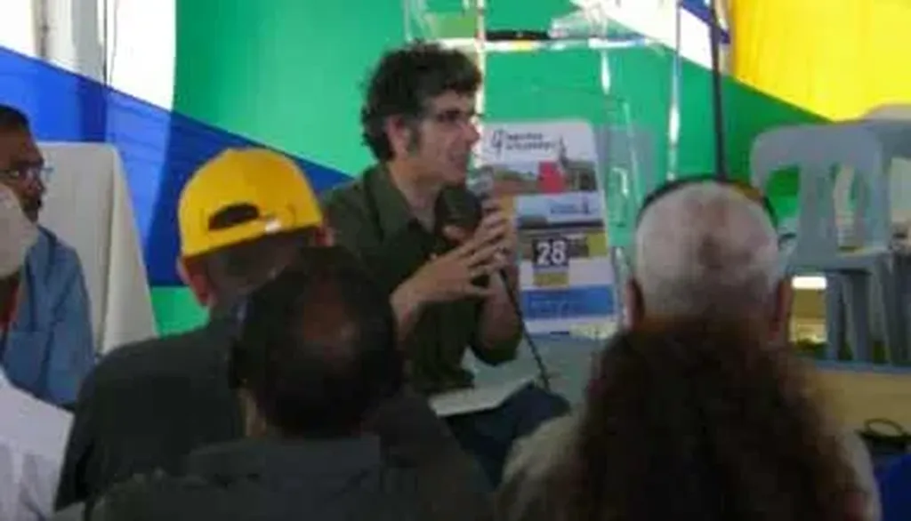

# Pourquoi le participatif est vital

Sur l’île de La Réunion, et ailleurs, Alain Bénard, maire de Saint-Paul, est souvent pris pour un extraterrestre. Mais pourquoi se lance-t-il dans le participatif ?

S’il en faisait la publicité, au moins devant ses concitoyens, on pourrait dire que c’est dans un but électoral, mais j’ai constaté que les Saint-pauliens ne savent pas que leur maire est l’avant-garde du participatif. Il y a ceux qui participent et ceux qui ne savent pas encore que c’est possible.

Alain ne veut pas aller trop vite car tout reste à apprendre. Il ne veut pas amener toute la population dans une démarche encore tâtonnante. Il a juste la certitude que nous n’avons plus le choix, que nous devons profiter de l’intelligence collective avant qu’elle ne devienne une nécessité par trop vitale et à laquelle nous serons mal préparés. À La Réunion, Alain effectue une révolution silencieuse. Pour lui la participation est une nécessité, pas une simple possibilité de gouvernance.

Hier, lors d’une longue série de questions/réponses avec les Saint-pauliens, j’ai essayé de dire pourquoi le participatif était aujourd’hui incontournable.

1. L’homme a changé. Plus éduqué, plus informé, plus conscient de lui-même, de sa différence, de sa valeur, plus habitué à s’exprimer sur les évènements du monde, il ne peut plus rester le spectateur passif de la politique. Le participatif est une façon de ne pas frustrer ceux qui veulent s’exprimer. Plus ils seront nombreux, plus le participatif sera incontournable. Les jeunes habitués à l’interactivité du net arrivent et ne connaissent rien d’autre que le participatif. Il faudra aller dans leur sens ou se heurter à leur volonté.
2. La méthode participative, en s’appuyant sur l’intelligence collective, est la plus apte à résoudre les problèmes complexes. Elle est particulièrement adaptée quand nous n’avons pas de solution. Plus le monde est complexe, plus le participatif est nécessaire.
3. La nature est elle-même massivement participative ([l’auto-organisation étant la forme idéale de la participation](les-pirates-de-la-reunion.md)). En étant participatif, en fonctionnant comme elle, nous avons plus de chances d’être en harmonie avec elle, donc moins de chance de la saccager. Nous n’avons guère d’autres choix alors que, par notre nombre, notre impact sur la biosphère est sans précédent.
4. Le participatif est déjà à l’œuvre dans nos villes, nos familles, nos équipes sportives… Il est déjà la forme d’organisation sociale la plus largement employée. Nous avons juste besoin de l’étendre aux domaines qui, un temps, ont profité de la méthode pyramidale et autoritaire.
5. Le participatif implique la durabilité. Si les citoyens décident collégialement où un nouveau gymnase sera construit, s’ils en définissent l’aspect, les modalités de fonctionnement, il devrait les satisfaire mieux que si on le leur avait imposé. Nous sommes moins prompts à jeter quelque chose qui nous satisfait. Un gymnase issu d’un processus participatif devrait être plus durable. Le participatif est la seule approche qui saura satisfaire l’objectif de durabilité que la société semble désireuse d’adopter.

#politique #y2007 #2007-11-29-10h5
