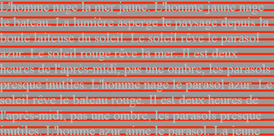

# Signer le code

L’art d’aujourd’hui me parle quand il est architectural. J’aime l’architecture parce qu’elle structure l’espace, j’aime la littérature quand elle structure mon imaginaire, j’aime la BD parce qu’elle structure la page, j’aime les photos montages pour la même raison. Les œuvres qui ne possèdent pas cette dimension architecturale, la plupart de celles exposées dans nos galeries, me paraissent datées.

Pour moi, Ed Ruscha est l’un des initiateurs du mouvement architectural. En 1966, avec [*Every Building on the Sunset Strip*](http://www.virtualmuseum.ca/Exhibitions/Photos/html/en/essayImages/SM010-001.html), il fait un retour aux polyptiques classiques, je pense au [*Cycle de la Scuola de Sant’Orsola*](http://vrcoll.fa.pitt.edu/UAG/Art-Anytime-Page/Lochoff-pages/pages/16-Carpaccio-Ambassadors.htm) de Carpaccio, tout en saisissant ce que j’apprécie le plus dans notre époque. Ruscha me donne envie de marcher en ville, de regarder la ville, de partir à l’exploration du quotidien.

Le montage qui illustre cet article provoque chez moi les mêmes sensations. J’en vois déjà qui vont dire « bof, je ne vois pas l’intérêt, c’est du déjà vu ». Commencez plutôt par cliquer sur l’image et vous comprendrez ce que je veux dire. Ce montage n’existe tout simplement pas, c’est un assemblage de flux vidéo en perpétuelle actualisation.

J’ai eu la chance de rencontrer BlueScreen, le créateur de ce [streamscape](http://streamscape.net), à Marseille. Son œuvre, comme il le dit lui-même, n’est pas le montage mais le code informatique qui engendre le montage. BlueScreen signe le code. Ses œuvres visibles ne sont que des représentations du code.

Il travaille actuellement au projet [jiaocha](http://jiaocha.org/), un système de chat visuel. Tu envoies une image à un ami ou un inconnu, il te répond en ajoutant à ton image une autre image… BlueScreen m’a montré des échanges superbes. J’ai tout de suite pensé que des auteurs de BD pourraient ce saisir du système, [reprenant et amplifiant la technique expérimentée par Jim et Fane](http://www.roquerols.fr/2007/10/01/petites-eclipses-a-sete/).

En parcourant [les travaux de BlueScreen](http://www.b-l-u-e-s-c-r-e-e-n.net/), ceux du [groupement scenocosme](http://www.scenocosme.com), j’espère que vous comprendrez mieux ce que j’entends par [artiste hacker](../10/culture-et-technologie.md), par cette nécessité à mon sens de [maîtriser le code pour être un artiste profondément contemporain](../10/culture-20.md).

Pour tout vous avouer, ce qui explique sans doute ma position, j’ai moi-même fait une incursion dans ce domaine du [code artistique](http://lab.tcrouzet.com/interlaced/). Cette expérience de 1996 vite abandonnée avait pour but de laisser l’utilisateur se créer une image en quelques clics. Elle m’a surtout donné la certitude que le code pouvait devenir générateur d’œuvres.

Dans le même esprit, j’ai écrit en 1991 et 1992 un roman appelé *Équinoxe d’automne* où chaque signe avait une valeur temporelle de 0,4 seconde. Pour décrire une action, je devais donc peser temporellement mes mots. Sans l’aide d’un code, ce travail aurait été impossible. Suivant ce principe, en hommage à Georges Pérec, j’ai fini par écrire 12 heures de la vie d’un Parisien.

Mes expériences personnelles expliquent ma pensée, elles expliquent aussi sans doute pourquoi je vois en BlueScreen un artiste important, pourquoi j’attache autant d’importance au code. Nous avons découvert un nouveau monde, il nous reste à l’explorer, il st du devoir de l’artistes de le faire et de ne pas se cantonner aux rivages familiers.

#connecteur #y2007 #2007-11-7-8h52
