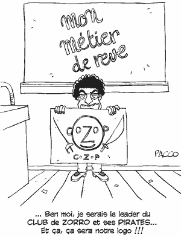

# Ohé blogueurs : coZop ouvre

En septembre 2006, je m’étais dis que nous pouvions [récupérer l’argent des blogueurs](../../2006/9/l%e2%80%99argent-des-blogueurs.md) pour financer des associations humanitaires, des fondations, des projets, soutenir les auteurs attaqués en justice…

Comme bien d’autres, cette idée est restée en stand by jusqu’au printemps dernier, jusqu’à ce qu’après la présidentielle une sorte d’accalmie se soit emparée de la blogosphère. Je me suis alors dit que nous devions nous auto-motiver.

Jusqu’à présent la blogosphère a été tirée en avant par un phénomène de mode, puis par les enjeux électoraux, parfois par des enjeux commerciaux pour les blogs ciblés qui réussissent à conjuguer audience et revenus publicitaires… Il est temps de transformer cette masse de créativité en un véritable pouvoir économique et politique. Avec Carlo Revelli, le fondateur d’[Agoravox](http://www.agoravox.fr), et Bertrand Couturier, un ami développeur, nous avons alors imaginé [coZop](http://cozop.com).

Pour les lecteurs, coZop se présentera comme un immense journal, publiant chaque jour des milliers d’articles en version intégrale et dans toutes les langues européennes.

Pour naviguer dans cette masse d’information, une fonction de social reading sera mise en œuvre : quand tes amis lisent un article, cet article t’intéresse peut-être. En liant les lecteurs par un réseau social, coZop apprendra à les connaître et leur délivrera automatiquement des articles susceptibles de les intéresser.

coZop veut casser le principe de la notoriété qui prévaut aujourd’hui sur le web : plus tu es lié, plus tu es intéressant. En 2005, lorsqu’Étienne Chouard publia son article contre la constitution européenne, personne ne l’avait jamais lié. Nous voulons que de tels articles remontent à la surface le plus souvent possible sans attendre un miracle.

Pour coZop, la popularité absolue n’existe pas. Il n’existe que des popularités relatives à l’intérieur des diverses communautés de lecteurs. Nous espérons faire découvrir aux lecteurs de nouveaux auteurs, de nouveaux sujets, nous espérons les aider à dépasser les sujets à la unes des journaux traditionnels. Nous espérons aussi obtenir une audience comparable aux grands médias pour qu’enfin cette blogosphère soit prise au sérieux lors des grandes échéances.

coZop ne réussira cette mission que si les auteurs du web, les blogueurs en premier lieu, participent à l’aventure. Ils peuvent dès aujourd’hui [s’inscrire sur coZop](http://cozop.com/_s_enregistrer) et référencer leurs sites. Leurs articles seront alors republiés et monétisés, 50% des revenus leur revenant. Ils pourront encaisser cet argent ou le reverser aux associations, fondations et projets qui s’inscriront sur coZop. Nous espérons ainsi que les petits ruisseaux formeront de grandes rivières.

coZop est en version alpha. Le [social reading](http://cozop.com/_social_reading) n’est pas encore opérationnel. Dans un premier temps, nous nous focalisons sur les fonctions destinées aux auteurs. Nous avons besoin d’accumuler une immense base d’articles avant que les lecteurs puissent les parcourir et nous apprendre à les connaître.

Nous avons ouvert un blog pour discuter de coZop.

Vous trouverez une présentation détaillée sur le site.

Nous construisons une série de questions/réponses pour préciser notre projet.

coZop permet déjà aux lecteurs comme aux auteurs de créer leurs propres journaux en épinglant entre eux des articles. J’ai commencé à créer le journal des connecteurs. Je le complète dès que les auteurs rejoignent coZop. J’ai aussi ouvert le journal des Freemen.

#buzz #y2007 #2007-12-5-15h18
