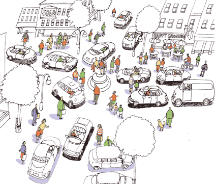

# Un croisement idéal

En retravaillant *[Le peuple des connecteurs](../../page/le-peuple-des-connecteurs)* en préparation de la [seconde édition audio](../11/liberer-les-connecteurs.md), j’ai cherché à savoir la suite donnée aux expériences de routes sans signalisation. Sur le site de [Ben Hamilton-Baillie](http://www.hamilton-baillie.co.uk), le spécialiste anglais de cette technologie de connecteur, j’ai découvert un projet imaginaire pour la ville de Bristol.

Ces deux dessins, avant et après, parlent d’eux-mêmes. Ils illustrent le passage du monde pyramidal au monde des connecteurs. Quand on enlève les signalisations, quand les hommes s’interconnectent en direct, la ville reprend vie.

#connecteur #y2007 #2007-12-4-12h32
