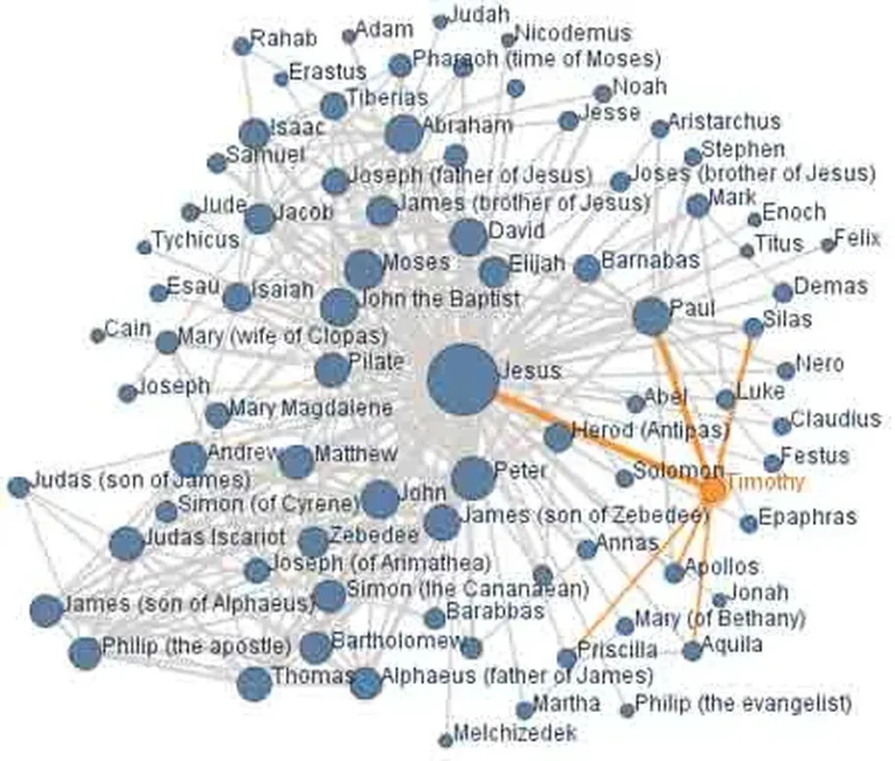

# Rien que pour le plaisir

Grâce à [barrablog](http://gentechspace.free.fr/barrablog/index.php?2007/01/04/268-reseau-social-historique), je viens de découvrir le réseau social entre les personnages du Nouveau Testament. Cette [cartographie animée](http://services.alphaworks.ibm.com/manyeyes/view/SMGTJEsOtha6zD-hkydKE2-) est proposée par le un [superbe service de partage de connaissances et de visualisation créé par IBM.](http://services.alphaworks.ibm.com/manyeyes/app)

#connecteur #noepub #y2007 #2007-2-6-10h24
