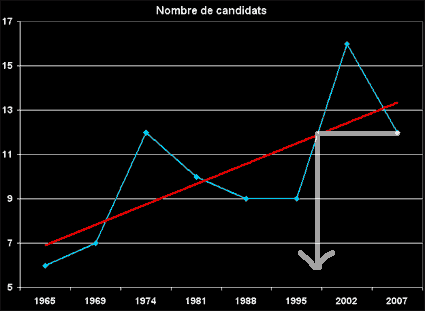
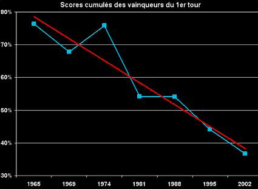

# Hold-up démocratique

Ça y est, nous y sommes, nous n’aurons cette année que 12 candidats à la présidentielle. L’UMP et le PS ne s’en sont pas trop mal tirés. Ils ont laissé assez de candidats se présenter pour ne pas inquiéter les démocrates naïfs mais pas trop pour se mettre en danger (nous aurions très bien pu avoir 16 candidats comme en 2002 et beaucoup plus si le jeu démocratique avait été ouvert).

Avec plus de candidats, les deux candidats qui accèdent au second tour auraient cumulé moins de suffrages, donc auraient été beaucoup plus vulnérables à la montée d’un troisième homme, comme Le Pen en 2002.

La clarté électorale, telle que la souhaite le PS, a bon dos. En fait, son seul but est de préserver les chances du PS pour le second tour. C’est une autre forme de l’argument [vote utile](le-vote-utile.md).

 

Historiquement, les scores cumulés des deux vainqueurs du premier tour est à la baisse. Avec 12 candidats contre 16 en 2002, nous risquons d’observer un léger recul (à cause du fameux effet mémoire de 2002). Dans la logique du graphique ci-dessus, nous devrions retrouver le score de 1995, soit 44 %.

Pour le moment, les sondages placent Sarko+Ségo beaucoup plus hauts, vers les 55 % (niveau de 1981 et 1988). Soit ils se trompent, soit notre démocratie prend un sacré coup de vieux, s’éloignant du [profil longue traîne](../../2006/12/la-longue-traine-politique.md) qu’elle avait montré en 2002, profil qui me paraît caractéristique de la nouvelle société participative, comme je l’explique dans [Le cinquième pouvoir](../../page/le-cinquieme-pouvoir).

*PS1 : L’UDF et le PC n’ont pas plus joué le jeu que le PS et l’UMP. Pour le PC, on peut comprendre, il joue la carte PS. Pour l’UDF new look on comprend moins. À mon sens Bayrou avait intérêt à ouvrir cette élection, c’était dans sa logique d’union nationale à la proportionnelle. Mais Bayrou a-t-il un pouvoir sur les derniers cadres de l’UDF ?*
*PS2 : Pour ma part, je ne pense pas que la baisse régulière des scores cumulés au premier tour soit un hasard. Je crois que c’est une tendance lourde qui démontre la défiance du peuple à l’égard des candidats. Cette défiance finira par se traduire par l’adoption de nouvelles modalités démocratiques. Nous n’aurons cette année sans doute qu’un sursis.*

#coup_de_gueule #y2007 #2007-3-19-22h29
