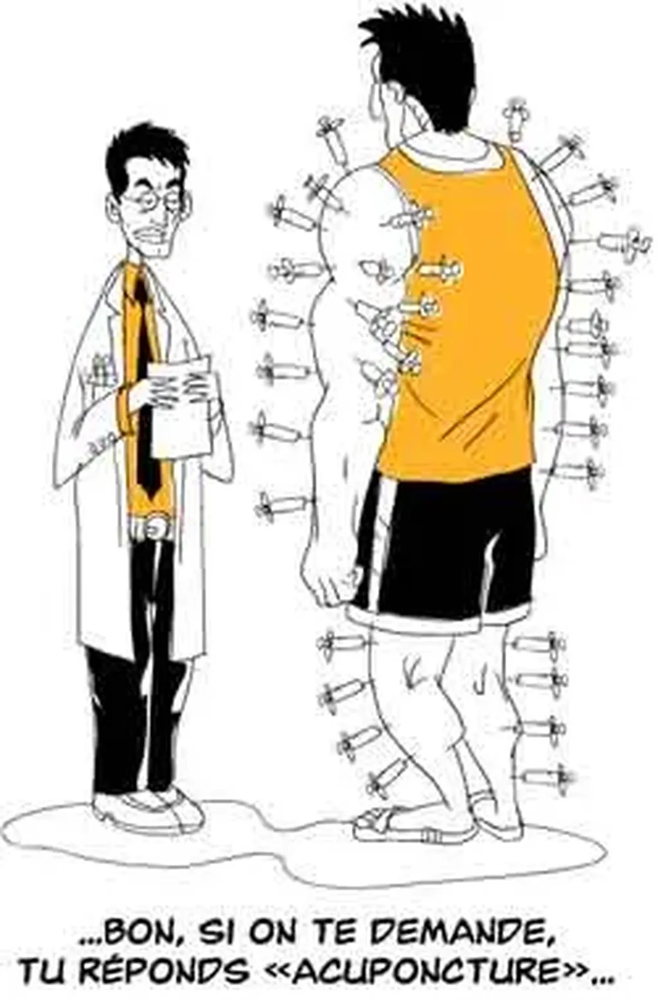

# Oui au dopage contrôlé

Je suis un fan du tour de France. Je ne manque pas une étape de montagne, mais j’avoue que cette année la course fut morose à cause des histoires de dopage. Mais pourquoi accabler les cyclistes ?

Vous buvez du café, vous êtes dopé.

Vous fumez, vous êtes dopé.

Vous prenez des vitamines, vous êtes dopé.

Les étudiants se dopent.

Les politiciens se dopent.

Les entrepreneurs se dopent.

Les artistes se dopent.

Pourquoi les sportifs ne pourraient-ils pas se doper ?

Depuis la nuit de temps, les hommes cherchent à dépasser leur nature. La technologie est une dope externalisée. Pourquoi refuser aux sportifs, qui cherchent justement à dépasser les limites humaines, de se doper ?

Pour les protéger ?

Mais alors pourquoi laisser les citoyens se doper sans entrave ?

Faut-il effectuer des prises de sang à l’entrée des concours, à l’entrée des bureaux, à l’entrée des isoloirs ?

Où est la limite ? N’est-elle pas aujourd’hui arbitraire ?

Est-ce normal que deux étudiants à capacités égales ne réussissent pas de façon égale parce qu’ils n’accèdent pas aux mêmes drogues ?

C’est encore le riche qui l’emporte… celui qui peut se payer la toute dernière technologie (et elle existe… si si… [Modafinil](http://www.doctissimo.fr/medicament-MODIODAL.htm) et compagnie). Mais ce n’est pas en interdisant qu’on équilibrera les chances. Les interdits peuvent toujours être outrepassés, surtout dans un monde où la technologie évolue exponentiellement.

Les nouvelles techniques de dopage sont toujours en avance sur la règlementation.

N’est-il pas préférable d’autoriser le dopage mais en l’encadrant médicalement ? S’il est accepté, ne sera-t-il pas moins nocif ? N’est-ce pas une situation comparable à la prostitution ?

Le problème est aussi complexe que l’hypocrisie est répandue. Des politiciens dopés votent la réglementation antidopage qui se traduit par « ne faites pas comme nous. » Mais pour quelle raison ? Pourquoi les sportifs devraient-ils être propres et pas les autres citoyens ?

Personnellement je ne me suis jamais drogué. Je n’abuse même pas de l’aspirine. Mais je sais que si un jour je vois ma capacité de travail diminuer, ma mémoire flancher, mon cerveau piétiner, je n’hésiterai pas à expérimenter les drogues qui sortent des laboratoires.

Refuser de vieillir, du moins refuser les conséquences du vieillissement, c’est comme pour un sportif refuser de manquer de force.

Il n’y a aucune différence.

Soit on autorise pour tous, soit on interdit pour tous, c’est-à-dire on contrôle tout le monde, ce qui évidement est impossible.

La formule 1 a longtemps été le laboratoire de l’industrie automobile (maintenant elle ne sert plus qu’à promouvoir une technologie désuète). Les sportifs ne pourraient-ils pas eux aussi contribuer au progrès de l’espèce humaine ? Ne pourraient-ils pas servir de cobayes consentants ?

Cette idée peut paraître horrible mais, dans les faits, beaucoup d’hommes servent déjà de cobaye volontaires : les astronautes, les pilotes d’essai, certains médecins qui expérimentent sur eux-mêmes de nouveaux traitements… Ils risquent leur vie pour essayer d’améliorer notre bonheur à tous.

Pourquoi pas les sportifs ? Pourquoi les laisser entre les mains de charlatans qui mettent en danger leur vie en prenant avec eux des risques même pas mesurés.

Si le dopage était socialement accepté, socialement admis, nous serions beaucoup plus méfiants à son égard. Les jeunes sportifs sauraient qu’il y a un danger. Aujourd’hui, on le leur cache, ne leur parlant que de victoire… alors que si victoire il y a, c’est une victoire sur nos limites humaines.

Tout le problème est de savoir comment protéger les enfants… car nous commençons le sport de compétition souvent très jeune. N’est-ce pas cela qui doit être remis en cause ? Pourquoi faire des enfants des bêtes de concours ? Les adultes sont les seuls coupables. C’est nous qui poussons au dopage.

#coup_de_gueule #y2007 #2007-7-26-9h26
