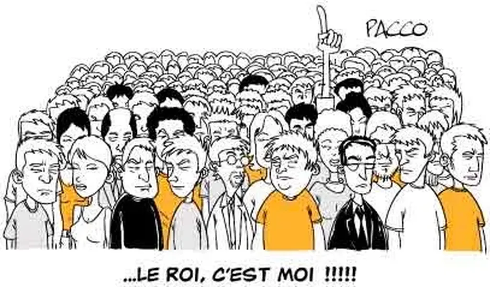

# La tentation du pouvoir

Donnez du pouvoir à quelqu’un, il tentera souvent d’en avoir plus. C’est ainsi que se lisent la carrière de presque tous les hommes politiques. De maire ils deviennent député, puis ministre, puis Président. Certains très lucides, comme Tony Blair, décident de tout lâcher en cours de route, avant que les échéances administratives ne les poussent à la retraite. Ils sont rares.

 

Dans le business, les hommes d’affaires sont tout aussi accros au pouvoir bien que parfois ils hésitent entre le pouvoir et l’argent. Ainsi certains après avoir fait fortune ne rêvent que de créer de nouvelles entreprises, non pas pour refaire fortune, ce qui n’a plus de sens, mais pour s’accomplir au travers de l’accomplissement des employés sous leur responsabilité.

Quand on connaît les bénéfices apportés par des structures décentralisées, on comprend mal pourquoi la tentation du pouvoir a survécu au jeu de l’évolution. Je me demande si, dans les systèmes complexes, le pouvoir n’apparaît pas comme une usure lorsqu’un système se meurt. L’histoire d’internet, en tout cas telle que je la lis, me le laisse croire.

Au début, quelques ingénieurs découvrent comment exploiter des calculateurs distants en les interconnectant. Le réseau pousse alors comme une herbe sauvage, sans le moindre contrôle par le haut. C’est une effloraison luxuriante qui prolifère à une vitesse jamais atteinte par les créations humaines antérieures.

Il n’y pas de chef, pas de centre de commandement, pas de normes et de règles inviolables, aucun goulet d’étranglement, c’est la ruée vers le virtuel, qui se prolonge encore aujourd’hui.

Mais, dans le même temps, des monstres apparaissent au sein de cette structure, des anomalies par rapport à son code génétique initial. Je pense à Google qui, tel un trou noir, cherche à tout avaler, les informations que nous produisons et même les entreprises innovantes.

Alors que, pendant 30 ans, internet a été régi seulement par la croissance pure, l’annexion de territoires vierge, Google inaugure la croissance par cannibalisation. Il n’y a pas une semaine sans que le monstre n’ingère un service potentiellement intéressant.

Si vous avez une idée, Google vous la prendra pour essayer d’en profiter lui-même. Cette boulimie n’est autre qu’une tentation vertigineuse du pouvoir. Elle risque d’être létale pour la croissance de l’ensemble d’internet.

Si avant de lancer un business, on pense sans cesse à Google, se demandant s’il ne va pas faire de même et nous écrabouiller, on ne vit plus à l’âge de la ruée vers le virtuel mais on entre dans un monde dominé par les puissants, un monde hyper-capitaliste qui empêche aux petits de coexister avec les gros.

Nous risquons d’assister à une perversion de la longue traîne, cette idée que tous les producteurs, petits ou grands, pourront coexister. Aujourd’hui, où observe-t-on la longue traîne ? Dans la liste des ventes d’Amazon par exemple. Un géant, à travers une plate-forme propriétaire, engendre une longue traîne mais en la centralisant, en faisant d’elle ce qu’il veut, pouvant à tout moment pousser vers le haut ou vers le bas un produit.

La longue traîne n’aura une portée sociale, une portée révolutionnaire, que le jour où elle sera décentralisée, où elle se constatera hors des bases de données des géants qui phagocytent une industrie qui pourrait se passer d’eux.

Mais le peut-elle ? Le pouvons-nous ? Je suis le premier à utiliser Google et Amazon. Ils ont acquis une telle avance sur leurs concurrents que nous ne songeons même plus à expériementer d’autres solutions. Le confort nous endort. En tirant le marché en avant, les géants actuels ne risquent-ils pas de se retrouver seuls ? Ils ont été parmi les premiers à créer la croissance mais ne seront-ils pas les premiers à lui mettre un frein ?

Je crois qu’il y a urgence pour que des solutions décentralisées se développent, pour que la communauté open source passe à la vitesse supérieure.

#politique #y2007 #2007-8-19-10h19
