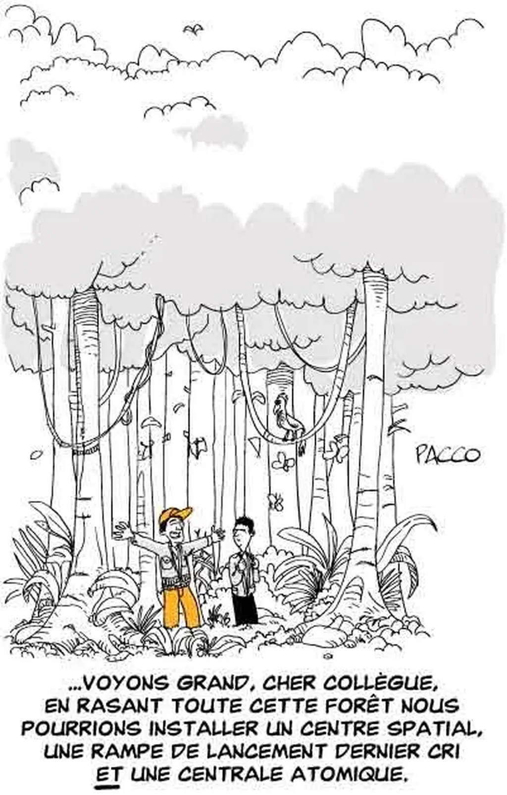

# Le rêve techniciste

Même si je critique tout, je suis d’un naturel optimiste. Au fond de moi, j’ai une telle confiance en l’homme que je crois que nous nous en sortirons toujours.

Durant mon adolescence, j’ai lu des centaines de livres de Science Fiction en même temps que toute la littérature scientifique qui me passait sous la main. Ces auteurs m’ont appris les dangers du développement technique à outrance mais aussi les infinies possibilités qu’il nous réserve.

Longtemps j’ai pensé que, même si nous autres humains commettions des erreurs, nous serions capables de les surmonter a posteriori (je dis bien surmonter et non pas corriger). Pour cette raison, j’étais un fervent partisan du nucléaire, certains que nous trouverions les moyens d’absorber les radiations rémanentes (ils existent des pistes hypothétiques aujourd’hui).

Je me plaçais dans la perspective d’un progrès exponentiel, les technologies d’un jour surpassant à tel point celles du jour d’avant qu’il était inutile de s’inquiéter de l’avenir. J’étais en plein rêve techniciste.

Aujourd’hui, sans doute à cause de l’âge, je suis plus modéré. [Moins enthousiaste pour le nucléaire](../5/le-nucleaire-me-turlupine.md), en partie parce qu’il existe déjà des alternatives que les lobbies centralisateurs tentent de nier, je doute parfois de la toute puissance de la technique.

Nous sommes toujours sur une courbe de développement exponentiel, mais nos vies sont-elles plus heureuses pour autant ? Qu’est-ce que la part spirituelle de l’homme a gagné ? Qu’avons-nous gagné en quiétude, en égalité, en respect ?

Nous avons découvert devant nous un réchauffement climatique qui risque de provoquer une guerre géante. Nous avons quelques idées pour le contrer, aussi bien préventives que futuristes comme l’installation de films réflecteurs dans l’espace, mais je me demande si nous serons capables de les mettre en œuvre avant le début du désastre.

J’ai par ailleurs découvert la complexité qui rend toute solution incertaine. Plus notre société se complexifie, moins nous maîtrisons les solutions possibles. Nous sommes embarqués sur une machine évolutive que nous sommes incapables de dompter. Le rêve techniciste, cette ambition de tout contrôler, s’écroule.

Il ne renaîtra que si nous trouvons les moyens de nous échapper de notre monde, d’aller en conquérir de nouveaux. Enfant, je croyais qu’aujourd’hui nous serions déjà dans ce monde des étoiles… mais la technologie a choisi un autre chemin, celui du numérique, qui d’ailleurs est un préalable obligatoire à la fuite vers l’espace (et il y aura encore beaucoup d’autres préalables). Une nouvelle fois le rêve techniciste s’écroule.

Malheureusement je n’en vois pas d’autres possibles. Nous sommes trop nombreux sur terre pour imaginer des solutions non technicistes. Nous n’avons pas d’autres choix que d’aller de l’avant, de parier sur notre génie.

La planète ne peut pas redevenir bio. Elle ne l’a jamais été d’ailleurs. L’idéal bio n’existe pas, c’est une mode et, comme toutes les modes, elle est ringarde comme l’a [souligné Casabaldi](devoir-de-difference/#comment-41513.md). Le bio n’est ni plus ni moins qu’une nouvelle technologie respectueuse de l’environnement (respect n’est pas un terme approprié d’ailleurs car la nature ne s’est jamais ménagé elle-même). Le bio s’inscrit dans le rêve techniciste, il est un pas en avant même si beaucoup de ses adeptes l’idéalisent comme un retour à la nature.

*PS : Je voulais rediscuter du principe de précaution suites à nos échanges mais je n’ai écrit qu’un prélude.*

#dialogue #y2007 #2007-8-22-11h12
