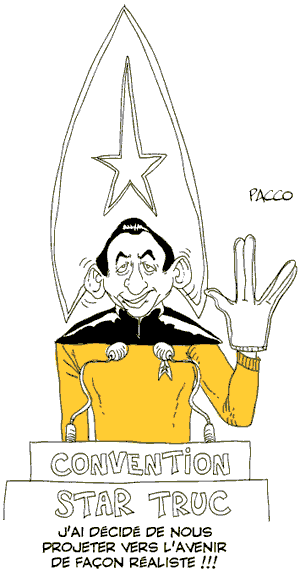

# Militantisme : école de médiocrité

J’ai assisté ce weekend à l’université d’été du Modem. Lors d’une [mini interview avec Nicolas Voisin](http://www.nuesblog.com/?729/Modem-et-Internet-Qu-en-pense-le-papa-du-5o-pouvoir), j’ai résumé ce que j’en pensais. Je voudrais m’expliquer plus longuement, replacer mes propos dans le contexte et justifier leur radicalité.

Je suis arrivé vendredi au VVF de Seignosse juste à temps pour le premier meeting de Bayrou, pas prévu au programme et qui a commencé en retard. Par moment, des vagues d’applaudissements montaient de la salle. « Bayrou, Bayrou… » J’ai vite eu l’impression de me trouver dans une église où les ouailles attendaient dieu le père en personne. Ça commençait mal. La suite n’a pas cessé de me décevoir.

### Médiocrité 1 : ambiance religieuse

Dans les entreprises comme en politique, les leaders motivent leurs troupes lors de grands shows. Chaque fois que j’assiste à ces évènements, je suis mal à l’aise car j’ai l’impression que les gens autour de moi se dissolvent dans le groupe, oubliant tout esprit critique. Il me semble qu’ils renoncent à leur individualité et à leurs particularités. Or, je crois que nous avons besoin de l’intelligence de tous. Chacun doit affirmer son individualité à tout prix. Le meeting politique ne convient pas à l’expression de l’intelligence collective car il ne met en exergue que l’intelligence de l’orateur. C’est une forme démodée... pour preuve, c’est hors des meetings officiels que les échanges fructueux ont eu lieu, avec Quitterie Delmas, Corrine Lepage ou Jean-Marie Cavada, sur le mode improvisé des barcamps.

### Médiocrité 2 : contradictions

Durant son [discours](http://www.forumdesdemocrates.fr/videos.php), Bayrou n’a jamais cessé d’être en contradiction entre ses propos et ses actes. Il parlait de la naissance d’un nouveau parti et, sur la scène, il avait placé de vieux briscards (et pour faire bonne figure le représentant des jeunes). Il parlait de démocratie, de participation, et il imposait sa vision. Par exemple, quand il proposa ses deux fois douze points pour la charte du Modem, il passa par-dessus les 700 contributions des militants. Il eut beau dire que sa proposition n’était que la 701e, j’ai perçu que tous ceux qui avaient contribué se sentaient trahis. Bayrou devait leur donner la parole, les citer, non pas faire la synthèse à leur place.

### Médiocrité 3 : contradictions encore

À quoi bon critiquer Nicolas Sarkozy, le centralisateur, pour agir soi-même en centralisateur ? Quand on pense que la décentralisation et l’ouverture sont les clés de la réussite dans un monde complexe, il faut commencer par appliquer ces clés à son propre parti. Tout au long du week-end, je n’ai cessé de noter un divorce entre les intentions et les actes. En ce sens, Sarkozy est beaucoup plus droit dans ses bottes. Il est partisan du top-down et il agit en accord avec ses principes.

### Lucidité 1 : Sarkozy va dans le mur

Au cours d’une conversation, un militant m’a dit que Sarkozy ne pouvait que se planter car le top-down ne peut plus fonctionner. Un seul homme ne peut prendre toutes les décisions sans paralyser les initiatives individuelles pourtant si nécessaires. Dans les mois qui arrivent, nous aurons peut-être la preuve que la centralisation excessive est néfaste dans un monde complexe. La droiture de Sarkozy au regard du top-down ne suffira pas à faire de cette approche démodée un succès.

### Médiocrité 4 : vive l’ordre

Mais nombre de militants attendaient des réponses, ils voulaient des consignes et des directives… Ils voulaient du Sarkozy like. Les contradictions révélées chez Bayrou étaient en fait plus générales (mais heureusement pas universelles car j’ai souvent senti un vent de révolte). On ne peut pas prôner l’ouverture à l’extérieur et, d’un autre côté, tenter de fermer l’idéologie comme de fermer les rangs du parti, réservant des sièges dorés à certains en particulier.

### Médiocrité 5 : ambition dévorante

Le pire était à venir. Tout le monde ne faisait que parler des prochaines élections et des investitures. Chacun cherchait à se positionner, à gagner des accessits. Nous étions dans l’antichambre du pouvoir. Seule y comptait l’ambition personnelle. J’avais espéré y découvrir une vraie rupture : sacrifier le court terme au profit de l’élaboration d’une vision qui à l’avenir ferait la différence. Tout le monde se comportait comme si cette rupture était déjà derrière eux, dans le programme présidentiel de Bayrou... je pense qu’il n’en est rien.

### Médiocrité 6 : sauver les meubles

Personne n’était capable de définir les grandes idées que défendrait le Modem, sinon à énoncer des banalités éculées que l’UMP ou le PS pourraient revendiquer, mais chacun rêvait de se faire élire. Que fallait-il faire de l’UDF ? Et surtout de son argent ? C’était la question centrale. J’avais l’impression de voir les employés d’une boîte qui vient de faire faillite se disputer la photocopieuse. Parfois, il faut savoir tirer un trait sur le passé et construire du neuf.

### Lucidité 2 : Corinne Lepage

C’est la seule star du Modem qui passa du temps au café avec les militants. Quand on prône l’ouverture, on doit soi-même s’ouvrir. Corinne Lepage participa à un débat improvisé sans jamais accaparer la parole, défendant l’idée que le Modem devait justement définir ses idées avant de penser élection. Il ne sert à rien de courir quand on ne sait pas quoi faire une fois arrivé (c’est d’ailleurs le meilleur moyen de ne jamais arriver).

### Médiocrité 7 : arrivisme

J’ai rencontré des jeunes enthousiastes et brillants, j’en ai vu d’autres dévorés par l’envie du pouvoir, prêt à gravir un à un les échelons jusqu’à la députation, prêt à consacrer vingt ans de leur vie à cette pénible ascension, prêts à s’assoir sur leurs idéaux. C’est pour moi la médiocrité des médiocrités. Celui qui veut réussir dans la vie, qui veut changer le monde, ne peut pas passer son temps à faire des courbettes. Voilà pourquoi les entrepreneurs fuient la politique. Ils entreprennent : ils ne parlent pas d’entreprendre. Voilà peut-être pourquoi Corinne Lepage était la seule ouverte et disponible. C’est une avocate et non une politicienne professionnelle. Elle vit dans la vraie vie.

### Médiocrité 8 : qui s’assemble se ressemble

Hors du cadre des militants fanatiques, les fameux colleurs d’affiches, j’ai découvert des gens qui acceptaient sans broncher toutes les médiocrités dénoncées. Les plus valeureux fuient ce système qui favorise la médiocrité et que des médiocres verrouillent. Quand j’arrivais à cette conclusion en public, on me demandait comment faire autrement ? Comment changer la donne sans passer par un poste électif ? Tous avaient a priori accepté les règles d’un jeu désuet. Tous étaient incapables d’en changer. Je leur répondais que, dans le business, il fallait justement changer de paradigme pour réussir. On me disait que la politique fonctionnait autrement. Je ne le pense pas. Même au football les changements de paradigme mènent à la victoire : souvenez-vous de l’Ajax de Johan Cruyff. Aux États-Unis, Ralf Nader prouva qu’on pouvait influencer la politique sans être élu. Il n’y a pas une voie unique tracée une fois pour toute. Seuls les conservateurs le pensent.

### Lucidité 3 : François Bayou

Il a décidé de lâcher le positionnement au centre et a tenté de placer le Modem sur une autre dimension politique. Ça va dans la bonne direction même si cette autre direction il ne l’a pas définie.

Au final, je crois que le Modem ressemble à l’UMP (le chef tout-puissant) qui, lui-même, ressemble au Modem (le désir d’ouverture) qui, lui-même ressemble à l’UMP (management top-down)… Je pourrais prolonger infiniment cette boucle, j’y inclurais même le PS s’il n’était en ce moment en totale déliquescence. Tous les partis se ressemblent, se copient les uns les autres, s’annihilent les uns les autres et les Français doivent s’en sortir seuls.

Je n’attaque aucun militant en particulier, ni même aucun élu en particulier, mais un système qui favorise la médiocrité et non pas l’excellence. Je suis triste quand je vois des gens renoncer à la force unique qui est en eux et l’abandonner à des chefaillons incapables de l’employer. J’ai croisé à Seignosse des gens remarquables, intelligents, doués, dévoués. Je suis triste de les voir rabaissés au rang de moins que rien. Je suis triste de les voir se soumettre. J’ai parlé de médiocrité parce que je n’ai pas entendu sonner assez fort les trompettes de la révolte.

Un mouvement politique devrait être une école de la liberté et non une machine à broyer les différences. Quand on a pour ambition de changer le monde, on n’a pas le droit de viser la normalité alors synonyme de médiocrité. J’ai voulu parler de cette médiocrité là et non de la médiocrité des hommes eux-mêmes. Comme je l’ai dit, j’ai rencontré ce week-end des gens remarquables. Mais placez des gens remarquables dans un système médiocre et ils le deviennent eux-mêmes ou fuient à la course.

#politique #y2007 #2007-9-17-14h57
