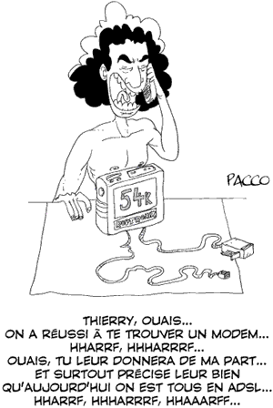

# Trois jours au vert !

Bertrand Rio de Cap21 m’a invité à parler d’internet et de la politique lors de [l’université d’été du Modem qui se tient ce weekend dans les Landes](http://www.forumdesdemocrates.fr/). J’ai accepté cette invitation. Dans la mesure du possible, j’essaie de porter la parole des connecteurs quand j’en ai l’occasion. Si le PS ou l’UMP m’avaient invité j’aurais accepté de la même façon.

Plutôt que de parler d’internet comme arme politique, sujet du cinquième pouvoir, je reviendrai au thème central du *[Peuple des connecteurs](../../page/le-peuple-des-connecteurs)* : comment s’inspirer de la pensée réseau pour repenser la politique. Le Modem étant un parti encore en gestation, j’ai l’espoir qu’il sera capable de prendre en compte cette nouvelle réalité. J’avoue être modérément optimiste quand je vois que les survivants de l’UDF occupent déjà les postes clés.

1. J’aimerais avec eux commencer par mettre en cause cette notion de poste clé, cette habitude de nommer des chefs et des sous-chefs alors même que ce n’est pas nécessaire. Je pourrais raconter [l’histoire des Apaches](../6/la-revanche-des-apaches.md).
2. Une autre histoire me tient à cœur. En 1935, Bill Wilson était proche de la mort, il devait cesser de boire. Comme aucun médecin n’avait jamais réussi à le sevrer, il eut l’idée d’appeler à l’aide d’autres alcooliques. L’association des Alcooliques Anonymes était née. Personne n’en était le chef et tout le monde l’était, expliquent Ori Brafman et Rod Becstrom dans [*The Starfish and the Spider*](http://www.amazon.fr/Starfish-Spider-Unstoppable-Leaderless-Organizations/dp/1591841437/ref=pd_bbs_sr_1). C’était une structure peer to peer (alcoolique à alcoolique). Bill Wilson se contenta de rédiger une méthodologie en douze points qui inspira tous ceux qui depuis créent de nouvelles associations. Ils le font librement sans demander l’aval de qui que ce soit.
3. L’ouverture est au cœur des Alcooliques Anonymes. Un mouvement politique moderne doit s’ouvrir de la même manière. N’importe qui doit pouvoir s’en revendiquer du moment qu’ils adhèrent à quelques grands principes : les douze points de Bill Wilson. Toute tentative d’encadrement, c’est-à-dire de centralisation, freinerait son développement.
4. L’ouverture de la structure politique doit s’accompagner d’une ouverture aux idées des autres structures politiques. L’union nationale ne doit pas être un positionnement marketing mais une façon de vivre la politique. Il n’y a pas d’ennemis a priori, nous devons discuter avec tous, nous allier avec tous. C’est au cas par cas, problème après problème, que nous devons définir nos positions.
5. Malheureusement, dans une démocratie représentative, la politique se termine presque toujours par des confrontations électorales. Ces batailles, même entre gentlemen, nous ramènent à l’état nature. Elles vont contre l’ouverture, poussent à la centralisation, dictent des solutions qui ne sont plus adaptées à l’hyper-complexité du monde.
6. Comment conjuguer une politique moderne avec un système politique désuet ? Cette question appelle des réponses. En attendant, il ne faut pas avoir peur d’inventer le mouvement révolutionnaire, le faire gonfler, jusqu’à ce que, par son ampleur, il pousse le système à se réviser. Il faudrait peut-être perdre quelques ambitions électorales à court-terme pour avoir une chance d’entrer dans l’histoire.

Sans parler d’internet, je ne ferai en fait que parler d’internet aux militants du Modem : le réseau se développe à une vitesse sans précédent dans l’histoire humaine parce qu’il est ouvert et décentralisé. Nous avons beaucoup de chance : personne ne le contrôle. Je souhaite que Google, qui fête aujourd’hui son neuvième anniversaire, ne lui mette jamais la main dessus comme il tente de le faire en ramenant tout à lui.

#dialogue #y2007 #2007-9-14-8h33
