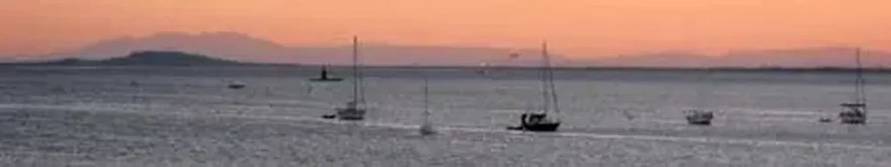
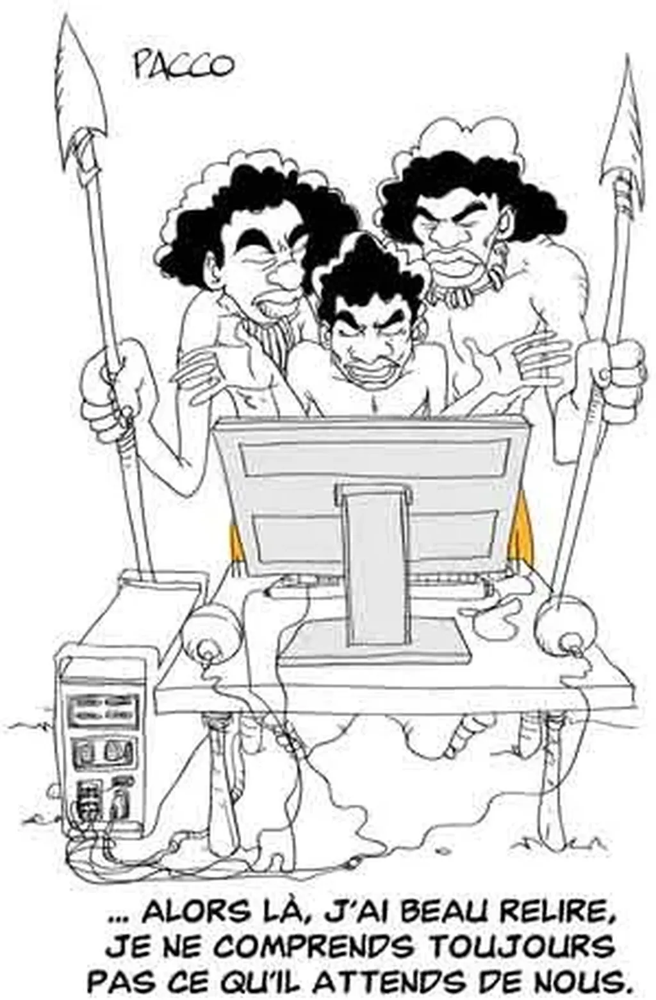

# Vous allez comprendre

Depuis mon retour de vacances, je suis toujours en vacances. Je travaille à mes livres littéraires le matin, après j’écris un billet pour le blog, je fais la sieste, je travaille un peu puis vais faire du vélo avant d’aller récupérer mon fils ainé. Hier soir, en venant consulter mes mails, j’avais cette vue sous les yeux.

 

L’étang de Thau, quelques voiliers au mouillage devant chez moi, au loin la montagne d’Agde, à l’horizon les Pyrénées. Je connais cette vue depuis que je suis enfant et elle me surprend toujours. Dans la vie certaines choses se répètent et diffèrent toujours. L’amour ne peut se prolonger qu’à cette condition.

J’ai la chance de vivre face à cette vue changeante. Je n’ai aucun mérite car mon père me l’a léguée. La chance est importante dans la vie. J’en ai eu, moins que certains, mais tellement plus que tous les autres. Je suis par fatalité optimiste. Si parfois je doute, il me suffit de voir quelque chose de beau pour me redonner le moral. Et tous les soirs j’ai cette vue, et bien d’autres choses encore.

Certains ont décelé dans mes derniers billets une humeur plus sombre, plus de gravité. C’est peut-être parce que je me désintéresse encore plus que d’habitude du bruit de fond.

Je crois que nous pouvons changer le monde de multiples façons, mais chaque fois nous devons le faire avec art. Nous ne devons pas négliger la dimension esthétique dans tout ce que nous entreprenons, même la révolution. Cet art de vivre, cet art de rêver, d’inventer, d’aimer… la chose politique en est trop dépourvue. Il faut donc changer la politique ou s’en désintéresser.

#dialogue #y2007 #2007-9-6-12h21
