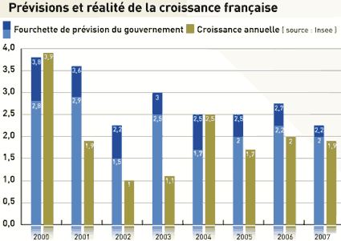

# L’avenir non-déchiffrable

Synopsie pour [ma conférence de ce soir](alors-peut-on-dechiffrer-l%e2%80%99avenir.md).
1. Si l’avenir était déchiffrable, nous serions tous traders, nous serions tous riches car nous serions capables de réduire les risques et maximiser nos chances de succès. La Bourse n’existerait d’ailleurs plus, de même que les casinos (heureusement les Italiens donnent un autre sens à ce mot qui lui garantit sa pérennité).
2. Je n’aime pas les experts, j’aime les prendre en train de se tromper. Il suffit de regarder les prévisions des taux de croissances et les taux de croissance effectifs pour comprendre que prévoir n’est pas chose facile. Pourtant, en temps normal, comme ces dernières années, la croissance est relativement stable. [N’empêche les futurologues se trompent six fois sur huit](http://www.lemonde.fr/web/infog/0,47-0@2-3234,54-954005,0.html).  

3. Il existe des domaines comme la Bourse où les variations ne sont pas bornées et où l’exercice prévisionnel est beaucoup plus périlleux. L’écrivain américain et trader [Nicolas Taleb raconte](../../2006/7/l%e2%80%99irresponsabilite-des-politiques.md) que, début 2004, un analyste lui montre une courbe décrivant l’évolution du prix du pétrole. Vingt-cinq ans plus tard, le baril devait coûter 27 $. Six mois plus tard, l’analyste se ravisa, il fallait plutôt tabler sur 75 $. Le baril a franchi les 100 $ début 2008 !
4. Les exemples de ce type sont innombrables. En fait, il suffit de prendre une prévision du passé et de la comparer à la réalité pour exploser de rire. Steven D. Levitt and Stephen J. Dubner débutent [*Freakonomics*](http://www.amazon.com/Freakonomics-Revised-Expanded-Economist-Everything/dp/0061234001) en racontant que les experts estimaient que la criminalité américaine devait continuer à monter tout au long des années 1990. En réalité, autour de 1995, la tendance s’est inversée, revenant au taux le plus faible des 50 dernières années.
5. Mais pourquoi nous efforçons-nous de déchiffrer l’avenir ? Imaginez-vous en chasseur-cueilleurs il y a 150 000 ans, ou même il y a 2 millions d’années. La nuit tombait, vous saviez que vous aviez une chance sur dix d’être attaqué par un fauve, vous saviez que le lendemain le jour se lèverait, comme vous viviez en Afrique, vous saviez que le temps serait presque avec certitude le même que la veille… Quand vous partiez à la chasse, vous aviez une chance sur deux de trouver du gibier. Une chance sur vingt d’être blessé. Une chance sur cent de mourir. La vie était simple. Elle se répétait jour après jour. Elle était prévisible. Cette idée d’un avenir prévisible s’est alors ancrée au plus profond de nous.
6. Prévoir l’avenir est un extraordinaire moyen de survie. On peut prévoir où se trouvera le gibier, quand les fruits seront murs, quand il faudra changer de campement. Notre cerveau est devenu un expert en probabilité normale, celles des dés ou des roulettes de Casino.
7. Aux temps préhistoriques, les prévisions échouaient, mais comme les possibilités étaient bornées, elles réussissait aussi souvent. Il arrivait toutefois des imprévus. Un chef n’anticipait pas la crue qui submergerait le campement et qui anéantirait la tribu. Mais comme personne ou presque ne survivait à l’imprévu, l’idée de l’imprévisibilité ne pouvait pas se renforcer dans la mémoire atavique de l’espèce humaine. Nous sommes les descendants de ces hommes qui ont échappé aux évènements imprévisibles. Nous sommes du coup persuadé que l’avenir est prévisible.
8. Cette croyance s’apparente à celle commune chez les joueurs : ils sont persuadés que la chance les accompagne. Ils se souviennent de leurs premières parties avec émoi, de leur coup de bol miraculeux. Pourquoi ? Parce que tous ceux qui n’ont pas eu autant de chance à leur début ont arrêté de jouer. La chance se répartit statistiquement, c’est tout. Ceux qui ont arrêté de jouer ne sont pas là pour témoigner de leur déveine.
9. Mais nous ne vivons plus au temps préhistoriques. Très souvent nous survivons aux imprévus, à la chute du mur de Berlin comme à l’émergence d’internet. Nicolas Taleb appelle ces imprévus imprévisibles des Black Swans. Plus notre société se complexifie, plus ils sont nombreux, moins l’avenir est déchiffrable même si nous continuons à croire le contraire.
10. En nous focalisons sur l’avenir que nous croyons imminent, celui dont parle les médias, nous ne voyons pas l’avenir déjà en marche. En politique, c’est désastreux. Nous vivons dans un monde socialement désastreux parce que nos hommes politiques nous font croire qu’ils maîtrisent notre avenir et ils usent de cette possibilité pour nous manipuler. Dans un monde à l’avenir imprévisible, il faut limiter les décisions globales qui peuvent être catastrophiques. Il faut procéder par petits essais, petites erreurs, petites corrections. Il faut ramener les décisions et les actions au niveau des citoyens, il faut s’appuyer sur le cinquième pouvoir, il faut que le cinquième pouvoir devienne le moteur de la société.

#connecteur #imprevisibilite #y2008 #2008-1-23-11h52
