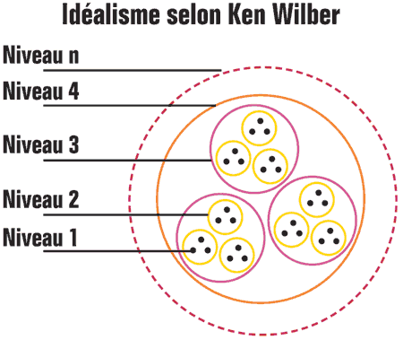
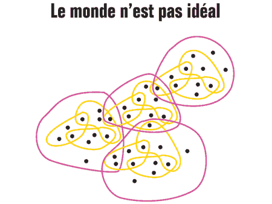
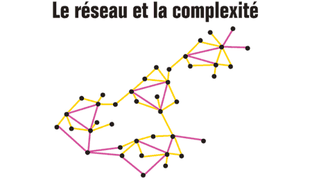

# De l’idéalisme à la complexité

Un [commentateur m’a reproché](../9/premiers-pas-avec-ken-wilber/#comment-61022.md) de ne pas avoir lu Ken Wilber. Selon lui, c’était une sorte de faute capitale. J’étais un imposteur parce que je ne connaissais pas le plus grand penseur de notre temps. Tout ce que j’avais pu écrire perdait tout intérêt.

Lire ne nous rend pas plus malin. Je pense qu’il n’existe aucune lecture indispensable même si certaines peuvent être pour nous décisives.

Pour lire *Le monde comme volonté et représentation*, Schopenhauer explique qu’il suffit de lire Platon. J’ai suivi ses conseils pour m’initier à la philosophie. J’ai découvert plus tard que Wittgenstein avait aussi commencé par Schopenhauer et Platon.

Wilber est donc bien évidemment pas plus indispensable que n’importe quel autre auteur. Maintenant, quand on me dit que je passe à côté d’une pensée profonde, qui plus est contemporaine, [je fais l’effort de l’étudier](../9/premiers-pas-avec-ken-wilber.md).

Je comprends pourquoi Ken Wilber a du succès. Belle gueule, un profil de Bouddha et un don manifeste pour ne choquer personne. Il écrit avec assurance sur un rythme agréable. On a l’impression de le comprendre immédiatement. Sa pensée paraît lumineuse. Le charisme du personnage aurait même tendance à nous subjuguer.

### La vision intégrale

Wilber prétend proposer une vision cohérente du monde qui intégrerait les grands modes de pensées occidentaux comme orientaux. Il ne dit jamais qu’il ne choisit que les modes idéalistes, négligeant le réalisme selon Popper par exemple. Cette omission m’est tout de suite apparue comme frauduleuse.

Une vision intégrale qui ignore les visions divergentes n’a rien d’intégrale. D’ailleurs comment pourrait-elle intégrer ce qu’elle nie ? Et comment pourrait-elle s’intégrer elle-même, chose indispensable pour prétendre à l’intégralité ? Une vision intégrale est tout simplement impossible.

Mais Wilber n’a pas l’impression de frauder car il présente son idéalisme comme la seule possibilité logique. Son explication est belle, tentante et charmeuse mais elle ne tient guère.

Il part de la notion de [holon](http://en.wikipedia.org/wiki/Holon_(philosophy)) proposée par Arthur Koestler en 1967. Un holon est une entité qui est en même temps une part de quelque chose et, en elle-même, une totalité. Par exemple, un atome est une totalité qui participe à la création des molécules. Nous sommes des totalités qui participons à la société.

Koestler a parlé d’holarchie, la structure hiérarchique des holons. Un atome entre dans une molécule qui entre dans une cellule qui entre dans un organisme…

Wilber affirme que les holarchies sont la fabrique même de l’univers. En tant que mystique, il tente d’accéder à des holons de niveaux holarchiques de plus en plus élevés. Après la biosphère vient la noosphère, après la noosphère la sphère spirituelle et ainsi de suite… je me demande bien jusqu’où ? Dès qu’un raisonnement aboutit à des régressions à l’infini, j’ai tendance à le mettre en doute.

L’usage des niveaux holarchiques, cette structuration en couches, est une idéalisation qui mène à l’idéalisme. C’est une vision possible du monde mais seulement une vision possible.

### La complexité non-hiérarchique

Je suis un holon, un tout partie de la société. Je ne le conteste pas. Mais n’est-ce pas déjà une première idéalisation.

La totalité de mon être est fluctuante. Des molécules d’eau me traversent, des sels minéraux entrent et sortent, des informations s’inscrivent dans mon cerveau, d’autres lui échappent. Si je me perçois comme un processus, j’ai du mal à m’affirmer comme un tout.

Quand je bois un verre d’eau, j’ingère dans mon organisme des molécules qui elles-mêmes participent au cycle de l’eau. Une même molécule peut donc participer à deux processus.

Une partie peut donc collaborer à plusieurs totalités. Et la notion d’holarchie commence à vaciller.

Je suis fait de molécules de diverses tailles, d’atomes isolés, d’idées qui n’appartiennent pas à la réalité matérielle, de sentiments encore plus mystérieux… tout cela interagit pour me constituer. Je suis l’ensemble de ces interactions et non un tout.

Les holarchies sont des simplifications. Et en déduire l’existence d’holarchies toujours supérieures est osé. C’est un point de vue religieux. Je le respecte mais je ne le partage pas.

À la vision du monde en poupées russes de Wilber, on peut opposer la vision dynamique que les réseaux nous aident à cartographier.

Des entités se forment, incertaines, floues, provisoires. La notion de hiérarchie doit être réinventée. Ce n’est plus comme dit Wilber « j’inclus et je transcende » mais « je connecte et j’échange ».

De nouvelles hiérarchies par la connexion apparaissent mais elles n’englobent plus, elles ne commandent plus.

Dans ce cadre, une mystique est aussi possible. Ce n’est pas une mystique de l’élévation structurelle, une mystique des niveaux de conscience ou des cercles de pouvoir, mais une mystique de la connexion, une mystique de l’interdépendance.

Dans le modèle de Wilber, plus on s’élève, plus on est responsable. Dans la structure en réseau, la responsabilité est intrinsèque. Comme tout élément est lié à tous les autres, tout élément est responsable. Il n’y a aucune possibilité de se décharger sur des structures supérieures.

### De la vision intégrale à l’idéologie

Je conçois que mon approche par les processus doit me faire commettre des erreurs de raisonnement. Wilber tombe dans le même piège avec son approche holarchique.

Pour lui, si l’évolution ne procédait que par le hasard, il lui faudrait plus de temps, pour inventer les ailes par exemple, que l’univers ne lui en a accordé.

C’est une idée répandue chez les extrémistes religieux. Wilber la soutient de façon éhontée en disant qu’aujourd’hui la plupart des évolutionnistes sont d’accord avec le fait que le hasard n’explique pas tout. Il en conclut qu’il existe une force transcendante essentielle à la réalité.

Il se garde d’évoquer Dawkins qui a réfuté son argumentation. La méthode de l’essai et de l’erreur a non seulement eut assez de temps, elle a même souvent eut le temps de répéter les mêmes innovations en suivant des chemins différents.

Wilber se fourvoie à cause son approche holarchique. Pour lui, une évolution radicale, telle que l’invention des ailes et donc du vol, équivaut à changer de niveau (car un holon doit être à sa place et pas à plusieurs niveaux en même temps). Un tel changement ne peut se produire que par la conjonction d’un grand nombre de mutations. Il a raison, c’est totalement improbable.

Mais les choses ne se passent peut-être pas comme Wilber le décrit. Il y a en fait coévolution. Les différentes branches du réseau se transforment jusqu’à ce que soudain une transformation sélectionnée dans un but, le confort thermique pour les plumes, amène aux ailes. Elles ne résultent d’aucun dessein mais d’un résultat involontaire.

Cet involontaire est inconcevable dans la logique holarchique car il y a direction vers le haut. Dans un réseau décentré, non hiérarchique, ça ne pose en revanche aucun problème.

Dans le réseau, le hasard a un rôle constructeur car il s’applique partout en même temps. Il ne faut pas qu’il crée les briques pour qu’elles puissent s’assembler et ainsi de suite. Le hasard joue avec toutes les connexions. C’est un processus parallèle, donc extrêmement rapide, alors que le système holarchique fait plutôt penser au séquentiel.

Je ne crois pas qu’il soit possible de départager les idéalistes et leurs adversaires. Nous ne pouvons tout au plus que réfuter les méthodes utilisées pour justifier une position ou une autre.

Wilber propose une approche totalisante qui est à vrai-dire totalitaire. Il triche, il omet, il ment pour soutenir son argumentation.

Son système a pour vocation de convertir. Il donne des arguments coûte-que-coûte, usant du langage scientifique pour mieux tromper son monde.

Je sais que je cherche souvent moi-même à convaincre, j’espère que je ne tomberai pas dans les mêmes travers de Wilber. Le jour où je fonderai l’université des connecteurs, la convention des connecteurs et je ne sais quels autres instituts, il faudra s’inquiéter.

La pensée de Wilber me paraît dangereuse car elle justifie la position des dominants, ces gens qui vivent dans les cercles supérieurs. Qu’on les appelle des éveillés ou des dictateurs ne change rien pour moi.

#connecteur #integral_philosophy #wilber #y2008 #2008-10-2-13h41
