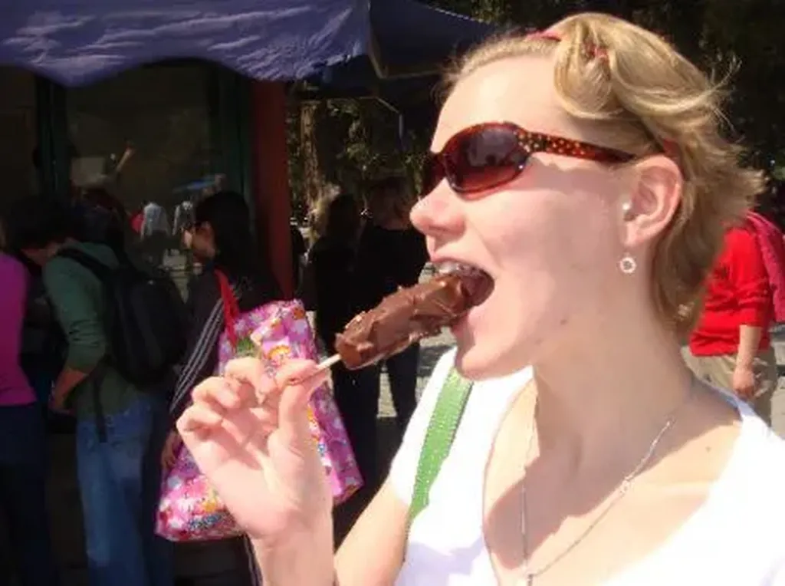

# Je fais l’amour avec Marie

Dans la réunion évoquée dans le [billet précédent](incompatibilite.md), tout le monde sauf moi, il me semble, disait « l’Internet ». Chaque fois je souriais. Je n’ai jamais compris cet apostrophe que le I cap vient contredire d’ailleurs.

Faites-vous l’amour avec Marie ou avec la Marie ?

Moi c’est avec Marie.

Si je lèche un esquimau, je ne lèche pas la Marie mais Marie.

J’aime Marie, pas la Marie.

J’aime Internet, pas l’Internet.

Internet n’est pas pour moi une chose, une espèce d’esquimau, mais une entité organique avec laquelle j’ai des rapports charnels. Dès que des gens parlent d’Internet en disant « l’Internet », je suis incapable de les prendre au sérieux. J’ai l’impression qu’ils n’ont pas compris de l’intérieur ce dont ils parlent. Ils ne l’ont pas pénétré, ils ne l’ont pas habité.

#coup_de_gueule #y2008 #2008-10-29-12h56
