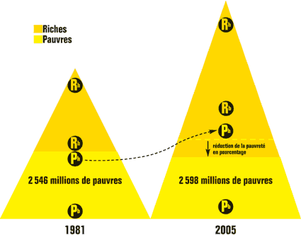

# La pyramide ne décolle pas

Les libéraux ultra-optimistes supposent que leur modèle économique bénéficie à l’ensemble de l’humanité. Tout le monde s’élèverait en même temps. Il y aurait toujours des inégalités, mais ceux situés en bas de l’échelle vivraient de plus en plus dignement. Nous assisterions à un vaste mouvement de progrès social.

On peut résumer leur vision par la métaphore de la pyramide qui décolle, telle une fusée qui prend de la hauteur année après années. Idéalement cette pyramide s’aplatirait progressivement pour bien montrer que les inégalités entre la base et le sommet se réduisent.

Mais est-ce que la pyramide décolle ? Pour y voir plus clair, nous disposons d’une montagne de chiffres, notamment ceux fournis par la [Banque mondiale](http://econ.worldbank.org), institution pas nécessairement impartiale car partie prenante dans le système capitaliste et libéral.

Qu’est-ce qu’un pauvre ? On a l’habitude de dire ceux qui vivent avec moins de 1$/jour ou moins de 2$/jour. Je n’aime pas trop cette définition. Je préfère celle qui dit qu’on est pauvre quand on consacre 80 % de son budget pour se nourrir. Alors on vit où ? On fait comment pour aller acheter à manger ? Et on oublie la santé. Cette définition est plus sévère que la limite des 2 $/jour, mais je n’ai pas trouvé les chiffres détaillés pour elle, et j’en reste au 2 $/jour pour la suite.

Pour moi, tant qu’il existe un pourcentage non négligeable de l’humanité qui vit dans cette pauvreté absolue, c’est la preuve que la pyramide n’a pas décollée socialement.

En 1981, nous étions [4,5 milliards](http://fr.wikipedia.org/wiki/Population_mondiale) dont 2,5 milliards avec moins de 2$/jour (55 %). En 2005, nous étions 6,5 milliards avec le même nombre de pauvres (38 %). Si le pourcentage baisse, le nombre de pauvres reste constant, ce qui pour moi signifie **symboliquement** que la base de la pyramide reste la même. Un pauvre de 1981 et un pauvre de 2005 mènent une vie tout aussi difficile.

Sur ce schéma qui a pour but d’illustrer la métaphore (nous sommes dans le littéraire et pas dans le scientifique), les surfaces des pyramides sont proportionnelles à la population. Les bases constantes reflètent la quasi stabilité du nombre de gens sous 2$/jour. Quand j’étire la pyramide de 1981 pour obtenir celle de 2005 (étirement qui illustre aussi l’écart grandissant entre les plus faibles revenus et les plus importants), je constate que certains pauvres entrent dans le monde des riches. L’ascenseur social fonctionne. Les libéraux semblent se satisfaire de ce phénomène (logique ils se situent déjà parmi les riches).

Les moins extrémistes parmi eux prétendent qu’il suffit d’attendre pour que la pauvreté tende vers zéro et que la pyramide finisse par décoller. Mais elle devra s’étirer jusqu’à quelle hauteur avant ce décollage ? En 25 ans, nous n’avons rien gagné socialement. Toujours autant d’hommes souffrent de la pauvreté absolue.

Avec la crise écologique, l’épuisement des ressources naturelles et le ras-le-bol grandissant des pays du Sud est-ce que ça ira mieux ? Il faut être fou pour encore le croire. Il est plus facile d’imaginer la totale implosion d’un système qui fonctionne encore sur le modèle de l’asservissement. Voilà pourquoi je passe autant de temps à imaginer d’autres possibilités pour notre organisation sociale.

PS : J’aurais pu dessiner des pyramides proportionnelles ou faire varier leur hauteur en fonction des écarts de revenus ([1 à 40 aux US en 1980, 1 à 400 en 2005](http://www.ffhsj.com/siteFiles/Publications/BB2938A7EB4BC4FE42214E518360D276.pdf)) et le résultat aurait été le même. Ce qui m’importe c’est le fond de cette histoire.

#coup_de_gueule #y2008 #2008-12-11-19h18
