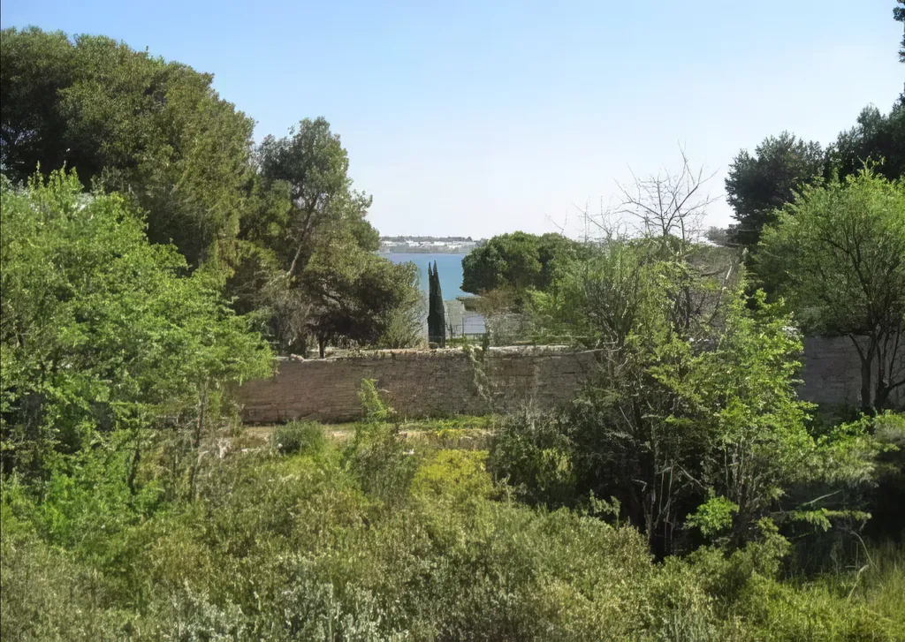
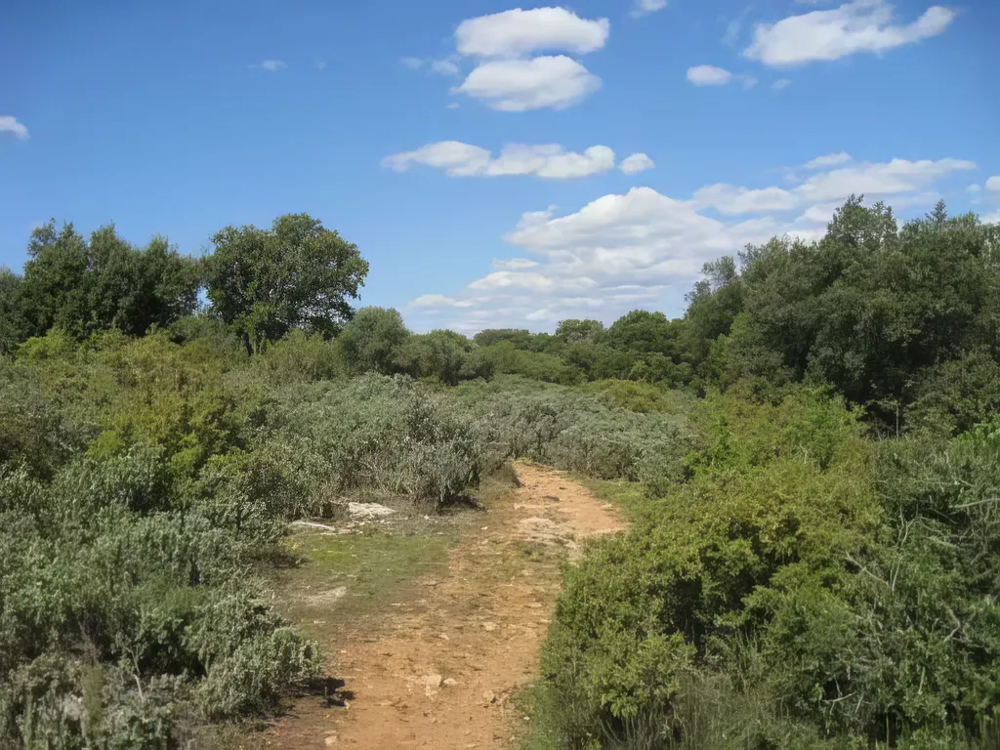
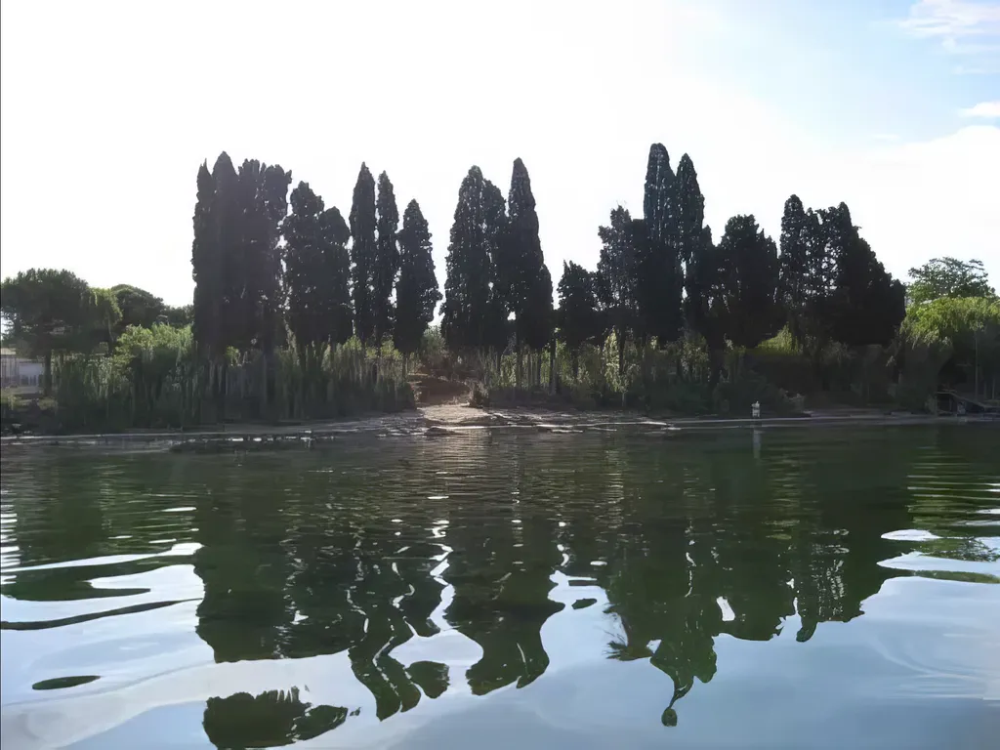

# Eau et garrigue

Un employé du syndicat d’initiative de Balaruc les Bains m’a demandé de parler de mon pays à des communicants qui préparent une plaquette publicitaire. Leur question « Qu’est-ce pour toi que le pays de Thau ? » Je me suis dit que j’allais répondre par écrit en donnant une réponse de tonalité politique.

J’ai longtemps vécu loin du Midi, souvent dans des villes humides : Paris, Londres, Seattle… J’avais alors en tête un coin bleu, pas celui indigo de la Méditerranée, mais celui plus doux de l’étang de Thau avec en premier plan le gris vert de la garrigue. Mon pays, c’est l’eau et la garrigue, deux éléments inséparables. Quand j’étais enfant, je jouais le matin au bord de l’étang, non loin de mon père qui levait ou rapiéçait ses filets, et l’après-midi, je courais en garrigue où nous organisions des parties de cache-cache géantes.

Ce monde bipolaire subsiste par endroits. Des enclaves de garrigue surplombent encore l’étang. Elles enferment la mémoire atavique de notre pays. Je pense par exemple au Pioch de Balaruc qui dégringole vers l’étang au lieu dit La descente du Pioch.

Depuis longtemps la serre municipale défigure la chute de ce jardin naturel, empêchant les dernières rocailles de venir mourir presque jusqu’à l’eau. Au-delà, cet espace idéalement sauvage, avec ses vagues réminiscences de vergers, est l’un des plus beaux jardins que je connaisse. Peut-être faudrait-il tout au plus empierrer l’ancienne route de Sète pour qu’elle soit un peu mieux praticable par les vélos.

J’ai beaucoup voyagé, très souvent autour de la Méditerranée, en Italie et en Grèce notamment. J’ai découvert à Delphes comme à Lipari les mêmes paysages que chez moi, des paysages d’eau et de garrigue. Aujourd’hui, plus que jamais, les hommes traversent le monde pour retrouver ces havres de paix.

Nous vivons dans une société de surabondance et nous recherchons souvent pour nos vacances des endroits simples et bruts, propices au recueillement. Il serait judicieux de préserver ces jardins naturels que les paysagistes modernes tentent de reconstruire à grand renfort d’investissements.

Je ne dis pas « Stoppons le développement ». Au contraire, pour nous développer, apprenons à préserver ce qui est unique chez nous, tel un morceau de garrigue en surplomb de l’étang de Thau. L’unique, plus que jamais, n’a pas de prix, alors que le béton est partout, identique à lui-même.

À l’opposé de La descente du Pioch, sur la côte nord de la presqu’île, se trouve un autre jardin : Les Arènes. C’est aussi un endroit magique, réduit à sa plus simple expression, mais il conserve également une part de notre mémoire collective. J’imagine qu’en un autre temps se tenaient sur cette plage des fêtes païennes. Le lieu possède une âme mystique, elle aussi unique. J’éprouve en cet endroit les mêmes frissons que devant le Tholos de Delphes.

Développer un pays, ce n’est pas poursuivre une croissance aveugle et standardisée, c’est amplifier ses particularités et se nourrir d’elles. Chez nous, à Balaruc, il n’y a pas que l’eau thermale, cette richesse presque trop abondante qui nous fait oublier les autres richesses bien plus précieuses, car non renouvelables.

Les lieux saints des Grecs et des Romains s’appuyaient sur la dualité des paysages, souvent sur le contraste terre-mer. Nous avons la chance de vivre au cœur de ce patrimoine précieux, mais en voie de disparition. Préservons-le, car de la dualité, de la tension entre opposés, naît la diversité. Amplifions la dualité, étendons-la par des ramifications piétonnes et cyclables jusque vers la Gardiole pour que la garrigue plus lointaine elle aussi se joigne à l’étang. Créons de nouvelles descentes qui seront autant d’ascensions pour les promeneurs, plutôt que détruire celles imaginées par les anciens et qui subsistent encore. 

J’entretiens une vision ni idyllique ni passéiste. Le nez plongé dans les nouvelles technologies, je consacre mon temps à réfléchir aux implications politiques de la révolution numérique. Le pays de Thau a des atouts pour traverser allégrement cette époque pour peu qu’il n’oublie pas que nous avons changé de siècle, quiattant le temps de la croissance à tout crin pour celui du développement raisonné.

Notes

1. Je relis ce billet avec tristesse, le 12 juin 2024. Les deux jardins de mon enfance ont été détruits.

2. Ce billet fait suite à [Pour un Balaruc durable](../../2007/10/de-la-theorie-a-la-pratique.md).
3. Quand je vois des palmiers au bord de nos rues et de nos plages, je me sens dépossédé de mon Midi. Ces arbres n’ont rien à faire là, comme bien souvent le béton. Au XIXe siècle, les palmiers faisaient exotiques sur la Côte d’Azur pour les Européens du nord. Aujourd’hui, nous recherchons l’exotique *in situ*.
4. Je ne suggère pas l’abattage des palmiers déjà plantés, mais je préférerais que nous cultivions chez nous ce qui nous est propre.
5. Aujourd’hui, le Pioch de Balaruc s’entretient de lui-même. C’est un jardin autosuffisant. Voilà pourquoi il a autant de charme. Ce n’est pas en mettant la main sur tout les espaces naturel que nous contrôlerons notre avenir.

#autobiographie #coup_de_gueule #y2008 #2008-3-18-23h18
