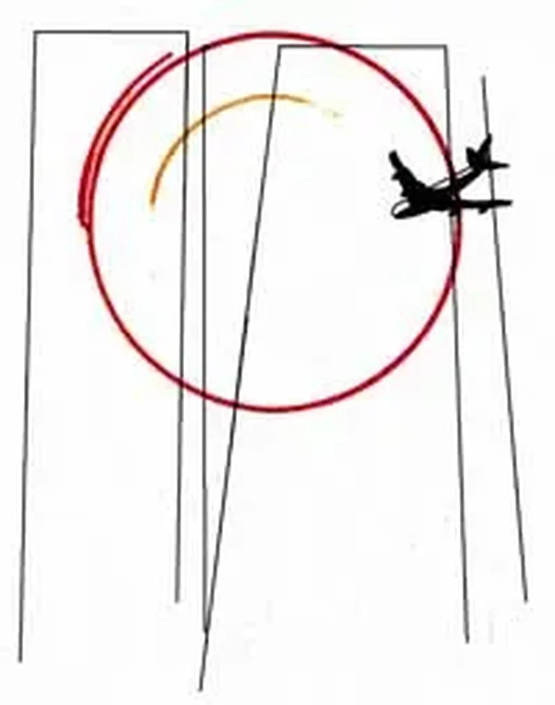

# À chacun son 9/11

Après [mon papier sur le scénario catastrophe de Robb](../3/la-premiere-puissance-mondiale-c%e2%80%99est-la-guerilla.md), j’ai vu sur [Agoravox](http://www.agoravox.fr/article.php3?id_article=38097), et même sur mon blog, les adeptes des théories du complot se rebiffer. J’avoue que je les supporte mal et que j’adore les agacer. [Outre le fait que leur psychologie déviante est de mieux en mieux comprise](../../2007/8/a-tous-les-conspirationnistes.md), je viens de noter certains traits de leurs caractères.

Pour eux que « dix-neuf pirates armés de cutters aient déjoué la première armée du monde » est une absurdité. Ils ne croient pas à cet exploit macabre. Non ils ne veulent pas y croire car ils ne veulent pas croire d’une manière générale qu’il existe des hommes exceptionnels (je ne porte aucun jugement de valeur). Que des héros s’exhibent sur les stades de foot, ça passe, c’est le spectacle. Mais qu’un homme ordinaire puisse sacrifier sa vie pour un idéal ça les dépasse. Ils n’y croient pas car s’ils y croyaient ils devraient se demander pourquoi eux-mêmes se contentent de critiquer sans cesse le monde.

S’ils croyaient que dix-neuf pirates armés de cutters ont déjoué l’armée américaine, ils seraient obligés de croire que dix-neuf mecs peuvent faire des choses extraordinaires. Ils ne veulent pas y penser, ils ne veulent surtout pas penser qu’ils pourraient être ces hommes (et notamment leur pendant positif). Ils ne veulent pas penser que plutôt que de cautionner des théories du complot, ils pourraient passer de l’autre côté (celui de l’action... positive s’entend).

Suivant un point de vue semblable, beaucoup de gens ne croient pas qu’on puisse devenir riche par son travail. Tout ce qui sort de l’ordinaire est suspect à leurs yeux. Les riches chercheraient toujours des magouilles, des appuis, des pistons, des malversations. Je connais bien cette façon de penser. Ma grand-mère maternelle, communiste indécrottable, pratiquait à merveille ce raisonnement. C’est plus confortable de dire que les riches sont des vauriens que de reconnaître qu’on n’a pas la force de devenir riche soi-même.

Dans un autre domaine, je retrouve la même attitude. Il y a des artistes d’un génie si éclatant qu’ils attirent la suspicion. Shakespeare par exemple. Les artistes ordinaires leur cherchent des noises pour justifier leur impuissance relative. J’ai connu des photographes qui ne croyaient pas que Cartier-Bresson ait pu prendre toutes ses photos sur le vif. Une chance pareille était impossible. J’ai toujours préféré rester en admiration devant le coup d’œil extraordinaire de Cartier-Bresson.

Qu’il y ait des hommes extraordinaires ne me dérange pas. Au contraire, ils me servent de guide. Je crois au génie négatif des pirates de 9/11. Je ne les admire pas mais je reconnais qu’ils ont réussi leur coup. Des coups improbables sont possibles dans notre monde comme l’explique [Nicolas Taleb](../../2007/9/conversation-avec-taleb.md).

Vous ne voulez toujours pas le croire. Si vous commencez à croire ces pirates géniaux, vous allez vous sentir moins que rien. Rester dans votre fauteuil, affalé devant la télé, vous deviendra insupportable. Alors vous préférez croire que des forces quasi-surnaturelles sont à l’œuvre. Sauvé. Vous avez trouvé une bonne raison de renoncer à votre responsabilité. Si le monde va mal, vous n’y pouvez rien.

Je préfère tirer mon chapeau à ceux qui agissent au nom de leurs idées même si ces idées me dérangent. Je préfère ceux qui agissent à ceux qui justifient leur inaction politique. Si tous les hommes se disaient qu’agir seul est impossible, il ne se passerait rien dans le monde.

La vérité est plus prosaïque : l’avenir est ouvert. Quelques hommes courageux peuvent créer un carnage. C’est peut-être triste mais c’est comme ça. Des experts comme [John Robb](http://globalguerrillas.typepad.com/) expliquent qu’il est possible de causer bien plus de victimes que lors de 9/11 en prenant moins de risques.

Contrepartie de cette vérité difficile à accepter : nous pouvons par notre courage changer le monde. Rassurez-vous, je n’encourage pas le terrorisme. Il nous démontre simplement que de petites actions peuvent avoir de grands effets dans nos sociétés interdépendantes. Nous pouvons reprendre ses méthodes, déjà commencer par les retourner contre lui, puis les utiliser pour construire.

Les adeptes des conspirations ne veulent surtout pas l’entendre de peur de renoncer sur le champ à leur confort. Pour ma part, je me contente de pleurer face à l’horreur. L’homme est un monstre. Chacun de nous peut devenir un monstre pour des milliers d’autres. C’est une terrible révélation. Dans notre monde technologique, nous pouvons devenir des monstres encore plus facilement que par le passé. Heureusement, la contrepartie est toujours possible. Nous pouvons aussi faire des choses merveilleuses. Alors je retrouve le sourire.

Notes

1. Tout ce que je dis sur 9/11, je pourrais le dire sur toutes les théories conspirationnistes qui ne sont imaginables qu’a posteriori et jamais a priori par ceux qui les auraient fomentées. Prendre 9/11 comme exemple est juste une façon de frapper les esprits.
2. 9/11 est une merveilleuse théorie conspirationniste car elle a fédéré a posteriori une armée de conspirationnistes (j’aime ce mot dont on ne sait jamais s’il désigne ceux qui complotent ou ceux qui fabulent le complot ou ceux qui discutent du complot effectif). Ils ont abattu un travail formidable, découvrant des coïncidences troublantes. Ça avait commencé dès le 9/11 avec les dingsbats trafiqués dans tous les sens qui voulaient nous faire croire que Microsoft était dans le coup.
3. Que le gouvernement Bush ait tenté d’utiliser après coup 9/11, j’en conviens. Qu’il ait lui-même perpétré l’attentat, je n’y crois pas une seconde. Depuis quand ce gouvernement serait intelligent ? Depuis quand la CIA maîtriserait le sens de l’histoire ? Vous y croyez vous ? Moi je crois qu’ils sont incompétents comme peut l’être toute organisation kafkaïenne.
4. Qui dit gouvernement, dit institution centralisée avec une multiplicité hiérarchique. 9/11 n’aurait pu être organisé par une instance centralisée sans que des centaines de personnes ne soient plus ou moins informées. Aujourd’hui, elles pourraient témoigner. Si elles ont été achetées, elles pourraient l’être une seconde fois.
5. Que les conspirationnistes imaginent donc un complot aussi complexe que 9/11. Je voudrais les voir à l’œuvre. Je crois qu’aucune personne créative ne peut croire cela possible. En revanche, que quelques hommes décident de faire un coup d’éclat est plus crédible. Ils agissent par conviction, sans penser qu’ils jouent au billard à dix bandes.
6. L’absence de preuve ne prouve rien (les fameuses boîtes noires introuvables). Nous n’avons pas de preuve de l’existence ou de la non existence de dieu. Même si le gouvernement US a fait disparaître les fameuses boîtes a posteriori, ça ne change rien à ce que je dis (la conspiration a posteriori, ça c’est facile... ils peuvent faire comme vous).
7. 9/11 est un [black swan](../../2006/7/l%e2%80%99irresponsabilite-des-politiques.md), un évènement totalement inattendu, aux conséquences totalement inattendues, la chute de tours par exemple. C’est un accident. Personne n’avait imaginé qu’elles tomberaient comme ça, surtout pas les terroristes.
8. J’ai vu 9/11 comme la démonstration d’un système complexe. On a tapé à un endroit et nous avons obtenu des réactions cataclysmiques que personne n’aurait pu anticiper. Pour moi, il n’y a rien d’extraordinaire. Les réactions extraordinaires sont le propre des systèmes complexes.
9. Si 9/11 est un complot, pourquoi ne pas dire que la vie sur terre est aussi un complot ? Il peut se passer des choses extraordinaires sans que quelqu’un soit aux commandes et contrôle la chaîne de bout en bout.
10. Si je crois à la thèse de l’attentat, c’est parce que le complot me paraît au-delà de notre capacité cognitive. Aucun homme ou institution n’est capable de planifier un 9/11 avec les conséquences que nous connaissons. En revanche, que des fanatiques se crashent sur des tours est bien plus humain (malheureusement).
11. Lors du tsunami de 2004, des conspirationnistes ont aussi crié au complot. Ils ne sont pas allés jusqu’à dire qu’une puissance avait provoqué le cataclysme mais que les gouvernements avaient volontairement négligé la sécurité côtière. Il s’agit alors du complot en négatif, le complot par manque d’action. Tout ce qui advient ou n’advient pas est donc manipulable. Mais qui a un cerveau suffisamment gros pour exercer cette manipulation. Dieu ? Je ne vois pas d’autre possibilité technique.
12. Tout manager sait qu’en ajoutant du personnel, on ajoute peu d’intelligence au système. L’intelligence ne s’accroît vraiment qu’avec les systèmes ouverts et collaboratifs. Alors 9/11 ne pourrait être que le fruit d’un complot open source. En 2001, je crois qu’il était trop tôt. En revanche, depuis, l’open source fonctionne à fond chez les conspirationnistes et ils nous démontrent que cette méthode de travail fournit des résultats extraordinaires. Dommage, vous auriez dû consacrer toutes cette énergie à nous créer une application révolutionnaire (et pourquoi pas qui aurait révolutionné la lutte anti-terroriste).
13. Il est plus facile d’agir du côté obscur de la force que du côté lumineux. Aller vers la lumière nécessite souvent d’inventer alors que la recette pour nuire est connue depuis l’éternité : empêcher d’avancer. Même les scénaristes de série TV tombent dans le piège. Hier soir, je regardais un épisode de *Heores*. Les auteurs n’ont pas le génie de montrer des hommes qui avancent vraiment. Même avec des superpouvoirs, leurs héros font du surplace.

#coup_de_gueule #y2008 #2008-4-7-14h42
