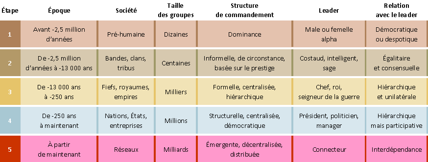

# De l’évolution sociale

Il m’arrive de discuter avec des universitaires. Souvent, je constate qu’ils s’enferment dans leur spécialité.

À Carcassonne, j’ai écouté la conférence de Jean Guilaine, archéologue spécialiste du néolithique. Je lui ai demandé si la transition néolithique pouvait nous apprendre quelque chose sur notre transition actuelle vers la société des réseaux.

Grand blanc. Hésitation. Guilaine n’avait pas réfléchi à la question. Il n’avait jamais sans doute entendu parler de la transition que j’évoquais.

Ce week-end, j’ai revécu la même scène avec un spécialiste de la révolution française. Je voulais savoir si on pouvait se servir du passé pour lire le présent. Il m’a dit que c’était essentiel mais ne m’a donné aucune piste. Lui aussi n’avait pas idée de la transition que j’évoquais.

Mon spécialiste de la révolution m’a dit que nous n’étions pas dans une situation prérévolutionnaire. Je lui dis qu’en effet nous n’étions pas à la veille de 1789 mais cent ans plus tôt. À cette époque, ceux qui parlaient de révolution étaient des utopistes.

Mais si le temps historique accélère à la même vitesse que le temps technologique, cent ans au dix-huitième siècle valent peut-être moins de dix ans aujourd’hui. Personne ne sent la révolution tout simplement parce que les médias n’en parlent pas mais elle est peut-être très proche de nous en années.

Les universitaires pourraient nous aider à décrypter le présent mais ils ont souvent peur de se hasarder hors de leur discipline. Ils ne veulent pas être accusés de transposer des données d’un champ à un autre mais, surtout, d’être accusé d’empiéter sur les plates-bandes de leurs collègues.

Je me suis fais la même remarque en lisant un très bon article de [Mark van Vugt](http://www.kent.ac.uk/psychology/department/people/van-vugtm/personal/index.htm) dans [NewScientist](http://www.newscientist.com/channel/being-human/mg19826601.900-follow-me-the-origins-of-leadership.html). Il parle de l’évolution des structures sociales et du leadership, mais sans projeter sur ce qui se produit aujourd’hui et pourrait advenir.

Je me suis amusé à ajouter une étape évolutive à son tableau. Je ne prétends pas prédire l’avenir, mais juste insister sur ce qui me semble se produire aujourd’hui et qui peut-être prendra de l’ampleur.

**Notes**
1. Mark van Vugt montre que la notion de leadership a évolué. Un chef d’état d’aujourd’hui aurait peut-être été un larbin à l’âge des chasseurs-cueilleurs.
2. En ce sens dire qu’il y a toujours eux des chefs est absurde car le chef d’une époque ne ressemble pas à celui d’une autre. Lorsque le chef guide son peuple par l’exemple, [comme chez les Apaches](../../2007/6/la-revanche-des-apaches.md), il ne peut être comparé au chef d’une entreprise ou à un dictateur. Un chef qui guide par l’exemple n’est tout simplement pas un chef même s’il reste un leader.
3. Mark van Vugt relève que, au cours de notre histoire, nous avons vécu avec des formes le leadership peu adaptées au présent. Nous avons tendance à designer des leaders inadaptés à la complexité de nos sociétés.

#politique #y2008 #2008-7-7-17h29
