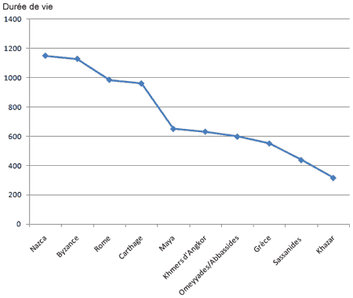

# Fin de civilisation

J’entends souvent dire que nous vivons [la sixième extinction de masse](http://www.sciencepresse.qc.ca/node/18558). Que notre civilisation, qui aurait commencé avec la renaissance autour de 1400 aurait atteint sa limite d’âge (car les civilisations auraient une durée maximale de 600 ans). Associé à ces prévisions, un vent de panique s’empare de beaucoup d’esprits.

J’ai alors repensé aux travaux de Lewis Fry Richardson qui en 1950 avait [classé les guerres en fonction de leur mortalité](http://www.hitchins.net/SysScience.html) et obtenu une power law. Cette courbe n’est pas surprenante, elle est une des signatures possibles d’un système auto-organisé autour d’un état critique, ce qu’on suppose le cas pour les sociétés humaines et l’ensemble de la biosphère.

Comme il n’y a pas une limite du nombre maximum de morts dans une guerre, je pense qu’il n’existe pas une durée limite pour une civilisation (tant que l’univers existe). C’est mon intuition. Je me suis amusé à remplir [un tableau avec la durée de vie de quelques civilisations](http://blog.tcrouzet.com/files_tc/civ.xls).

C’est très approximatif, je n’y ai pas passé des heures. En plus quand commence une civilisation et quand elle se termine n’est jamais facile à définir. Tout juste si on peut parler d’une civilisation quand on l’identifie grâce à son âge d’or. J’ai ensuite tracé un axe avec en ordonnée la durée de vie des civilisations, un autre avec en abscisse les civilisations classées par durée de vie. Si la notre a aujourd’hui 600 ans, elle se trouve au milieu du graphe. Elle a donc du temps devant elle avant d’atteindre une hypothétique limite d’âge.

Par ailleurs, et c’est là ce qui m’intéresse, la fin d’une civilisation ne ressemble pas nécessairement à celle des Mayas qui s’éteignirent presque tous jusqu’au dernier. Après la fin de leurs cités et de leur civilisation, les Grecs se fondirent avec les Romains, les influençant en profondeur.

Nous pouvons donc effectivement approcher la fin de notre civilisation industrielle sans pour autant être menacé d’extinction. Nous pouvons au contraire basculer dans une autre civilisation, reposant sur des mécanismes totalement différents et que je commence à appeler symbiotiques en même temps que j’avance dans mon prochain livre.

Dans *L’avenir d’une exception*, Hakim El Karaoui montre comment le monde Islamique entre dans la modernité, même si ce n’est pas une modernité occidentale. En le lisant, je n’ai cessé de me dire que nous aussi n’avions pas terminé notre transition vers la modernité. Nous sommes justement à mon sens, planétairement, en train d’entrer dans une nouvelle civilisation, exactement comme les Grecs du troisième siècle avant Jésus-Christ.

> Dans cette lecture de l’évolution des sociétés, la phase essentielle est bien celle de la crise de transition entre tradition et modernité, ce moment où tous les repères changent, où l’angoisse du changement devient collective, où une société se pose pour la première fois la question de son évolution future, écrit Karaoui.

Pour lui, l’occident aurait déjà traversé cette crise : révolution française, communisme, nazisme… Il oublie dérèglement climatique, épuisement des ressources naturelles, pollution, pourrissement du système capitaliste… C’est l’ensemble des hommes qui doivent transiter vers autre chose. Et cette transition a bel et bien commencé. Ira-t-elle à son terme ? C’est une autre question.

#connecteur #y2009 #2009-1-9-11h54
