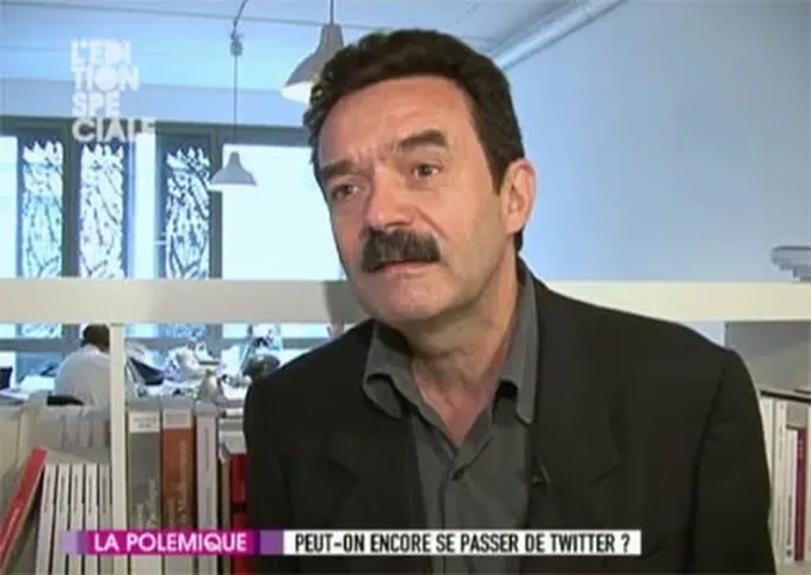

# Dans la série les rétrogrades : Edwy Plenel

> « J’ai vu mon propre témoignage [au procès Clearstream] résumé sur Twitter. C’était nul, déclare [Edwy Plenel sur Canal+ (séquence 3, 10:50).](http://www.canalplus.fr/tous-les-programmes/les-emissions/pid2244-c-p-edition-speciale.html) »

Qui est nul d’après vous ? Ceux qui empêchent l’information d’être diffusée ou ceux qui la diffusent avec les moyens du bord ? En Iran est-ce la censure gouvernementale ou les manifestants démocrates ?

J’ai une petite idée de qui est nul. Un patron de presse incapable de faire décoller son journal sur Internet et qui voit des choses plus intéressantes s’écouler de toutes parts sur Twitter. L’information est devenue liquide, elle n’appartient plus à personne, Plenel ne l’a pas compris. Il tente de la maintenir dans [le coffre fort payant de Mediapart](../../2008/6/mediapart-mort-ne.md), se faisant il la tue en lui refusant de se confronter aux autres informations dans l’espace informationnel.

> « C’était pas ce que j’ai dit, c’était une sorte de jugement péremptoire, de résumé totalement déformant, ajoute Plenel. Ça ce n’est pas du journalisme. Notre métier c’est donner du sens… »

Il l’a lâché. Je l’ai entendu à la radio il y a quelques jours s’élever contre l’essentialisme. Mais que fait-il ? Il évoque l’essence du journalisme qui serait justement de donner du sens. Mais quel sens ? Tu nous crois trop cons pour donner nous-mêmes du sens. Tu préférais quand on t’écoutait béatement et buvait tes paroles. C’est mal, on te remet en cause, on ne te fait plus confiance. Ton sens, on s’en fiche. Pourquoi ton sens serait-il plus intéressant que celui donné par madame Michu ? Pour qui te prends-tu ? Antiessentialiste, toi ? Qui te place au-dessus des autres pour croire leur adresser la juste parole ?

> « [Le journalisme c’est] faire comprendre, c’est donner du contexte, c’est aller en profondeur. Le journalisme est déjà assez discrédité auprès de l’opinion pour qu’on en rajoute pas. Le journalisme c’est pas des petits messages entre copains. C’est une responsabilité démocratique face au réel. »

C’est toi qui discrédite le journalisme. Le réel. Cet autre épouvantail cher aux essentialistes. Platon jubile. Scoop : Plenel sait ce qu’est le réel alors qu’aucun scientifique ne se hasarderait à une telle confession. Abonnons-nous à Mediapart pour recevoir la parole divine.

Mais arrêtez un peu de vouloir définir le journalisme. Soyez journalisme. Écrivez des papiers de fond comme vous dites, faites des analyses en profondeurs plutôt que sans cesse nous assener votre jus de crâne.

*PS1 : Comment croyez vous que j’ai entendu parler du passage de Plenel sur canal+. Non pas en regardant la TV mais en suivant mon Twitter.*
*PS2 : Twitter n’a pas que du bon. La semaine dernière il me faisait écrire contre Libération, aujourd’hui contre Plenel. Comme il me fait suivre les journalistes que je ne suis pas en général, il me donne l’occasion de m’énerver. Vous direz, ça me détend dans l’écriture de mon prochain livre.*
*PS3 : 19:27 Ce billet est nul. Je fais ce que je reproche à Plenel : du jus de crâne. Mieux vaut parler des choses positives. Je vais arrêter de cliquer sur n’importe quel lien Twitter. Les journalistes ne savent que nous faire perdre du temps.*

#netculture #coup_de_gueule #y2009 #2009-10-6-16h10
