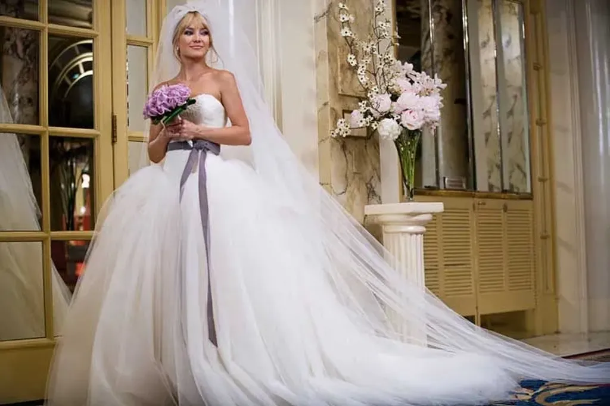

# Long tail ? Mon cul !

Ce titre pourrait être le début d’un dialogue entre un partisan de la théorie d’Anderson et un défenseur du vieux business model de la rareté.

Je lis tout et n’importe quoi sur la longue traîne. Beaucoup de gens en restent à une idée simpliste, ne songeant qu’à leur business model. Par exemple [Frédéric Filloux](http://www.mondaynote.com/2009/09/27/the-long-tail-coming-up-short/). Tout cela me donne envie de [revenir brièvement sur le sujet](#long-tail).

1. Je me réjouis de voir les entrepreneurs qui construisent un business sur la longue traîne se planter. La longue traîne ne s’enferme pas. À mon sens, elle ne peut se mesurer qu’à l’échelle globale. Prenons tous les livres, vendus ou gratuits, lus chez soi ou dans une bibliothèque, traçons la courbe de ce que les gens lisent. C’est là qu’il faut chercher la longue traîne pas chez tel ou tel vendeur (seul un immense vendeur comme Amazon peut la faire apparaître – et ce n’est même pas obligatoire).
2. Si un vendeur de DVD comme NetFlix ne fait pas apparaître la longue traîne dans ses ventes, c’est juste la preuve qu’il n’a pas réussi à mettre en place un système de recommandation pour que ses clients réussissent à s’auto-conseiller. Ça ne prouve rien d’autre sinon que NetFlix, malgré son large catalogue, reste dans l’économie de la rareté.
3. La longue traîne n’est malheureusement pas une fatalité sinon nous aurions quitté depuis longtemps l’économie de la rareté.
4. La longue traîne ne peut naître que sous l’impulsion de système de recommandation, donc avec le développement des réseaux sociaux et la multiplication des propulseurs. Une entreprise isolée aura toujours du mal à créer cette dynamique.
5. La longue traîne ne peut être que le fruit de la décentralisation. Prenons l’audience de tous les journaux, de tous les magazines, de tous les blogs… là encore il est fort probable que nous ayons une longue traîne. Nous le savions avant Anderson d’ailleurs. Tout système complexe se caractérise par une loi de puissance. De même que les organisations sociales non pyramidales ce qui est le propre des systèmes de recommandation. Anderson n’est pas du tout le premier qui a vu ça, Barabasi en parle dès 2003 dans *Linked* et avant dans ses travaux de recherche.
6. Nous n’avons pas besoin d’observer la longue traîne mais nous devons chercher à la développer pour passer de la société de la rareté à la société de l’abondance. C’est un acte politique, pas commercial.
7. Si les petits producteurs peuvent survivre, c’est une attaque frontale au capitalisme totalitaire qui veut devenir hégémonique. Il est de notre devoir de consommateur de défendre ces petits producteurs et donc, incidemment, de développer la longue traîne.
8. La longue traîne doit se construire indépendamment de toute plate-forme centralisée, telle celle d’Amazon.
9. La longue traîne est anticapitaliste par principe. Pas étonnant que les entreprises capitalistes qui cherchent à l’exploiter se prennent souvent les pieds dans le tapis.
10. Au final, distancions-nous d’Anderson qui n’a développé sa théorie que pour servir le capitalisme sans en mesurer la portée révolutionnaire. Revenons à l’idée de loi de puissance beaucoup plus féconde.

#long_tail #netculture #coup_de_gueule #y2009 #2009-10-22-21h24
