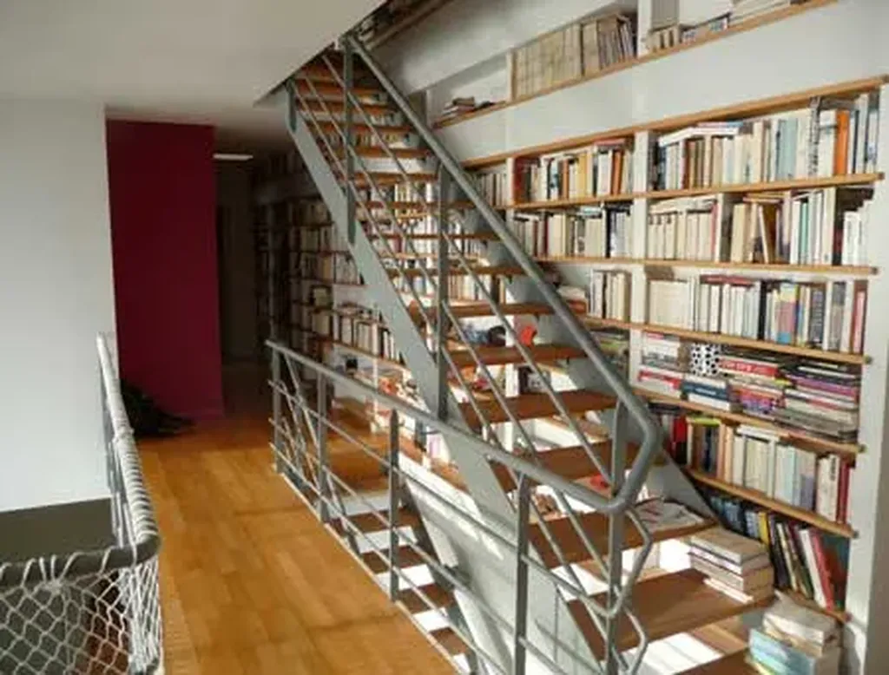
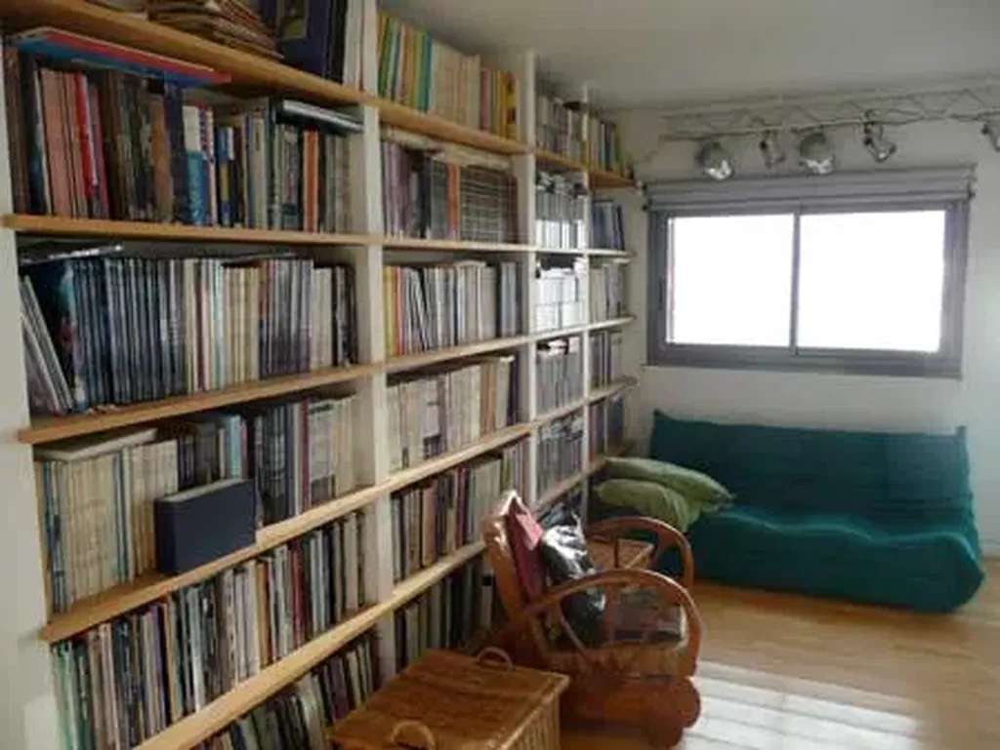
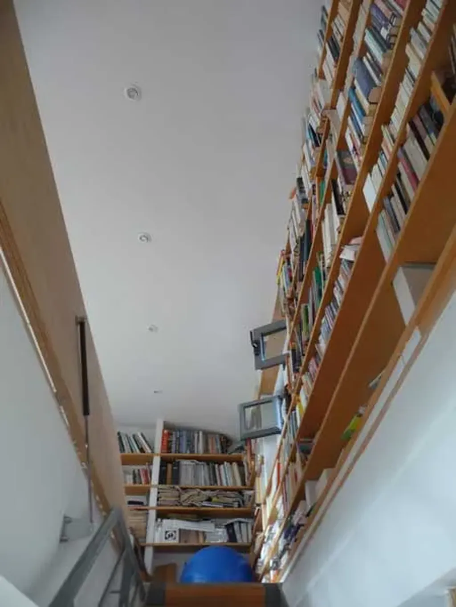

# On peut aimer les livres…

Mais aussi comprendre qu’ils sont morts. Photos de ma bibliothèque : le coin BD, la mezzanine littérature, tout en haut mon bureau très éclectique, je vous épargne ma chambre plutôt consacrée à l’art, les toilettes et les chambres des enfants… tout ça pour dire qu’on peut aimer une chose, regretter qu’elle disparaisse tout en sachant que c’est une nécessité et qu’une nouvelle aventure commence.

#edition #dialogue #y2009 #2009-11-12-17h3
