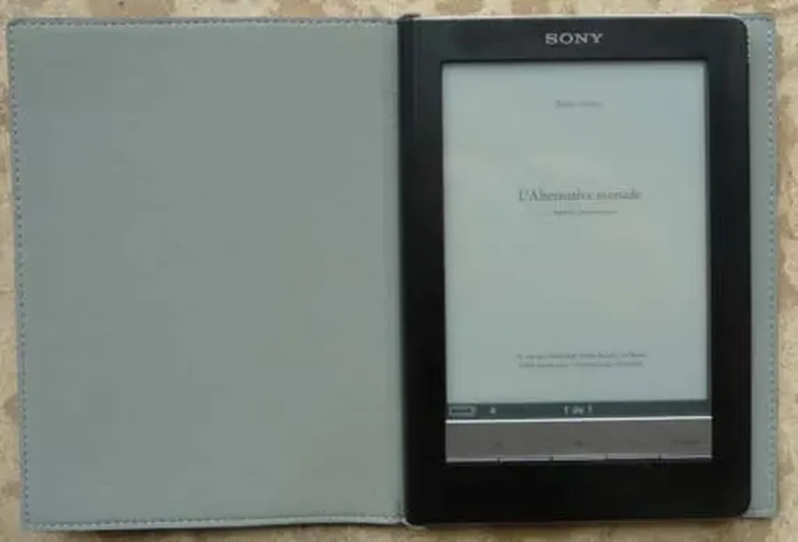

# Vous pensez quoi des ebooks ?

Début septembre, sur Twitter j’avais demandé à ma communauté de réagir au sujet des ebooks. Je m’étais inspiré de [toutes ces réponses](../9/tweets-du-mardi-01-septembre-2009.md) et d’autres glanées plus tard pour essayer de traduire un état d’esprit général. Finalement, je n’utilise pas ces petits textes pour mon livre (pas le courage d’attribuer chacun à son auteur).

« Rien ne remplacera la texture du papier, le froissement des pages, le craquement de la reliure qui s’ouvre pour la première fois. »

« Adolescent, quand je lisais *Dune* de Frank Herbert, j’imaginais que l’odeur de l’encre était celle de l’épice. Jamais personne ne retrouvera cette sensation avec un ebook. »

« Le papier est chaud, l’électronique froide. »

« J’aime trop corner les pages, voir d’un coup d’œil ce qui me reste à lire, approcher de la fin et ne plus pouvoir m’arrêter »

« Les gens aiment avoir de beaux livres dans leur salon. C’est un marqueur social. »

« Un bouquin, on peut le prêter, le confier, le donner de la main à la main. C’est un échange physique en même temps qu’intellectuel. »

« Le papier se conserve sans technologie, sans énergie. Il peut traverser le temps, pas l’électronique. »

« J’aime m’attarder dans un livre, avoir avec lui une relation fidèle. Je me fiche de me trimballer avec ma bibliothèque. Si j’ai trop de livres avec moi, je me laisse distraire. »

« Je viens d’acheter quatre livres. J’en ai lourd dans mon sac – vrai quoi, avec le numérique on sait pas valoriser symboliquement l’achat. »

« J’ai pas besoin de recharger mes livres et ils tombent pas en panne. »

« Nous faisons corps avec le livre, tant gestuellement qu’intellectuellement. »

« Dans les greniers, les générations futures ne découvriront plus de piles de vieux bouquins datant d’un demi siècle. »

« Rien ne remplacera les écorchures aux doigts provoquées par le papier trop coupant. »

« Un livre est tout terrain, il supporte les secousses et les éclaboussures. Va lire ton ebook dans ton bain. »

« Quand on a lu un bouquin, on peut retrouver un passage parce qu’on se souvient au jugé dans quelle tranche il se trouve. Avec un ebook, le texte reste à plat. »

« Lire la dernière page du livre avant la première et utiliser un beau marque page. »

« Sur un ebook, ils la feront où leur dédicace les auteurs ? »

« Le livre papier constitue un espace silencieux qui met en échec le culte de la vitesse. »

« Pour caler un meuble, on fera comment avec ces misérables ebooks ? »

« Aucune larme n’imprégnera jamais un ebook. »

« Un livre est une promesse d’un temps pour soi, exclusif, égoïste. On le mesure d’un coup d’œil au nombre de pages et on se délecte par avance. Un ebook est intangible, il ne nous fait pas rêver.»

« Quand j’ai commencé un roman sur la plage, j’y retrouve plus tard des grains de sable. »

#ebook #edition #dialogue #y2009 #2009-11-15-12h27
