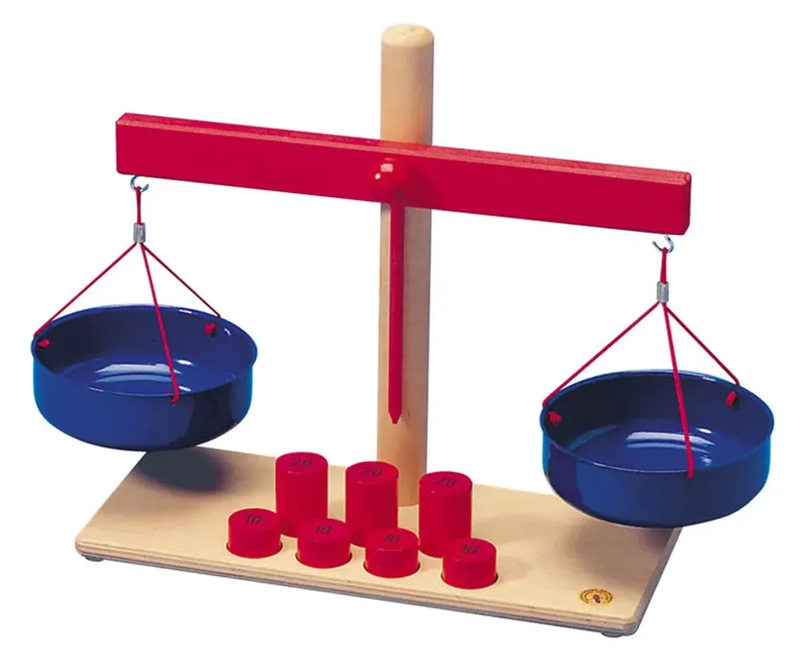

# L’État spolie les blogueurs

Je dois être naïf. Je ne suis pas l’actualité alors je tombe des nues quand, sur Twitter, François Bon attire mon attention vers [un article du *Monde*](http://www.lemonde.fr/actualite-medias/article/2009/12/30/les-editeurs-de-presse-en-ligne-se-repartissent-20-millions-d-euros-d-aides_1285932_3236.html) où j’apprends que la presse en ligne va recevoir 60 millions d’Euros de subvention.

Et pourquoi je ne reçois rien moi ? Pourquoi nous autres blogueurs qui écrivons presque tous les jours et donc participons bien à la presse en ligne ne recevons-nous rien ?

Ok nous n’avons pas déposé de dossiers pour demander les subsides de l’État. Mais croyez-vous que nous aurions pu déposer des milliers de dossiers ? Croyez-vous que nous répondions aux conditions d’éligibilité pour cette subvention ?

Bien sûr que non. Le gouvernement ne subventionne que la presse qu’il peut contrôler, c’est-à-dire celle qui ressemble à une entreprise (et déficitaire de préférence). Mais nous au moins nous ne perdons pas d’argent et créons de la richesse. Nous ne sommes pas en train de ruiner des investisseurs ou de pomper les impôts de nos compatriotes. Nous participons à la vie culturelle et nous n’allons rien recevoir, sinon des volées de bois verts.

On nous menacera de nous faire taire, de nous poursuivre en diffamation dès que nous serons impertinents ou politiquement incorrects, on nous discréditera, nous accusant de pratiquer le journalisme de caniveau… tout cela justement parce que nous ne faisons pas la manche, parce que nous ne demandons rien, parce que nous somme libres.

Rappelez-vous. Il avait été question d’attribuer des macarons aux blogueurs politiquement corrects. Le gouvernement fait mieux : un chèque. Si l’argent était réparti à l’audience cumulée, les médias qui vont recevoir cet argent n’auraient droit à rien parce qu’ils ne représentent plus rien.

Je ne demande pas à l’État de nous subventionner mais je lui demande de laisser crever une industrie moribonde. Rue89. Médiapart. Slate. N’avez-vous pas honte de demander de l’argent ? Aurez-vous encore la force d’écrire « je » et d’élever la voie. Vous ne l’avez jamais fait d’ailleurs, sinon pour participer à la valse bien huilée du monde médiatique qui se regarde le nombril.

Subvention ou pas vous êtes morts. La centralisation médiatique est morte. Les journalistes deviennent des artisans high-tech. Vous allez finir par le comprendre ? Pour faire ce travail, pour bien le faire, pas besoin d’être employé par une entreprise ? Au contraire, il faut être libre. Vous perpétuez un vieux monde effrayant. Vous faites penser à ces vieillards libidineux qui vont séduire de jeunes femmes avec leur pognon. Vous êtes des danseuses.

#journalisme #netculture #coup_de_gueule #y2009 #2009-12-30-15h56
